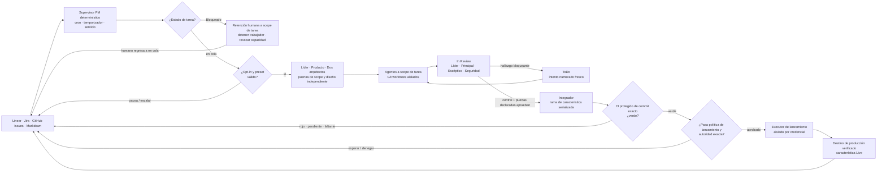

# Startup Factory

> **Convierta su panel de productos en un sistema de entrega de software gobernado.**

**Startup Factory es un framework de orquestación agéntica para la entrega de productos de extremo a extremo.** Conecte la herramienta de gestión de proyectos que su equipo ya prefiere—Linear, Jira, GitHub Issues, Markdown local o su propio adaptador—y conviértala en el plano de control durable para un equipo multifuncional de agentes de IA.

Coloque un `[task]` en ToDo—el mapeo enviado del estado de cola genérico. Cuando la automatización está habilitada y programada, el supervisor PM determinístico verifica el panel cada tres minutos por defecto, deja cualquier elemento etiquetado `human-work` para humanos, enruta cada otra tarea en cola según su preset de equipo explícito (o su configuración predeterminada) y la impulsa a través de arquitectura, implementación, una puerta `In Review` central de tres revisores, puertas especializadas de Seguridad/QA declaradas e integración. También observa el trabajo Bloqueado como un bloqueo de seguridad controlado por humanos: los trabajadores de la tarea coincidente se detienen, mientras el trabajo independiente en ToDo continúa. Cuando su política de lanzamiento, aprobación exacta y prueba verde de CI protegida lo permiten, un ejecutor aislado por credenciales despliega el artefacto inmutable revisado, verifica el destino y solo entonces cierra el `[feature]` padre como `Live`.

Atraiga sus propios modelos, repositorio, stack, tracker e infraestructura. Los ganchos estructurados neutrales al proveedor pueden apuntar a producción en cualquier nube, plataforma, clúster, centro de datos o entorno interno que pueda implementar el contrato plan/apply/status/verify. Startup Factory suministra el protocolo de entrega, la topología del equipo, el runtime determinístico, el modelo de recuperación y los límites de seguridad a su alrededor.

**Nativo de gestión de proyectos · Multi-modelo · Agnóstico a la nube · Falla cerrada · Auditable**

Esto no es un bucle de chatbot oculto. Los planes, la propiedad, el progreso, las decisiones, la evidencia, los bloqueos, las aprobaciones, los denegados por política y el estado de despliegue permanecen visibles en el mismo panel donde su equipo gestiona el producto. El texto del tracker y la autoría reclamada son evidencia de flujo de trabajo, nunca autenticación de seguridad o autoridad de producción.


```text
ToDo -> In Progress -> In Review -> Ready for production -> deploy -> Live
                          findings -> ToDo -> fresh attempt -> In Progress
             red / pending / missing CI ----------------------X deploy anywhere
```

> **Seguro por defecto:** la automatización del panel y la entrega a producción se envían deshabilitadas. Los agentes ordinarios nunca reciben credenciales de producción; habilitar un lanzamiento requiere configuración externa protegida, ganchos, identidades y verificación. Solo una prueba verde de CI/CD exacta y actual para el commit de lanzamiento permite el despliegue.

## Tabla de contenidos

- [Límites de seguridad en capas para constructores de IA](#layered-safety-boundaries-for-ai-builders)
- [¿Por qué Startup Factory](#why-startup-factory)
- [Superpowers + Startup Factory: dividir el ciclo de vida de desarrollo por fortaleza](#superpowers--startup-factory-split-the-sdlc-by-strength)
- [Transparencia total en su tracker](#full-transparency-in-your-tracker)
- [Elija su modo de operación](#choose-your-operating-mode)
- [Requisitos](#requirements)
- [Inicio rápido (2 minutos, sin cuentas)](#quick-start-2-minutes-no-accounts)
- [Instalar en su repositorio](#install-into-your-repository)
- [Conectar su LLM](#connect-your-llm)
- [Conectar su tracker](#connect-your-tracker)
- [Configurar](#configure)
- [Usarlo](#use-it)
- [Automatizar el panel y la entrega a producción](#automate-the-board-and-production-delivery)
- [Los seis equipos predefinidos](#the-six-preset-teams)
- [Cómo funciona](#how-it-works)
- [Mapa de documentación](#documentation-map)
- [Mapa de directorios](#directory-map)
- [Extenderlo](#extend-it)
- [Solución de problemas](#troubleshooting)
- [Créditos](#credits)
- [Licencia](#license)

---

## Límites de seguridad en capas para constructores de IA

Los agentes autónomos solo son tan útiles como los límites a su alrededor. Startup Factory suministra controles de flujo de trabajo y lanzamiento que fallan en cerrado, pero el código del repositorio no es un límite de seguridad del sistema operativo. Los agentes ordinarios aún requieren un sandbox limitado al scope del worktree real e identidad de privilegio mínimo:

- **Una puerta de política de producción basada en código.** `bin/policy-check.py` filtra cada comando de gancho de lanzamiento privilegiado y plan de producción normalizado antes de que comience ese subprocess. Su línea base de denegación — composición de shell, escalada de privilegios, destrucción de sistema de archivos/base de datos/infraestructura, volcado de secretos, acceso a credenciales de metadatos, evasión de comandos codificados — es propiedad del código: la configuración del proyecto puede **agregar** denegaciones, nunca eliminar una.
- **Un modelo de autoridad de tres niveles.** Cada acción se resuelve como **DENY**, **REQUIRE HUMAN APPROVAL** o **ALLOW** (`reference/guardrails.md`). Las aprobaciones vinculan dígitos exactos, entornos, destinos, expiraciones y nonces de un solo uso. El silencio nunca aprueba; cualquier cosa desconocida se deniega.
- **Un rastro de denegación de lanzamiento a nivel `[task]`.** Una denegación de plan de producción normalizado se proyecta de forma idempotente como `[DENIED ACTION]` a través de `bin/tracker-ops.sh record-denial`. Otros lanzadores, rutas, colas y rechazos de pre-vuelo de identidad fallan antes de la mutación y permanecen en registros de runtime protegidos; no se anuncian falsamente como registros del tracker.
- **Sandboxes de agentes de privilegio mínimo.** En modo forzado, cada proceso LLM y `WORKTREE_SETUP` se ejecuta como `AGENT_SANDBOX_RUNNER --workdir <absolute> -- /usr/bin/env -i ...`. El lanzador acepta solo un ejecutable protegido fuera del repositorio; ese executor debe forzar el aislamiento de sistema de archivos, proceso, red y IAM. En modo broker, ningún LLM, incluido el líder del equipo, recibe credenciales del tracker.
- **Espacios de trabajo contenidos.** Cada implementador está aislado en su propio git worktree; las rutas de archivos del tracker son seguras para symlinks y confinadas a su raíz configurada; las transiciones de integración y terminal se serializan, verifican por lectura regresiva y están reservadas para componentes dedicados.
- **Automatización desactivada por defecto.** El supervisor de portafolio es determinístico (no un LLM), deshabilitado hasta que se habilite explícitamente, y detiene el pase en lugar de fabricar estado cuando algo está mal formado.

La política de autoridad incorporada es intencionalmente simple:

| Decisión | Acciones representativas | Quién puede autorizarlo |
|---|---|---|
| **Denegación siempre** | Escape de ruta o eliminación recursiva/masiva fuera del scope de tarea desechable; borrados o truncamientos de base de datos/esquema; eliminación de instancia/clúster/almacenamiento/red/DNS/certificado/clave/respaldo/registro de producción; extracción de secretos; escalada de privilegios; IAM comodín; force-push/reesritura de historial; evasiones de sandbox o política | Nadie dentro de Startup Factory. Use un proceso separado de ruptura de vidrio operado por humanos. |
| **Requiere aprobación humana exacta** | Cambios no destructivos en infraestructura de producción, IAM, red, DNS, certificado, capacidad, esquema, relleno, tráfico, costo o escala; comunicación externa | Un verificador protegido debe autorizar el manifiesto exacto, destino, commit, artefacto, dígitos, expiración y nonce de un solo uso. Un comentario del tracker no es aprobación. |
| **Permitir dentro del scope** | Inspección de solo lectura, planes, pruebas, compilaciones, linting, ediciones locales de worktree, puntos de control de rama de tarea, integración intermediada, verificaciones de salud y lanzamiento de artefacto inmutable limpio de política | El rol asignado o executor determinístico, dentro de sus límites de ruta, identidad, destino, cuota y ciclo de vida. |

La lista completa ineludible y el límite de aplicación están en [`reference/guardrails.md`](reference/guardrails.md).

El resultado: puede entregar trabajo real de entrega a agentes de IA e inspeccionar, desde su tracker, el actor del flujo de trabajo, las aprobaciones del flujo de trabajo, el ID de aprobación de producción y las denegaciones de política para cada entrega. La identidad del aprobador de producción autenticado permanece en estado de transacción protegido; la autoría del tracker nunca se trata como autenticación.

## ¿Por qué Startup Factory

| Ventaja | Qué le brinda |
|---|---|
| **Moverse rápido sin caos de fusiones** | Un despachador determinístico lanza solo trabajo aprobado por diseño, listo para dependencias y seguro para recursos. Cada intento obtiene su propia rama de tarea y worktree; la integración permanece serializada. |
| **Ver toda la entrega, no solo la salida del agente** | Un registro `[progress]` en vivo por `[task]` y un `[digest]` por `[feature]` muestran el estado del tracker, la etapa de ejecución, el actor y el intento en su herramienta de gestión de proyectos. |
| **Usar el modelo correcto para cada trabajo** | Mezcle Claude, Codex, Gemini o cualquier CLI de lectura de archivos por rol, luego enrute tareas individuales a perfiles de modelo rápidos, estándar o fuertes. |
| **Mantener puertas de calidad explícitas** | La aprobación de arquitectura precede a la implementación. In Review requiere aprobaciones independientes del Arquitecto Principal, Arquitecto Principal Escéptico, Ingeniero Senior de Seguridad y Líder del Equipo sobre un paquete exacto; QA opcional puede agregar evidencia, y el integrador ejecuta sus comandos de compilación, prueba y lint antes de fusionar. |
| **Recuperar en lugar de reiniciar** | Paquetes de tarea inmutables, eventos duros, ramas de punto de control, un buzón de salida idempotente y relanzamientos conscientes de intentos hacen que el trabajo interrumpido sea inspeccionable y recuperable. |
| **Mantener su stack y su tracker** | El mismo flujo de trabajo se ejecuta a través de idiomas, frameworks, LLMs y herramientas de gestión de proyectos. Comience sin conexión con Markdown y cambie adaptadores sin reescribir el proceso. |
| **Convertir el panel en una cola de entrega segura** | Un pase determinístico cron/servicio observa trabajo en cola/bloqueado, restaura ejecuciones en vuelo, elige un preset de equipo explícito y lanza LLMs solo para tareas en cola elegibles. |
| **Pausar una tarea sin detener la fábrica** | En el siguiente análisis, `[Blocked]` inmediatamente acota solo la tarea coincidente. El trabajo independiente ToDo y otras características continúan; solo un humano puede desbloquearlo. |
| **Mantener la autoridad peligrosa fuera de los agentes** | Un contrato de denegación/aprobación/permiso gobierna cada rol. La puerta de código bloquea ganchos y planes de lanzamiento privilegiados peligrosos; su sandbox OS requerido e identidades de privilegio mínimo fuerzan límites de sistema de archivos, red, proceso e IAM de agentes ordinarios. |

## Superpowers + Startup Factory: dividir el ciclo de vida de desarrollo por fortaleza

[`obra/superpowers`](https://github.com/obra/superpowers) y Startup Factory operan en niveles diferentes y complementarios.

Superpowers es una metodología de ingeniería empaquetada como habilidades de agente. Su flujo de trabajo upstream completo puede cubrir lluvia de ideas, planificación de implementación, creación de worktree, ejecución de tareas, TDD, depuración, revisión de código, verificación y finalización de rama. Startup Factory es un plano de control de entrega de proyectos: coordina producto, arquitectura, implementación, seguridad, calidad, integración, automatización de portafolio y lanzamiento a producción a través de estado durable del tracker y múltiples agentes independientes.

La integración combinada usa deliberadamente **la parte más fuerte de cada sistema sin ejecutar dos orquestadores de ejecución**:

- Superpowers moldea la idea en una especificación aprobada y un plan de implementación detallado.
- Startup Factory revisa esos documentos como entradas, crea y gobierna la entrega rastreada y posee la ejecución a través de producción verificada.
- Los trabajadores de tareas Claude pueden usar métodos enfocados de Superpowers para TDD, depuración, recepción de revisión y verificación fresca dentro de su única tarea asignada.
- Superpowers no crea un segundo worktree, despacha un segundo equipo, ejecuta el plan, fusiona la rama o declara la característica lanzada.

```mermaid
flowchart LR
    Idea["Idea de producto o ticket"]
    Brainstorm["Lluvia de ideas de Superpowers<br/>preguntas · alternativas · diseño aprobado"]
    Plan["Escritura de planes de Superpowers<br/>archivos exactos · interfaces · pruebas · comandos"]
    Handoff["Transferencia de planificación vinculada por digest<br/>especificación + plan commiteada"]
    Shape["Revisión de planificación de Startup Factory<br/>Producto · Líder · Principal · Escéptico"]
    Tracker["Característica y tareas rastreadas<br/>aceptación · dependencias · recursos"]
    Execute["Ejecución de Startup Factory<br/>paquetes · ramas · worktrees · despacho"]
    Methods["Métodos locales de Superpowers Claude<br/>TDD · depuración · respuesta de revisión · verificación"]
    Review["Panel de revisión de paquete exacto<br/>Líder · Principal · Escéptico · Seguridad"]
    Integrate["Integración serializada<br/>rama de característica validada"]
    Release["CI y lanzamiento protegido<br/>política · aprobación · desplegar · verificar"]

    Idea --> Brainstorm --> Plan --> Handoff --> Shape --> Tracker --> Execute
    Execute --> Methods --> Review --> Integrate --> Release
```



### Por qué dividir el ciclo de vida

| Razón | Beneficio |
|---|---|
| **Una autoridad por etapa** | La especificación tiene una fuente, el tracker tiene un dueño de flujo de trabajo, cada tarea tiene un intento activo, la rama de característica tiene un integrador y la producción tiene un executor de lanzamiento protegido. |
| **La metodología permanece separada de la orquestación** | Superpowers puede mejorar cómo piensa, planifica, prueba y depura Claude sin competir con el programador, worktrees, panel de revisión, escritores de tracker o transacción de lanzamiento de Startup Factory. |
| **Diferentes scopes obtienen diferentes herramientas** | Superpowers es excelente en el bucle de razonamiento local alrededor de un diseño o tarea. Startup Factory gobierna el sistema más amplio de roles, dependencias, trabajo concurrente, artefactos, estados y entornos. |
| **Los modelos independientes permanecen independientes** | Claude puede moldear el plan, mientras Codex, Gemini u otro modelo pueden desafiar arquitectura, implementar, revisar o probar sin recibir instrucciones exclusivas de Superpowers de Claude. |
| **La planificación permanece desafiante** | Un plan pulido es evidencia, no autoridad. Producto y ambos arquitectos aún prueban su scope, criterios de aceptación, interfaces, riesgos, dependencias y orden de entrega antes de que se cree o despache el trabajo. |
| **La recuperación se vuelve durable** | Superpowers proporciona disciplina fuerte a nivel de sesión; Startup Factory agrega historial del tracker, paquetes inmutables, identidad de intento, diarios de eventos, buzones de salida idempotentes, integración reanudable y transacciones de producción seguras para reinicio. |
| **La integración es reversible** | `USE_SUPERPOWERS=false` elimina todo el cableado específico de Superpowers sin cambiar el ciclo de vida, modelo de tracker, topología de equipo o controles de lanzamiento de Startup Factory. |

### Mapa de responsabilidad del ciclo de vida de desarrollo

| Etapa del ciclo de vida | Contribución de Superpowers | Contribución de Startup Factory | Dueño principal en esta integración |
|---|---|---|---|
| Descubrimiento de idea | Aclaración socrática, una pregunta a la vez, enfoques alternativos, compensaciones, aprobación incremental del usuario | Contexto de producto, restricciones del repositorio, scope explícito y NO-en-scope | **Superpowers**, con aprobación humana |
| Especificación | Escribe y auto-verifica el documento de diseño; requiere que el usuario revise la especificación escrita | Gerente de Producto y arquitectos desafían completitud, límites, riesgos y criterios de aceptación | **Superpowers produce; Startup Factory acepta o se opone** |
| Planificación de implementación | Produce tareas detalladas con archivos exactos, interfaces, pasos de código, comandos de prueba, resultados esperados y sin marcadores | Convierte el plan en rebanadas verticales revisables independientemente, dependencias, tracks, recursos y perfiles de modelo | **Transferencia compartida; Startup Factory posee estructura de proyecto ejecutable** |
| Gestión de tracker y portafolio | No se usa como plano de control del proyecto | Crea `[features]` y `[tasks]`, posee estados legales, enrutamiento, progreso, dígitos, scope de automatización y generaciones | **Startup Factory** |
| Diseño por tarea | Puede informar la implementación propuesta | Requiere notas de diseño del implementador, registro de contrato y aprobación independiente de Principal + Escéptico antes del código | **Startup Factory** |
| Implementación | TDD y métodos de ingeniería disciplinados de pasos pequeños dentro de una tarea Claude | Selecciona el trabajador/modelo, crea paquetes inmutables e intentos aislados, fuerza el scope y registra evidencia | **Startup Factory orquesta; Superpowers mejora el método local** |
| Depuración | Investigación de causa raíz, comparación de patrones, una hipótesis a la vez, prueba de regresión, verificación fresca | Detener/reintentar/escalar a scope de tarea, evidencia durable, recuperación de intento y re-revisión arquitectónica cuando sea necesario | **Compartido: método Superpowers dentro de límites Startup Factory** |
| Revisión de código | Ayuda a un trabajador a recibir retroalimentación técnicamente y verificar correcciones | Cuatro veredicos independientes vinculados a commit sobre un paquete de revisión exacto, más evidencia opcional de QA y especialistas | **Startup Factory** |
| Integración | Superpowers upstream tiene flujos de trabajo de finalización de rama, pero no se invocan aquí | El integrador solo valida y escribe la rama de característica; transacciones intermediadas hacen reintentos idempotentes | **Startup Factory** |
| CI, lanzamiento y producción | Sin autoridad de producción en esta integración | CI protegido de commit exacto, comprobaciones de política, vinculación de aprobación, credenciales aisladas, ganchos plan/apply/status/verify, rollback y transición `Live` | **Startup Factory** |
| Operaciones y recuperación | Disciplina de verificación a nivel de sesión | Conciliación de portafolio, bloqueos humanos `[Blocked]`, acotación de trabajadores obsoletos, recuperación de lanzamiento y proyecciones de tracker auditables | **Startup Factory** |

### Dónde es más fuerte Superpowers

- **Diseño antes del código.** Su habilidad [`brainstorming`](https://github.com/obra/superpowers/blob/main/skills/brainstorming/SKILL.md) explora el repositorio, hace preguntas enfocadas, compara enfoques, valida el diseño sección por sección, escribe la especificación, realiza una revisión de consistencia/ambigüedad y espera la aprobación del usuario.
- **Planes que otro ingeniero puede ejecutar.** [`writing-plans`](https://github.com/obra/superpowers/blob/main/skills/writing-plans/SKILL.md) insiste en rutas exactas, interfaces explícitas, pasos completos, comandos de prueba concretos, resultados esperados, commits pequeños, ordenamiento TDD y sin atajos de `TBD` o "similar a la tarea anterior".
- **Hábitos de ingeniería estrictos.** [`test-driven-development`](https://github.com/obra/superpowers/blob/main/skills/test-driven-development/SKILL.md) fuerza un bucle real rojo-verde-refactorización; [`systematic-debugging`](https://github.com/obra/superpowers/blob/main/skills/systematic-debugging/SKILL.md) requiere evidencia de causa raíz antes de correcciones; y [`verification-before-completion`](https://github.com/obra/superpowers/blob/main/skills/verification-before-completion/SKILL.md) requiere salida de comando fresca antes de una reclamación de éxito.
- **Disciplina de revisión local útil.** [`receiving-code-review`](https://github.com/obra/superpowers/blob/main/skills/receiving-code-review/SKILL.md) ayuda a un trabajador Claude a evaluar retroalimentación técnicamente, aclarar incertidumbre, corregir un problema a la vez y verificar el resultado en lugar de responder performativamente.

Esas fortalezas se usan intencionalmente como **entradas de planificación y métodos locales de tarea**. No otorgan autoridad de tracker, programador, integración o producción.

### Dónde es más fuerte Startup Factory

- **Gobernanza multifuncional.** Producto, Líder del Equipo, Arquitecto Principal, Arquitecto Principal Escéptico, Seguridad, implementación, QA, integración y lanzamiento tienen responsabilidades explícitas e intercambiables.
- **Independencia multi-modelo.** Asigne familias de modelos diferentes a diseño, desafío, implementación y revisión para que el punto ciego de un modelo no se convierta silenciosamente en el consenso del equipo.
- **Ejecución determinística.** El despachador—no un LLM—selecciona trabajo elegible del estado del tracker, dependencias, conflictos de recursos, aprobaciones de diseño, riesgo y capacidad.
- **Aislamiento y recuperabilidad.** Cada intento obtiene un paquete de tarea inmutable que contiene el historial completo de comentarios del tracker actual, una rama segura contra colisiones, worktree separado, ruta de informe, historial de eventos y capacidad de publicación autenticada.
- **Integridad de revisión e integración.** Tres revisores centrales distintos más cualquier puerta de Seguridad/QA declarada por riesgo deciden contra el mismo paquete exacto. Ninguna aprobación sobrevive código cambiado, y solo el integrador escribe la rama de característica.
- **Seguridad humana y de producción.** `[Blocked]` es un bloqueo de tarea controlado por humanos. La producción requiere evidencia de CI protegida, planes limpios de política, autoridad externa exacta donde se configura, credenciales aisladas, verificación de destino y transacción durable.
- **Visibilidad de extremo a extremo.** La herramienta de gestión de proyectos permanece como el registro durable desde la idea y criterios de aceptación a través de hallazgos, retrabajo, integración, despliegue y `Live`.

### Flujos de trabajo de ejecución que no deben superponerse

Superpowers upstream incluye excelentes flujos de trabajo de ejecución para proyectos que usan Superpowers solo. Startup Factory reemplaza estos en la capa de orquestación para una característica entregada por un equipo de Startup Factory:

| Flujo de trabajo Superpowers | Dueño Startup Factory usado en su lugar |
|---|---|
| `using-git-worktrees` | Worktrees por intento creados y retirados por `launch-team.sh` |
| `subagent-driven-development` / `executing-plans` | Paquetes de tarea impulsados por tracker y programación determinística `dispatch.sh` |
| `requesting-code-review` como puerta autoritativa | Panel central de Startup Factory de paquete exacto más puertas de apoyo declaradas |
| `finishing-a-development-branch` | Integrador serializado más ciclo de vida de lanzamiento protegido |

No ejecute ambos sistemas de ejecución en la misma característica. Dos programadores no pueden compartir de forma segura identidad de tarea, ramas, worktrees, estado de revisión o autoridad de finalización.

### Cuándo usar cada modo

| Modo | Mejor ajuste |
|---|---|
| **Superpowers + Startup Factory** | Una característica significativa planificada por Claude que debería convertirse en rastreada, desafiada independientemente, implementada por un equipo, revisada, integrada y potencialmente entregada a producción. |
| **Startup Factory solo** | Runtimes no Claude, una especificación ya aprobada, trabajo operacional/de lanzamiento o cualquier proyecto que quiera planificación nativa sin la dependencia de Superpowers. |
| **Superpowers solo** | Una sesión de codificación local donde explícitamente quiere el flujo de trabajo de ejecución upstream de Superpowers y no lanza un equipo de Startup Factory para el mismo trabajo. |

### Cómo usar el flujo de trabajo combinado

El ejemplo a continuación usa Claude Code para planificación y un equipo de Startup Factory para entrega. Superpowers upstream soporta otros agentes de codificación también, pero esta integración se habilita intencionalmente por defecto **solo para Claude Code**.

1. Instale ambos sistemas y cree la rama de característica que se convertirá en el nombre del equipo de Startup Factory:

   ```bash
   # En Claude Code:
   /plugin install superpowers@claude-plugins-official

   # En su shell del proyecto:
   SF_HOME=.claude/skills/startup-factory
   git switch -c payments-revamp
   ```

2. Mantenga la configuración de planificación predeterminada, o inspéctela antes de comenzar:

   ```text
   USE_SUPERPOWERS=true
   SUPERPOWERS_PLUGIN_ID=superpowers@claude-plugins-official
   SUPERPOWERS_SPEC_ROOT=docs/superpowers/specs
   SUPERPOWERS_PLAN_ROOT=docs/superpowers/plans
   ```

   `true` significa "Claude es elegible", no "habilitar Superpowers para cada modelo". Codex, Gemini y harnesses sin marca permanecen en el flujo de trabajo nativo.

3. Verifique que Claude pueda usar el plugin configurado:

   ```bash
   python3 "$SF_HOME/bin/superpowers-planning.py" preflight --runtime claude
   ```

4. Pida a Claude que moldee el ticket, y haga explícito el límite de propiedad:

   ```text
   Use superpowers:brainstorming to shape this feature. Explore the repository,
   clarify scope and success criteria, compare approaches, and write the approved
   specification. After I approve the written spec, use
   superpowers:writing-plans to create the detailed implementation plan.

   Stop after the committed specification and plan. Do not use Superpowers
   worktrees, subagent-driven-development, executing-plans, code-review
   orchestration, or branch-finishing. Startup Factory will own execution.
   ```

5. Revise los documentos generados. Normalmente viven bajo:

   ```text
   docs/superpowers/specs/YYYY-MM-DD-<topic>-design.md
   docs/superpowers/plans/YYYY-MM-DD-<feature-name>.md
   ```

   Ambos archivos deben ser commiteados. Si alguno cambia más tarde, commitee el cambio, recree la transferencia y repita cualquier aprobación de planificación afectada.

6. Vincule los documentos exactos al equipo de Startup Factory:

   ```bash
   TEAM=payments-revamp
   FEATURE_ID=ENG-100
   SPEC=docs/superpowers/specs/2026-07-16-payments-revamp-design.md
   PLAN=docs/superpowers/plans/2026-07-16-payments-revamp.md

   "$SF_HOME/bin/launch-team.sh" planning-handoff \
     "$TEAM" "$SPEC" "$PLAN"
   ```

7. Permita que Startup Factory revise y operacionalice la transferencia. El Gerente de Producto, Líder del Equipo, Arquitecto Principal y Arquitecto Escéptico aún aprueban scope, criterios de aceptación, contratos, dependencias, riesgos, rebanadas verticales y orden de ejecución antes de la implementación.

   Una instrucción adecuada para el agente de Startup Factory es:

   ```text
   Use the validated planning handoff for payments-revamp as planning evidence.
   Review it with the Product Manager, Team Lead, Principal Architect, and
   Sceptical Architect. Resolve pushback, then create or update ENG-100 and its
   vertical-slice tasks with acceptance criteria, dependencies, tracks, files,
   resources, and model profiles. Startup Factory owns all execution.
   ```

8. Lance la entrega normal de Startup Factory:

   ```bash
   "$SF_HOME/bin/launch-team.sh" preflight "$TEAM" "$FEATURE_ID"
   "$SF_HOME/bin/launch-team.sh" gate-team full-stack "$TEAM" "$FEATURE_ID"
   "$SF_HOME/bin/dispatch.sh" "$TEAM" "$FEATURE_ID" --watch
   ```

   Los comandos `claude` directos en `config/team.config.md` se reconocen automáticamente. Marque un wrapper Claude explícitamente:

   ```text
   FRONTEND_CMD="STARTUP_FACTORY_LLM_RUNTIME=claude /path/to/claude-wrapper {prompt_file}"
   ```

   En modo harness, declare Claude mientras compone:

   ```bash
   STARTUP_FACTORY_LLM_RUNTIME=claude \
     "$SF_HOME/bin/launch-team.sh" compose "$TEAM" "$FEATURE_ID" team-lead full-stack
   ```

9. Para volver completamente a la planificación nativa de Startup Factory, edite `config/planning.config.md`:

   ```text
   USE_SUPERPOWERS=false
   ```

Para el límite forzado por máquina exacto, vea [`reference/superpowers-planning.md`](reference/superpowers-planning.md).

## Transparencia total en su tracker

Startup Factory trata el tracker como la superficie de colaboración durable, no un panel de estado actualizado después de que el trabajo real ocurrió. El runtime local hace la coordinación rápida, pero la información que un humano necesita para supervisar la entrega se proyecta de vuelta a la herramienta configurada.

| Puede inspeccionar | Cómo permanece visible |
|---|---|
| Scope y orden de ejecución | `[features]`, `[tasks]`, dependencias, declaraciones de recursos y transiciones legales del panel |
| Decisiones de diseño | Notas de diseño estructuradas, oposición, aprobaciones, condiciones y listas de verificación de arquitectura numeradas |
| Progreso en vivo | Un registro `[progress]` actualizado mecánicamente en cada tarea y un `[digest]` compacto a través de la característica |
| Validación y revisión | Registros de evidencia, listas de archivos cambiados, hallazgos de revisión, rutas de artefacto exactas y declaraciones explícitas `NOT validated` |
| Bloqueos y decisiones humanas | Relaciones `blocked-by` probadas más escalaciones con una pregunta, opciones y un defecto si está inactivo |
| Denegaciones de política de lanzamiento | Comentarios de auditoría idempotentes `[DENIED ACTION]` para planes de producción normalizados; otros rechazos de pre-vuelo permanecen en registros de runtime protegidos |
| Entrega | El commit integrado, puertas de validación completadas, `[Ready to deploy]` genérico (enviado como `Ready for production`), prueba verde de CI protegida y una proyección idempotente `[deployment]` a través de producción verificada y `Live` |

Use tanta parte del sistema como su proyecto necesite:

| Capa | Qué le brinda | Dónde |
|---|---|---|
| **1. Puerto PM** | Un agente de IA crea/rastrea/completa `[features]` y `[tasks]` en cualquier tracker configurado a través de un flujo de trabajo agnóstico a la herramienta. | `SKILL.md`, `reference/`, `adapters/` |
| **2. Escuadrón gobernado** | Un líder coordina, dos arquitectos independientes acotan el diseño, especialistas implementan y tres agentes centrales distintos—el Líder del Equipo y ambos arquitectos—aprueban cada paquete de revisión exacto. Seguridad y QA se unen cuando son declaradas por riesgo; el integrador solo escribe la rama de característica. | `reference/orchestration.md`, `roles/` |
| **3. Runtime impulsado por tareas** | Despacho impulsado por eventos, ondas paralelas acotadas, enrutamiento de modelo, paquetes de revisión exactos, transferencias dures e integración recuperable. | `bin/dispatch.sh`, `bin/runtime-state.py`, `bin/integrate-task.sh` |
| **4. Equipos predefinidos** | Seis listas de roles listas para trabajo full-stack, backend, frontend, seguridad, infraestructura e IA/ciencia de datos, todas resueltas a través del mismo lanzador de equipo. | `teams/`, `bin/launch-team.sh` |
| **5. Automatización de portafolio** | Un pase cron/servicio acotado observa estados genéricos en cola/bloqueados, bootstraps solo ejecuciones de característica en cola y concilia comentarios, retenciones de tarea y acciones de equipo. | `bin/pm-agent.py`, `reference/automation.md` |
| **6. Entrega a producción segura** | Ganchos estructurados neutrales al proveedor plan/apply/status/verify, guardrails estrictos, credenciales aisladas, recuperación de fallo y rollback acotado. | `bin/release-feature.py`, `bin/policy-check.py`, `reference/deployment.md` |

Todo es inspeccionable: Markdown plano, scripts de shell, pequeñas utilidades Python y git. No hay servidor de aplicación ni base de datos coordinadora para alojar; los programadores invocan scripts acotados, y `--watch` es un propietario de reloj en primer plano opcional. El sistema es **agnóstico a idioma, framework, tracker y LLM** porque gestiona el contrato de entrega alrededor del código en lugar de asumir nada sobre el stack.

## Elija su modo de operación

Adopte solo las capas que necesite; cada modo mantiene el mismo vocabulario e historial del tracker.

| Su objetivo | Forma del runtime | Comience aquí |
|---|---|---|
| **Darle a un agente un flujo de trabajo PM confiable** | Su agente existente lee `SKILL.md`; no se requiere daemon, tracker externo o lanzador de equipo. | [Inicio rápido sin conexión de dos minutos](#quick-start-2-minutes-no-accounts) |
| **Lanzar un equipo de especialistas gobernado** | El lanzador y despachador coordinan trabajadores a scope de tarea, roles de puerta, worktrees aislados e integración serializada. | [Ejecutar un equipo completo](#a-whole-team) |
| **Extraer trabajo continuamente del panel** | Cron, un temporizador de servicio o un programador alojado invoca un pase determinístico acotado `pm-agent.py --once`. | [Automatizar el panel](#automate-the-board-and-production-delivery) |
| **Desplegar trabajo aprobado a un destino de producción** | Un executor determinístico protegido ejecuta ganchos de proveedor fijos por digest con credenciales aisladas y verificación independiente. | [Configurar entrega a producción](#production-delivery-configuration) |

---

## Requisitos

**Mínimo (agente único):** un repositorio git, un shell POSIX y cualquier CLI o IDE agéntico LLM que pueda leer archivos (Claude Code, Codex CLI, Gemini CLI, Aider, Cursor, Windsurf, Cline, …). El instalador de lanzamiento se ejecuta como una herramienta Python aislada a través de `uvx` (o `pipx`) y no requiere Homebrew, Node.js, `git` o `rsync`. La ruta de compatibilidad de shell auditable usa `curl`, `git` y `rsync`.

**Para equipos multi-agente, adicionalmente:** el lanzador (`bin/launch-team.sh`) necesita `bash` + `git`; cada tarea de implementación usa una rama de tarea y worktree aislado. `tmux` es opcional pero recomendado — sin él, los agentes se ejecutan como procesos de fondo. Las puertas de protocolo autónomas requieren adicionalmente un sandbox real OS/contenedor que oculte el estado de capacidad del common-dir de Git y otros entornos de proceso de los roles de agente; los modos de archivo Unix solos no aíslan procesos del mismo UID. Configure ese ejecutable externo protegido como `AGENT_SANDBOX_RUNNER` antes de habilitar la ejecución autónoma.

**El acceso al tracker es opcional.** El tracker `Markdown` predeterminado almacena todo en archivos locales, así que puede ejecutar todo sin conexión. Conecte Linear/Jira/GitHub cuando esté listo—vía MCP, REST o la CLI `gh`, dependiendo del adaptador.

**Para automatización cron/servicio:** use una instancia de programador y un adaptador scriptable con scope explícito (REST/CLI/archivos; un proceso cron no puede invocar un cliente MCP). El análisis observa trabajo en cola y Bloqueado, pero solo el trabajo en cola bootstraps o lanza. Las ejecuciones registradas se re-autorizan en cada pase a través de una exportación exhaustiva por característica. La entrega a producción necesita adicionalmente ganchos/config/estado externo estructurados protegidos, un atestor de identidad/aislamiento externo para modo automático y un entorno de credenciales de corta vida separado que los agentes ordinarios nunca hereden.

La salida humana de `[Blocked]` también necesita un control operado por operador en la herramienta de gestión de proyectos: restrinja las transiciones salientes de Bloqueado a principios humanos y denieguelas a cada programador, bot e identidad de servicio. Startup Factory se niega a sus propias escrituras salientes, pero los adaptadores normalizados no prueban quién realizó una transición externa. Si la herramienta no puede forzar permisos a nivel de estado o proporcionar procedencia de transición verificada, trate la reclamación de solo humano como una política operacional y mantenga la automatización de portafolio autónoma deshabilitada para esa herramienta.

---

## Inicio rápido (2 minutos, sin cuentas)

La victoria más rápida: un agente de IA gestionando trabajo en archivos Markdown locales. No se requiere cuenta de tracker, clave API, fórmula Homebrew o paquete global—`Markdown` es el defecto.

1. **Desde la raíz de su proyecto, instale el paquete de lanzamiento completo y versionado.** Codex y Aider usan el directorio del proyecto de Habilidades de Agente compartido:

   ```bash
   uvx startup-factory@latest install --agent codex
   ```

   Para Claude Code use `--agent claude-code`. Fije un lanzamiento en entornos controlados, por ejemplo `startup-factory@0.1.7`. `uvx` crea un entorno aislado para el instalador y no deja ningún paquete de Startup Factory en su entorno de proyecto.

   > La ruta `uvx` descarga el paquete PyPI publicado. Para un checkout Git o uso sin conexión, use la [ruta de compatibilidad de shell auditable](#shell-compatibility-path).

   Este inicio rápido demuestra el flujo de trabajo de un agente. Establezca `TEAM_MODE=false` en el `config/project-management.config.md` instalado antes de continuar; las instalaciones frescas de lo contrario usan el flujo de trabajo de equipo por defecto.

2. **Pregunte a su agente, en lenguaje natural:**

   ```
   Plan a feature: add CSV export to the reports page.
   ```

   La habilidad crea un `[feature]` y un puñado de `[tasks]` como archivos Markdown bajo `.workspace/task-manager/`. Luego impúlselos:

   ```
   Start task 1.        → moves it to [Active], implements it
   Send task 1 to review.
   Finalize task 1.     → verified, committed + [Ready to deploy]
   ```

Ese es todo el bucle — planificar → iniciar → revisar → completar — en vocabulario genérico que funciona idénticamente en cada tracker. Cuando esté listo para un tracker real o un equipo completo, siga leyendo.

> **Comprobación de cordura del runtime** (sin llamadas LLM, sin costo): desde el directorio de habilidad instalado, ejecute `bash tests/run-all.sh --smoke` para una comprobación rápida central o `bash tests/run-all.sh` para la suite completa sin conexión. El ejecutor ejecuta cada prueba seleccionada, informa todos los fallos juntos y termina con `ALL TESTS PASS`.

---

## Instalar en su repositorio

Use una copia **limitada al proyecto**. Startup Factory contiene configuración mutable de tracker, equipo, automatización, despliegue y guardrails, así que una copia global no debería compartirse entre proyectos no relacionados. Homebrew aún necesitaría un segundo paso de inicialización de proyecto y no es intencionalmente parte de la distribución actual.

Elija la ruta del proyecto que su agente soporta:

| Agente | Directorio de instalación del proyecto | Descubrimiento |
|---|---|---|
| **Codex** | `.agents/skills/startup-factory` | Ruta nativa de habilidad de proyecto |
| **Claude Code** | `.claude/skills/startup-factory` | Ruta nativa de habilidad de proyecto |
| **Aider** | `.agents/skills/startup-factory` | Comience con `aider --read .agents/skills/startup-factory/SKILL.md` |
| **Otros agentes** | Su directorio nativo de habilidad de proyecto | Use descubrimiento nativo o apunte al agente a `SKILL.md` |

El paquete de lanzamiento incrusta un paquete determinístico construido desde un commit Git exacto. El instalador verifica cada ruta archivada, tamaño, modo y digest SHA-256 antes de planificar un cambio de destino, luego registra la versión instalada, commit de origen, digest del archivo y política de propiedad localmente.

```bash
# Instalación aislada de un solo tiro
uvx startup-factory@latest install --agent codex

# Claude Code
uvx startup-factory@latest install --agent claude-code

# Executor aislado alternativo
pipx run startup-factory install --agent codex

# CLI de operador persistente
uv tool install startup-factory
startup-factory install --agent codex
```

Use una versión exacta en lugar de `@latest` en entornos controlados. Los espejos de índice de paquetes funcionan a través de configuración normal `uv`/`pipx`; la semántica de instalación no está vinculada a una nube, herramienta de gestión de proyectos o proveedor de despliegue.

Para una ruta explícita en lugar de un mapeo de agente:

```bash
uvx startup-factory@latest install \
  --install-dir /absolute/path/to/startup-factory
```

### Ruta de compatibilidad de shell

Hasta el primer lanzamiento de paquete, o en un host sin `uv`/`pipx`, use el actualizador auditable. El archivo temporal único se elimina automáticamente, y una descarga fallida no puede ejecutar un instalador obsoleto:

```bash
SF_INSTALL_DIR=.agents/skills/startup-factory
(
  set -eu
  installer="$(mktemp "${TMPDIR:-/tmp}/startup-factory-install.XXXXXX")"
  trap 'rm -f "$installer"' EXIT
  curl -fsSLo "$installer" \
    https://raw.githubusercontent.com/alexrolls/startup-factory/main/bin/update-installed-skill.sh
  # Auditoría opcional: less "$installer"
  bash "$installer" --install-dir "$SF_INSTALL_DIR"
)
```

Si ya clonó o descargó Startup Factory, omita `curl` y ejecute su `bin/update-installed-skill.sh` local con el mismo argumento `--install-dir`. El script de compatibilidad busca el paquete completo del repositorio—no solo `SKILL.md`.

> **¿Por qué el README no usa actualmente `npx skills add`:** el [CLI de Habilidades](https://www.skills.sh/docs/cli) abierto es la dirección correcta a largo plazo y descubre correctamente este repositorio. Sin embargo, su ruta de instalación actual de repositorio remoto solo copia el `SKILL.md` raíz. Startup Factory también requiere `bin/`, `config/`, `adapters/`, `extensions/`, `reference/`, `roles/` y `teams/`; una instalación de extremo a extremo sin ellos está rota.
> Hasta que se publique una distribución anidada ligera, no use `npx skills add` o `npx skills update` para Startup Factory.

### Actualizaciones seguras

Previsualice y aplique una actualización con el mismo CLI de lanzamiento. Reconoce la instalación de proyecto seleccionada y realiza una pre-vuelo completa antes de cualquier mutación de destino:

```bash
uvx startup-factory@latest update --agent codex --dry-run
uvx startup-factory@latest update --agent codex
```

Para Claude Code, use `--agent claude-code`. También puede preguntarle a su agente:

```
Fetch latest Startup Factory skill.
```

La configuración del proyecto existente permanece sin tocar byte por byte por defecto, mientras que los archivos de configuración recién introducidos se instalan. Los archivos de solo destino bajo los puntos de extensión documentados `adapters/`, `extensions/` y `teams/` también se preservan. Un manifiesto de propiedad generado permite a actualizaciones posteriores eliminar una extensión upstream retirada sin confundir archivos de propiedad del proyecto con archivos upstream. Una instalación heredada sin manifiesto se migra conservadoramente: los archivos de extensión de solo destino se mantienen. Si un lanzamiento upstream posterior introduce un archivo en una ruta de extensión de propiedad del proyecto, la actualización falla antes de la mutación en lugar de sobrescribirlo:

- `config/project-management.config.md`
- `config/planning.config.md`
- `config/team.config.md`
- `config/statuses.config.json`
- `config/automation.config.json`
- `config/deployment.config.json`
- `config/guardrails.config.json`

Para reemplazar intencionalmente esos archivos con defectos upstream también:

```bash
uvx startup-factory@latest update --agent codex --overwrite-config
```

Para verificar el runtime poseído independientemente de la configuración preservada y extensiones personalizadas:

```bash
uvx startup-factory@latest verify --agent codex
```

El CLI de lanzamiento usa un directorio de staging hermano, un bloqueo de instalación y un intercambio de respaldo con rollback. Una copia interrumpida no puede convertir silenciosamente una instalación válida en una parcial. Sus opciones de operador principales son:

| Opción | Propósito |
|---|---|
| `--agent codex\|claude-code\|aider` | Seleccionar el directorio nativo de habilidad de proyecto. |
| `--project PATH` | Resolver el directorio del agente relativo a otro proyecto. |
| `--install-dir PATH` | Anular el directorio de instalación mapeado. |
| `--bundle PATH` | Para instalación/actualización, usar un archivo canónico local suministrado explícitamente. |
| `--overwrite-config` | Para instalación/actualización, reemplazar los siete archivos de configuración de proyecto preservados. |
| `--dry-run` | Para instalación/actualización, imprimir el plan sin escribir el destino o bloqueo. |
| `--json` | Emitir salida legible por máquina para automatización de operador. |

Copias heredadas/instaladas desde fuente pueden continuar usando el actualizador de compatibilidad de shell desde su paquete instalado:

```bash
bash .agents/skills/startup-factory/bin/update-installed-skill.sh --dry-run
bash .agents/skills/startup-factory/bin/update-installed-skill.sh
bash .agents/skills/startup-factory/tests/run-all.sh --smoke
```

Requiere `git`, `rsync` y `python3`, acepta `--remote-url` y `--ref`, y defectúa a `main`; prefiera una etiqueta revisada o commit exacto. El actualizador de compatibilidad construye y valida un árbol de staging hermano bajo un bloqueo de instalación, luego usa un intercambio de respaldo para que una copia fallida no pueda reemplazar parcialmente la habilidad en vivo. Antes de la activación verifica que el adaptador de tracker seleccionado y `STATUS_CONFIG` configurado existan en el resultado en staging. También analiza el panel retenido y verifica sus nombres de estado, transiciones, estados iniciales/terminales y mapeos para la herramienta de gestión de proyectos seleccionada, devolviendo un error específico antes de la mutación si son incompatibles. La configuración canónica existente, el panel de estado personalizado configurado y los archivos de proyecto de solo destino se preservan por defecto. Los metadatos de propiedad de ruta más objeto Git permiten a una actualización posterior eliminar un archivo upstream retirado solo cuando sus bytes instalados aún coinciden con la fuente instalada previamente; los metadatos de solo ruta heredados se migran conservadoramente.

Cada actualización gestionada por fuente exitosa registra el commit exacto buscado en `.startup-factory-source-install.json`. La consola informa la cuenta de entradas de sistema de archivos planificada o aplicada; cuando el directorio de instalación está ignorado por Git también explica por qué `git status` y `git diff` no pueden mostrar esos cambios.

El CLI de lanzamiento adicionalmente vincula su versión de paquete incrustado y commit de origen a la versión del paquete Python. El actualizador de shell se niega intencionalmente a cualquier instalación que contenga `.startup-factory-install.json` o `.startup-factory-bundle.json`: sincronizar un checkout Git mutable sobre una copia gestionada por lanzamiento destruiría la procedencia verificable. Actualice esas copias solo a través de `uvx`, `pipx` u otro executor aislado para el paquete versionado `startup-factory`.

Antes de sincronizar, el actualizador de compatibilidad verifica el paquete buscado y se niega a la raíz del sistema de archivos, el directorio principal, una raíz de repositorio Git, symlinks internos o rutas no regulares, y directorios no relacionados no vacíos. Cuando se invoca desde un checkout de fuente, selecciona una instalación existente `.agents` o `.claude` solo cuando no hay ambigüedad. `--dry-run` nunca crea un destino o bloqueo faltante.

### Procedencia de lanzamiento

`packaging/build_bundle.py` construye el archivo canónico desde bytes de objeto Git en un commit exacto—no desde un checkout no commiteado—y normaliza el ordenamiento, marcas de tiempo, propiedad y modos del archivo. El CI de lanzamiento lo construye dos veces y requiere salida idéntica byte a byte, incrusta esos bytes exactos en la rueda y distribución de fuente, ejercita la rueda construida, genera atestaciones de procedencia de GitHub y publica a través de PyPI Trusted Publishing. El Lanzamiento de GitHub se crea desde los mismos artefactos ya probados; nada se reconstruye durante la publicación.

Antes del primer lanzamiento, un mantenedor debe registrar el Publicador Confiado de PyPI `startup-factory` para `.github/workflows/release.yml` en el Entorno GitHub `pypi`, restringir las ramas de despliegue de ese entorno a `main` sin revisores requeridos para publicación sin atención, proteger `main` con CI de Paquete como una comprobación requerida y habilitar Lanzamientos de GitHub inmutables. Cada empuje exitoso producido por una fusión a `main` ejecuta el flujo de trabajo de lanzamiento. La fusión debe avanzar la versión en `pyproject.toml` porque las versiones de paquete PyPI son inmutables. Después de que el commit fusionado exacto se prueba, atestigua y publica en PyPI, el flujo de trabajo crea la etiqueta coincidente `vX.Y.Z` y Lanzamiento de GitHub desde los mismos artefactos.

Los equipos multi-agente requieren que el **proyecto destino** sea un repositorio git porque cada intento de implementación recibe una rama de tarea y git worktree. El paquete de habilidad puede vivir dentro de ese repositorio para uso interactivo/manual; la automatización autónoma en su lugar requiere una instalación externa revisada y protegida. Use el mismo instalador con un destino de propiedad de operador absoluto fuera del checkout y cada montaje de agente. Agregue `.teamwork/`, `.workspace/` y `/.startup-factory-retrospective.md` y `/.startup-factory-retrospective.lock` a la raíz `.gitignore` del repositorio destino—las reglas de ignorancia dentro de una instalación de habilidad anidada no cubren rutas de runtime de raíz de proyecto. `bin/retrospective.py init` agrega estas reglas exactas idempotentemente y crea el archivo Markdown local privado.

Dos modos de ejecución (`config/team.config.md` → `EXECUTION`) comparten el mismo aislamiento de rama de tarea/worktree: **`sequential`** ejecuta un trabajador de tarea a la vez; **`parallel`** despacha ondas seguras para dependencias/recursos, acotadas por `MAX_ACTIVE_IMPLEMENTERS` (defecto 2 cuando no se establece). Los roles de puerta e integración permanecen serializados donde se requiere.

---

## Conectar su LLM

Hay dos modos, y se conectan a su LLM de manera diferente.

### Agente único — nada que conectar

Ya ejecuta un agente (Claude Code, Codex, …). La habilidad son *instrucciones que ese agente lee*, así que no hay conexión separada: instale el paquete y hable con su agente normalmente. Sus credenciales LLM existentes se usan tal cual.

### Equipos multi-agente — mapee cada rol a un comando CLI

`config/team.config.md` es **todo el acoplamiento LLM**: una línea por rol que da el comando de shell que ejecuta ese rol. El lanzador compone el prompt de inicio de cada agente en un archivo y sustituye su ruta por `{prompt_file}`.

Cada preset multifuncional requiere un Arquitecto Escéptico. Su mapeo de protocolo, entrada de lista, resumen de rol y comando se validan antes de que comience cualquier proceso de equipo; `SCEPTICAL_ARCHITECT_CMD=null` es un error de configuración, no una opt-out.

```
TEAM_LEAD_CMD="claude -p \"$(cat '{prompt_file}')\" --permission-mode acceptEdits"
PRINCIPAL_ARCHITECT_CMD="claude -p \"$(cat '{prompt_file}')\" --permission-mode acceptEdits"
SCEPTICAL_ARCHITECT_CMD="codex exec --full-auto \"$(cat '{prompt_file}')\""
BACKEND_CMD="codex exec --full-auto \"$(cat '{prompt_file}')\""
REVIEWER_CMD="gemini --yolo \"$(cat '{prompt_file}')\""
TEAM_DEFAULT_CMD="claude -p \"$(cat '{prompt_file}')\" --permission-mode acceptEdits"
```

Plantillas de comando para CLIs comunes:

| LLM / CLI | Plantilla de comando |
|---|---|
| Claude Code | `claude -p "$(cat '{prompt_file}')" --permission-mode acceptEdits` |
| Codex CLI | `codex exec --full-auto "$(cat '{prompt_file}')"` |
| Gemini CLI | `gemini --yolo "$(cat '{prompt_file}')"` |
| Cualquier CLI de lectura de archivos | `yourcli --prompt-file {prompt_file}` |

Los comandos `claude` directos se detectan automáticamente. Si Claude está detrás de un wrapper, marque solo esa plantilla de comando para que los equipos multi-modelo permanezcan precisos:

```bash
FRONTEND_CMD="STARTUP_FACTORY_LLM_RUNTIME=claude /path/to/claude-wrapper {prompt_file}"
```

**Mezclar LLMs es la intención de diseño** — ej. Claude para liderar y poseer la posición de arquitectura principal, Codex para desafiarla independientemente e implementar, y Gemini para revisar. Use familias de modelos diferentes para los dos arquitectos cuando sea posible para reducir errores de razonamiento correlacionados. Los equipos del mismo LLM aún funcionan.

Las anulaciones opcionales `TASK_FAST_CMD`, `TASK_STANDARD_CMD` y `TASK_STRONG_CMD` enrutan paquetes de tarea individuales por `model-profile:`, clasificación de riesgo conservadora o una ruta rápida de bajo riesgo acotada para documentación, formateo y tareas de prueba/config estructurales pequeñas. Las anulaciones faltantes caen de vuelta al comando de rol.

Use `review-gates: qa`, `review-gates: security` o ambos en una descripción `[task]` cuando el riesgo requiera esos pases independientes. El despachador enruta especialistas declarados antes de la revisión del Líder del Equipo, y el validador de evidencia de integración rechaza aprobaciones de apoyo faltantes, obsoletas, reordenadas o que no coinciden con el paquete. Deep Infra y Deep Security hacen `security` efectivo automáticamente.

### Modo Harness — compañeros como subagentes, sin procesos CLI

Si su harness puede generar subagentes y enviarles mensajes (ej. la herramienta Agente de Claude Code), omita el mapeo de comando por completo: compose el prompt de inicio de cada rol con `bin/launch-team.sh compose <team> <featureId> <role> [preset]` y genere el rol nativamente con él. Los mensajes del harness reemplazan buzones, las notificaciones de inactividad del harness reemplazan latidos, y el tracker permanece como fuente de verdad — vea `reference/orchestration.md` → *Modo Harness*.

Cuando el runtime del harness es Claude Code, declárelo mientras compone para incluir la integración Superpowers por defecto:

```bash
STARTUP_FACTORY_LLM_RUNTIME=claude \
  bin/launch-team.sh compose <team> <featureId> <role> [preset]
```

Omita la variable para Codex, Gemini y otros runtimes.

**Resolución de comando por rol:** valor explícito `<ROLE>_CMD` → usado; `<ROLE>_CMD=null` → rol deshabilitado; **ausente** → cae de vuelta a `TEAM_DEFAULT_CMD`. Esa caída de vuelta es por qué los muchos roles de preset de equipo especializados no necesitan claves por rol — establezca `TEAM_DEFAULT_CMD` una vez y anule solo los roles que quiera en un modelo diferente.

> ⚠️ **Seguridad:** esas plantillas usan banderas de auto-aprobación (`acceptEdits`, `--full-auto`, `--yolo`) para que los agentes puedan trabajar sin atención. Los trabajadores pueden commitear puntos de control no confiables solo a ramas de tarea; solo el integrador escribe la rama de característica. Cada implementador está aislado en su propio git worktree — pero aún ejecute equipos en una rama que pueda descartar, y revise el tracker antes de fusionar a su rama principal.

---

## Conectar su tracker

Elija un tracker en `config/project-management.config.md`:

```
PRODUCT_MANAGEMENT_TOOL=Markdown      # o Linear, Jira, GitHubIssues
```

Luego cablee su acceso (omite por completo para `Markdown`):

| Tracker | Opciones de acceso | Qué establecer |
|---|---|---|
| **Markdown** | ninguna — archivos locales | `MARKDOWN_ROOT` (defecto `.workspace/task-manager`) |
| **Linear** | MCP **o** clave API REST | `LINEAR_ACCESS=mcp\|rest`; para `rest`, exporte `LINEAR_API_KEY` |
| **Jira** | MCP **o** token API REST | `JIRA_ACCESS=mcp\|rest`, `JIRA_PROJECT_KEY` exacta e `JIRA_TASK_ISSUE_TYPE` hija; para `rest`, exporte `JIRA_BASE_URL`, `JIRA_EMAIL`, `JIRA_API_TOKEN` |
| **GitHub Issues** | CLI `gh` **o** GitHub MCP | `GITHUB_REPO` (requerido explícitamente para automatización; el uso interactivo puede inferir de git remote), `GITHUB_USE_MCP` |

Las rutas **REST/clave-API** significan que los harnesses sin un cliente MCP (Codex, Aider, scripts planos) son de primera clase. Cada `adapters/<Tool>.md` tiene una sección *Mecanismos de acceso* con la configuración exacta (MCP, REST/`curl`, `gh` o instrucciones de archivo local según corresponda). Las operaciones remotas scriptables tienen un plazo interno de 60 segundos por defecto; los operadores pueden establecer `TRACKER_OPERATION_TIMEOUT_SECONDS` a un entero de 1 a 300, mientras el `operationTimeoutSeconds` de automatización permanece como el límite externo del grupo de procesos.

**Las credenciales viven en variables de entorno, nunca en los archivos de configuración.** Una vez configurado el acceso, cambiar entre adaptadores enviados es un cambio de una línea en `PRODUCT_MANAGEMENT_TOOL`; ningún flujo de trabajo, prompt o resumen de rol menciona un tracker por nombre. Una nueva herramienta también necesita su contrato de adaptador y backend `tracker-ops.sh` determinístico antes de que el despacho o automatización sin atención puedan usarla.

---

## Configurar

La operación central usa tres archivos. La operación autónoma agrega tres plantillas JSON que fallan en cerrado. La política del proyecto permanece versionada; una configuración de despliegue habilitada se copia en su lugar a almacenamiento externo protegido por operadores fuera de montajes de agente.

### `config/project-management.config.md` — el tracker

| Clave | Significado | Defecto |
|---|---|---|
| `PRODUCT_MANAGEMENT_TOOL` | Tracker activo (coincide con un `adapters/<Name>.md`) | `Markdown` |
| bloque por herramienta | Modo de acceso + defectos para el tracker activo (vea arriba) | — |
| `TEAM_MODE` | `true` habilita el modelo de propiedad de estado multi-agente; establezca `false` para el flujo de trabajo de agente único | `true` |
| `STRICT_STATUS` | `true` = rechazar una acción si un `[task]` no está en el estado esperado (el "cordón de andon") | `true` |

> El modo equipo está habilitado en nuevas instalaciones. Establezca **`TEAM_MODE=false`** para optar por el flujo de trabajo de agente único.

### `config/planning.config.md` — intake de planificación de Claude opcional

| Clave | Significado | Defecto |
|---|---|---|
| `USE_SUPERPOWERS` | Hacer Claude Code elegible para lluvia de ideas y escritura de planes de `obra/superpowers`; runtimes no Claude permanecen nativos | `true` |
| `SUPERPOWERS_PLUGIN_ID` | ID de plugin de Claude Code requerido verificado por la pre-vuelo de planificación | `superpowers@claude-plugins-official` |
| `SUPERPOWERS_SPEC_ROOT` | Raíz relativa al repositorio para especificaciones aprobadas | `docs/superpowers/specs` |
| `SUPERPOWERS_PLAN_ROOT` | Raíz relativa al repositorio para planes de implementación aprobados | `docs/superpowers/plans` |

Ejecute `python3 bin/superpowers-planning.py preflight --runtime claude` antes de las etapas de planificación de Claude, luego `bin/launch-team.sh planning-handoff <team> <spec-path> <plan-path>` antes de lanzar el equipo de Startup Factory. Establezca `USE_SUPERPOWERS=false` para eliminar todo el cableado de prompt específico de Superpowers. Con el `true` por defecto, solo los comandos clasificados como Claude reciben ese cableado. Vea [Superpowers + Startup Factory](#superpowers--startup-factory-split-the-sdlc-by-strength) para el flujo de trabajo de extremo a extremo y mapa de propiedad del ciclo de vida de desarrollo.

### Configure su panel

`config/statuses.config.json` define ambas máquinas de estado: cada estado, `transitions` legales, dueño y mapeo `tool` por tracker. El flujo de tarea interno es `Planned → Active → Review → Ready to deploy`, enviado a herramientas de proyecto como `ToDo → In Progress → In Review → Ready for production`; `Blocked` es el estado de retención humana a scope de tarea. Los hallazgos de revisión mueven la tarea de `Review` de vuelta a `Planned`/`ToDo`, y el despachador inicia un intento de implementación fresco que regresa a través de `In Progress`. Las transiciones salientes listadas normalizan acciones de gestión de proyectos humanas; Startup Factory mismo no puede autoriarlas. El flujo de característica interno es `Planned → Active → Resolved`, enviado con `Resolved` mapeado a `Live`. Agregue, renombré o elimine estados editando el JSON, luego ejecute `bin/launch-team.sh validate-board` para verificar el gráfico estructural, alcanzabilidad, dueños y roles de marcador. Verifique por separado que su adaptador activo mapee cada estado a un estado real del tracker (el tracker Markdown necesita nada). En el panel enviado, solo el `release-executor` determinístico posee el estado terminal de característica `Resolved`; la entrega deshabilitada o no verificada permanece no terminal.

### `config/team.config.md` — el equipo (solo para multi-agente)

| Sección | Claves | Propósito |
|---|---|---|
| Rol → comando | `TEAM_LEAD_CMD`, `PRINCIPAL_ARCHITECT_CMD`, `SCEPTICAL_ARCHITECT_CMD`, `SENIOR_SECURITY_ENGINEER_CMD`, `INTEGRATOR_CMD`, `BACKEND_CMD`, `FRONTEND_CMD`, `QA_CMD`, `REVIEWER_CMD`, `TEAM_DEFAULT_CMD` | Qué CLI ejecuta cada rol ([vea arriba](#multi-agent-teams--map-each-role-to-a-cli-command)) |
| Enrutamiento de modelo de tarea | `TASK_FAST_CMD`, `TASK_STANDARD_CMD`, `TASK_STRONG_CMD` | Anulaciones opcionales de comando a nivel de tarea seleccionadas desde metadatos de paquete y clasificación de riesgo conservadora; cada una cae de vuelta al comando de rol |
| Coordinación | `TEAMWORK_ROOT` (`.teamwork`), `AGENT_ENV_ALLOWLIST` (mínimo no secreto), `POLL_INTERVAL_SECONDS` (120), `STUCK_AFTER_MINUTES` (15), `ESCALATE_AFTER_ATTEMPTS` (2), `TRACKER_WRITERS` (`broker`), `EXECUTION` (`sequential`), `MAX_ACTIVE_IMPLEMENTERS` (`null`) | Rutas canónicas de espacio de trabajo seguras para symlinks; los LLMs comienzan con `env -i`; el broker determinístico mantiene las credenciales del tracker fuera de cada rol LLM; supervisión impulsada por eventos con fallback de sondeo; programación secuencial/paralela acotada |
| Provisión de worktree | `WORKTREE_SETUP` | Comando de setup no vacío ejecutado una vez dentro de cada worktree de tarea fresco a través del mismo límite de sandbox; el modo autónomo rechaza provisionamiento nulo/no-op. |
| Aislamiento de agente | `AGENT_SANDBOX_RUNNER`, `AGENT_SANDBOX_ENFORCED` | Límite externo protegido `runner --workdir ABSOLUTE -- /usr/bin/env -i …`. El executor, no el código de Startup Factory, debe forzar el aislamiento de sistema de archivos, proceso, red e identidad. |
| Autoridad de ciclo de vida | `BROKER_LIFECYCLE_ROOT` | Raíz externa protegida modo-0700 absoluta para identidades PID/inicio/tmux autenticadas HMAC. Sin ella, los procesos manuales son no gestionados y `stop` se niega a señalar. |
| Validación | `VALIDATE_BUILD`, `VALIDATE_TEST`, `VALIDATE_LINT`, `VALIDATE_FORMAT`, `VALIDATE_SCRIPT` | Comandos de su stack; el integrador los ejecuta antes de cada fusión (`null` = omitir). `VALIDATE_SCRIPT` reemplaza los cuatro con un script poseído por el repositorio que recibe la lista de archivos cambiados |

Apunte los comandos `VALIDATE_*` a su compilación/prueba/lint real (ej. `VALIDATE_TEST="pytest"`) — este es el único lugar donde el integrador agnóstico al framework aprende sobre su stack.

### Automatización, despliegue y guardrails

| Archivo | Propósito | Defecto seguro |
|---|---|---|
| `config/automation.config.json` | Cadencia de análisis, tipos de observación/lanzamiento separados, política de retención de tarea, tope de ejecución, raíz de rama/worktree, presets de equipo permitidos/defecto | `enabled: false` |
| `config/deployment.config.json` | Plantilla deshabilitada para rutas de destino/estado externo protegidas, base de confianza, pines de código/gancho, límites de entorno positivo, ganchos de CI/atestación/aprobación protegidos y plazos | `enabled: false`, `approval-required` |
| `config/guardrails.config.json` | Adiciones de proyecto a la política de denegación inmutable incorporada y límites automáticos de costo/cambio | Delta de costo cero; no puede debilitar incorporados |

#### Configuración de automatización del panel

Copie [`config/automation.config.json`](config/automation.config.json) a almacenamiento externo protegido antes de habilitarlo. El programador lee estas claves:

| Clave | Valor enviado | Significado |
|---|---:|---|
| `schemaVersion` | `1` | Esquema de configuración; versiones desconocidas fallan en cerrado. |
| `enabled` | `false` | Interruptor maestro. Un pase deshabilitado no lanza nada. |
| `trustedPath` | `/usr/bin:/bin` | Directorios absolutos de búsqueda de comandos protegidos usados por el programador. |
| `scanIntervalMinutes` | `3` | Intervalo de análisis del panel, de 1 a 1440 minutos. Omita para retener el defecto de tres minutos. El legado `pollSeconds` se acepta solo cuando esta clave está ausente. |
| `leaseSeconds` | `900` | Arrendamiento de pase de host único y ventana de recuperación obsoleta acotada; entero 5–86400. |
| `operationTimeoutSeconds` | `120` | Plazo externo para cada proceso hijo de adaptador, lanzador y despachador; entero 5–3600. |
| `releaseTimeoutSeconds` | `7200` | Plazo externo separado para la transacción de lanzamiento completa; entero 60–86400 y al menos el límite conservador de la ruta completa de gancho. |
| `maxFeaturesPerPass` | `2` | Máximo de nuevas ejecuciones de característica bootstrapeadas en un pase, de 1–1000; las ejecuciones existentes concilian primero. El fallback de omisión es 1. |
| `requireAgentSandbox` | `true` | Invariante obligatorio; `false` o ausente se rechaza. |
| `requireSingleTrackerWriter` | `true` | Invariante obligatorio que requiere escrituras de broker determinístico. |
| `observeStatusKinds` | `queued`, `blocked` | Tipos exactos neutrales al adaptador para observar. El mapeo de proyecto enviado es ToDo y Blocked; la observación no es autoridad de lanzamiento. |
| `launchStatusKinds` | `queued` | El único tipo elegible para un nuevo lanzamiento automático. `[Blocked]` se observa solo para forzar su retención. |
| `blockedTaskPolicy` | acotado a tarea, salida humana, sin reanudación automática | Política fija que falla en cerrado: continuar trabajo independiente, refrescar toda comunicación, propagar solo dependencias directas confirmadas por líder y usar un intento fresco después de reanudación humana. Valores faltantes, desconocidos o más débiles se rechazan. |
| `ignoredTaskLabels` | `human-work` | Etiquetas del tracker insensibles a mayúsculas/minúsculas que reservan una tarea para personas. Las nuevas tareas coincidentes nunca se reclaman ni lanzan; si la etiqueta aparece en vuelo, el siguiente reconciliado detiene/acota esa tarea mientras el trabajo independiente continúa. Eliminarla restaura el manejo específico de estado normal en el siguiente análisis. |
| `reconcileRegisteredRuns` | `true` | Re-exportar y re-autorizar cada característica registrada sin finalizar en cada pase. |
| `baseRef` | `main` | Ref de inicio de ejecución de característica cuyo commit base resuelto se registra inmutablemente. La procedencia de producción se ancla por separado por `trustedBaseRef` de despliegue. |
| `branchPrefix` | `factory-` | Prefijo para ramas de características generadas. Los IDs externos se hash antes de usar en rutas o refs. |
| `workspaceRoot` | `.teamwork/pm-agent` | Raíz de espacio de trabajo y registro del supervisor relativa al repositorio. |
| `defaultTeamPreset` | `full-stack` | Equipo usado cuando los metadatos elegibles no contienen un preset explícito. |
| `allowedTeamPresets` | los seis presets enviados | Lista de permiso exacta de enrutamiento. Enrutamiento desconocido o cambiado pausa la ejecución. |
| `requireMetadataOptIn` | `false` | Cuando `false`, cada tarea en cola no ignorada es elegible por defecto. Establezca `true` para requerir adicionalmente un marcador explícito `automation: enabled` más reciente. |
| `metadata.optInKey` | `automation` | Clave de descripción/comentario neutra al adaptador para habilitación. |
| `metadata.teamPresetKey` | `team-preset` | Clave de descripción/comentario neutra al adaptador para enrutamiento de equipo especializado. |

`--print-cron` soporta intervalos de minuto estables que dividen 60 e intervalos de hora completa que dividen 24. Use un temporizador de servicio o programador alojado para otros intervalos válidos, y configure su equivalente de "prohibir ejecuciones superpuestas". El arrendamiento de sistema de archivos cubre un host solo.

#### Configuración de entrega a producción

Comience con el deshabilitado [`config/deployment.production.approval-required.example.json`](config/deployment.production.approval-required.example.json), cópielo fuera del repositorio y cada montaje de agente, luego configure el destino exacto y ganchos protegidos.

```json
{
  "enabled": false,
  "mode": "approval-required",
  "environment": "production",
  "target": {
    "id": "payments-production",
    "provider": "your-cloud-or-platform",
    "region": "your-region-or-datacenter",
    "service": "your-service-or-application"
  }
}
```

Mantenga `enabled` falso hasta que cada ruta, digest, gancho, identidad y verificador externo requerido a continuación estén instalados y probados.

| Grupo de claves | Qué configurar |
|---|---|
| `enabled`, `mode`, `environment` | Mantenga deshabilitado hasta que el límite de confianza externo esté listo. Elija `approval-required` o el modo `automatic` con atestación más estricta; el executor actual requiere `environment: production`. |
| `trustedBaseRef` | Ref de base protegido desde el cual la cadena de integración sin lagunas debe descender. Esto no reemplaza la protección de rama. |
| `target` | Establezca un `id` estable no secreto; agregue enrutamiento neutro al proveedor como `provider`, `region`, `service`, campos de cuenta, espacio de nombres o clúster necesarios por sus ganchos. |
| `stateRoot`, `trustedPath` | Raíz absoluta de transacción/estado de lanzamiento externo y ruta de búsqueda de ejecutable protegida. |
| `gitLfsPolicy`, `maxSourceArchiveBytes`, `maxSourceBytes`, `maxSourceFiles` | Acotar y validar la instantánea de fuente aislada consumida por la planificación. |
| `approvalTtlSeconds`, `deliveryAttestationTtlSeconds`, `ciAttestationTtlSeconds` | Edad máxima de aprobación exacta, atestación de entrega automática y evidencia verde de CI protegida. |
| `planningIsolation` | Declare el proveedor de sandbox protegido, identidad separada, rutas de credencial/estado desmontadas y postura de salida de producción. Las plantillas seguras están intencionalmente incompletas. |
| `credentialEnvFile`, `credentialEnvironmentAllowlist` | Fuente de credencial externa modo-0600-o-más-estricto y los nombres exactos que los ganchos privilegiados pueden recibir. Los agentes ordinarios y ganchos de plan nunca lo heredan. |
| `planningEnvironmentAllowlist`, `trackerEnvironmentAllowlist`, `environmentAllowlist` | Listas de permiso positivas independientes para planificación/verificación CI, proyección de tracker y ganchos de lanzamiento privilegiados. |
| `trustedCodeDigests`, `trustedHookDigests` | Pines SHA-256 para el conjunto de executor/auxiliar protegido y cada ejecutable de gancho dedicado. |
| `hooks.plan` | Producir un plan estructurado canónico desde fuente aislada, vinculando el archivo de fuente exacto y `artifactDigest` inmutable. Requerido cuando la entrega está habilitada. |
| `hooks.verifyCi` | Requerido siempre que la entrega esté habilitada. Devolver una prueba protegida, fresca y de commit exacto de que cada comprobación requerida tuvo éxito y ninguna está fallida, pendiente, omitida, faltante, obsoleta o no verificable. Se vuelve a ejecutar antes de la planificación y dos veces en el límite de aplicar. |
| `hooks.status`, `hooks.apply`, `hooks.verify` | Leer estado de destino actual, aplicar el artefacto revisado exacto y probar independientemente la versión y salud desplegadas. |
| `hooks.rollback` | Gancho de recuperación acotada opcional; el rollback automático puede apuntar solo al artefacto inmutable inmediatamente anterior que coincide con el estado pre-aplicar observado. |
| `hooks.verifyApproval` | Requerido por `approval-required`; validar una autorización de manifiesto exacto externo. Los comentarios del tracker nunca lo satisfacen. |
| `hooks.verifyDelivery` | Requerido por `automatic`; atestar aislamiento de rol, aislamiento de planificación y autenticidad de aprobación para el commit exacto y dígitos de evidencia. |
| `timeoutsSeconds` | Límites por gancho para verificación CI, plan, estado, aplicar, verificar, rollback, aprobación y atestación. Su total conservador debe caber dentro de `releaseTimeoutSeconds`. |

| Modo de lanzamiento | Qué puede proceder |
|---|---|
| `approval-required` | Aplicar procede para un manifiesto limpio de política solo después de que el gancho protegido `verifyApproval` confirme el destino exacto, commit, artefacto, dígitos de evidencia, expiración y nonce. |
| `automatic` | Solo un lanzamiento de artefacto inmutable no destructivo, reversible y sin efectos de solo aprobación con una atestación protegida `verifyDelivery` válida. |

Ambos modos de lanzamiento también requieren el gancho protegido `verifyCi` para probar una canalización verde para el commit exacto de lanzamiento. CI rojo, fallido, pendiente, omitido, faltante, obsoletu o no verificable bloquea aplicar antes de que cualquier entorno soportado pueda cambiar; ningún agente o comentario del tracker puede eximir esa puerta.

Los ganchos del proveedor son el límite del destino de producción. Startup Factory no codifica AWS, Azure, GCP, Kubernetes, VMs, metal desnudo o un servicio CI/CD particular; cada gancho recibe y devuelve los contratos normalizados documentados en [`reference/deployment.md`](reference/deployment.md).

#### Adiciones de guardrail del proyecto

[`config/guardrails.config.json`](config/guardrails.config.json) no puede eliminar ni anular ninguna denegación incorporada. Sus listas de patrón/acción solo agregan restricciones; sus claves numéricas establecen límites poseídos por operador para planes automáticos de lo contrario limpios de política:

| Clave | Defecto seguro | Propósito |
|---|---:|---|
| `additionalDenyPatterns` | `[]` | Agregar patrones prohibidos específicos del proyecto para argv de gancho de lanzamiento privilegiado. |
| `additionalApprovalRequiredActions` | `[]` | Agregar clases de acción específicas del proyecto que siempre necesitan aprobación humana exacta. |
| `maximumAutomaticPlanChanges` | `100` | Acotar el número de efectos normalizados en un plan de lanzamiento automático. |
| `maximumAutomaticCostDelta` | `0` | Con el defecto cero, un delta de costo positivo se deniega en modo automático y solo de aprobación en modo approval-required. |
| `allowAutomaticRollbackOnlyToPreviousArtifact` | `true` | Permitir rollback automático solo al artefacto inmutable inmediatamente anterior cuyo digest coincide con el estado pre-aplicar objetivamente observado; `false` deshabilita rollback automático. |

Nunca coloque credenciales de producción, argv de gancho privilegiado, pines de confianza o estado de lanzamiento en configuración del repositorio. (`config/team.config.md` contiene intencionalmente CLI, setup y comandos de validación de agentes ordinarios.) Cuando el despliegue está habilitado, use una configuración y raíz de estado externa protegida, ejecutables de gancho fijos por digest absolutos fuera del repositorio y un archivo de credencial fuera del repositorio con modo 0600 o más estricto, listados de nombres de credencial exactos, propiedad de executor/raíz y sin symlink. Los intérpretes genéricos se rechazan como ejecutables de gancho privilegiado. El programador autentica y captura la entrada de lanzamiento externo/config antes de su primera instrucción y pasa solo listas de entorno positivas; la confianza externa ausente o deshabilitada no inicia ningún executor de lanzamiento. Vea `reference/deployment.md` para las claves exactas de código de confianza, límites de entorno, atestación y contratos de gancho.

El lanzamiento autónomo adicionalmente se niega a comenzar a menos que `TRACKER_WRITERS=broker`, `AGENT_SANDBOX_ENFORCED=true` y un `AGENT_SANDBOX_RUNNER` protegido válido estén configurados. El executor debe ser un ejecutable absoluto, no symlink, fuera del repositorio, poseído por el executor o raíz y no escribible por grupo/mundo. Startup Factory valida e invoca ese límite; la implementación del executor permanece responsable del aislamiento real OS/contenedor. También requiere la raíz externa modo-0700 `BROKER_LIFECYCLE_ROOT`, mantenida fuera de cada montaje de agente, para autoridad de ciclo de vida PID/tiempo de inicio/tmux autenticada.

---

## Usarlo

### Un agente

Establezca `TEAM_MODE=false` en `config/project-management.config.md`, luego hable con su agente en el vocabulario genérico:

- *"Plan a feature: …"* → crea un `[feature]` + `[tasks]`
- *"Start task ENG-142"* → `[Active]` genérico / `In Progress` enviado, luego implementa
- *"Send it to review"* → `[Review]` genérico / `In Review` enviado, lanzando los tres revisores centrales y cualquier puerta de Seguridad/QA declarada
- *"Finalize it"* → solo después de aprobaciones centrales y de puerta declarada, `[Ready to deploy]` genérico / `Ready for production` enviado
- *"Switch the tracker to Linear"* → sigue la configuración del adaptador

### Un equipo completo

1. Establezca la ruta del paquete para su instalación, confirme la configuración `TEAM_MODE=true` enviada, configure comandos de rol, `WORKTREE_SETUP` y al menos un comando `VALIDATE_*` real en `$SF_HOME/config/team.config.md`:

   ```bash
   SF_HOME=.agents/skills/startup-factory        # Codex / Habilidades de Agente compartidas
   # SF_HOME=.claude/skills/startup-factory      # Claude Code
   ```

   Agregue `.teamwork/` y `.workspace/` a la raíz `.gitignore` del repositorio destino. Provea la raíz externa protegida modo-0700 `BROKER_LIFECYCLE_ROOT` para esta ruta impulsada por despachador; suministra vivacidad autoritativa, previene lanzamientos duplicados y habilita `status`/`stop`.
2. Cree una rama de característica — su nombre **es** el nombre del equipo:

   ```bash
   git checkout -b payments-revamp
   ```
3. Si Claude/Superpowers produjo una especificación y plan commiteados aprobados, vincúlelos antes del lanzamiento:

   ```bash
   "$SF_HOME/bin/launch-team.sh" planning-handoff payments-revamp \
     docs/superpowers/specs/2026-07-16-payments-revamp-design.md \
     docs/superpowers/plans/2026-07-16-payments-revamp.md
   ```

   Omita este paso cuando use planificación nativa de Startup Factory.
4. Lance la supervisión persistente y roles de puerta del preset:

   ```bash
   "$SF_HOME/bin/launch-team.sh" gate-team deep-backend payments-revamp ENG-100
   #                                        └ preset      └ rama/equipo    └ featureId
   ```
5. Inicie el despachador determinístico en su propio shell persistente. Este proceso posee reclamaciones de tarea y lanza trabajadores de scope de tarea frescos:

   ```bash
   "$SF_HOME/bin/dispatch.sh" payments-revamp ENG-100 --watch
   ```

6. Vigile al equipo:

   ```bash
   tmux attach -t team-payments-revamp         # ventanas de agente en vivo, cuando se usa tmux
   "$SF_HOME/bin/launch-team.sh" status payments-revamp  # estado de proceso protegido + latido
   ```

   El progreso aterriza en su tracker; cualquier cosa que necesite a usted aterriza en `.teamwork/payments-revamp/ESCALATIONS.md`.
7. Detenga el despachador con `Ctrl-C`, luego detenga el equipo gestionado:

   ```bash
   "$SF_HOME/bin/launch-team.sh" stop payments-revamp
   ```

   Si experimenta intencionalmente con lanzamientos directos no gestionados en su lugar, no confíe en la vivacidad del despachador, `status` o `stop`; supervise los procesos de fondo/tmux usted mismo.

> Mantenga `SF_HOME` establecido en cada shell que ejecute un lanzador o despachador. Para una instalación de automatización externa protegida, establézcalo en esa ruta absoluta.

**Subcomandos `bin/launch-team.sh`:**

| Comando | Propósito |
|---|---|
| `team <preset> <team> <featureId>` | Lanzar un listado de preset completo |
| `gate-team <preset> <team> <featureId>` | Lanzar solo puertas de supervisión/revisión/integración persistentes; la automatización usa esto y inicia implementadores por tarea |
| `planning-handoff <team> <spec-path> <plan-path>` | Vincular entradas de especificación y plan commiteadas de Claude/Superpowers a este equipo de Startup Factory |
| `preflight <team> <featureId>` | Verificar acceso de adaptador, escribibilidad de espacio de trabajo y pin UTC — ejecute una vez antes de cualquier lanzamiento de equipo CLI |
| `start <team> <featureId> <role>…` | Lanzar roles específicos (equipos personalizados) |
| `relaunch <team> <featureId> <role> [preset]` | Reiniciar un agente fallido/atascado |
| `compose <team> <featureId> <role> [preset]` | Escribir el prompt de inicio de un rol **sin generar** — para ejecutar compañeros como subagentes dentro de su propio harness (vea `reference/orchestration.md` → *Modo Harness*) |
| `compose-review <team> <featureId> <role> <taskId> [preset]` | Desde un `tasks.json` normalizado recién exportado, escribir un prompt de revisión de un paquete ligero y puntero de manifiesto de vinculación exacto sin generar ni otorgar autoridad de revisor |
| `start-task <team> <featureId> <role> <taskId> [attempt] [preset]` | Generar un paquete y lanzar un trabajador de scope de tarea en su worktree |
| `compose-task <team> <featureId> <role> <taskId> [attempt] [preset]` | Generar un paquete y prompt de inicio ligero sin generar, para subagentes harness |
| `worktree <team> <role> <taskId> [attempt]` | Crear un worktree de tarea aislado para un implementador |
| `worktree-remove <team> <role> <taskId> [attempt]` | Eliminar un worktree solo después de que el estado de ciclo de vida protegido pruebe que su trabajador está detenido; el modo no gestionado se niega |
| `validate-board [config-path]` | Validar estructura de estado, reglas iniciales/terminales, transiciones, alcanzabilidad, dueños y referencias de rol de marcador |
| `status <team>` | Mostrar estado de proceso autenticado más último latido cuando la autoridad de ciclo de vida protegida está habilitada; de lo contrario informar que los marcadores son no autoritativos |
| `stop <team>` | Detener el equipo gestionado a través de identidades de ciclo de vida autenticadas; el modo no gestionado se niega a señalar |
| `stop-task <team> <taskId>` | Enviar TERM→KILL acotado al grupo de procesos/sesión gestionado por lanzador autenticado para un [task], luego revocar las capacidades de publicación activas de ese [task]; trabajadores hermanos y roles de puerta continúan |

La detención del grupo de procesos es control de ciclo de vida, no un límite de contención completo. Un subprocess que escapa deliberadamente con `setsid`, doble bifurcación o un supervisor externo puede sobrevivir al lanzador. Las implementaciones autónomas deben por lo tanto usar un sandbox OS, cgroup/contenedor, trabajo de servicio o límite equivalente de matar-al-cerrar que contenga a cada descendiente. Las comprobaciones de retención de broker aún rechazan salida de un proceso obsoleto escapado.

**`bin/dispatch.sh` — el bucle de eventos:**

| Comando | Propósito |
|---|---|
| `dispatch.sh <team> <featureId> --once [--dry-run]` | Un pase de lectura y acción determinístico |
| `dispatch.sh <team> <featureId> --watch` | Despertar en eventos de runtime con `POLL_INTERVAL_SECONDS` como fallback — ejecute en un shell persistente (tmux/nohup); **usted posee este proceso** |

> **El despacho CLI requiere acceso scriptable al tracker.** Linear y Jira defectúan a MCP; establezca `LINEAR_ACCESS=rest` o `JIRA_ACCESS=rest` en `config/project-management.config.md` antes de ejecutar `dispatch.sh --watch`. El modo harness (`launch-team.sh compose`) soporta MCP nativamente.

**`bin/tracker-ops.sh` — operaciones scriptables normalizadas del tracker:**

| Comando | Propósito |
|---|---|
| `state <taskId> <Status>` | Hacer y verificar una escritura de estado genérica `[task]` legal. Startup Factory rechaza cada transición `[Blocked]` saliente; un humano debe realizar ese movimiento en la herramienta de gestión de proyectos. |
| `feature-state <featureId> <Status>` | Hacer y verificar una escritura de estado genérica `[feature]` legal. |
| `feature-reopen <featureId> <Status>` | Reapertura terminal-a-cola solo para supervisor PM para una nueva generación de entrega. |
| `task-reopen <taskId> <Status>` | Reapertura terminal-a-cola solo para broker de integración después de hallazgos tardíos válidos; el destino enviado es `Planned`/`ToDo`, seguido de una reclamación fresca a `Active`/`In Progress`. |
| `comment <taskId> [bodyfile]` | Agregar un comentario, leyendo su cuerpo desde un archivo o stdin. |
| `comment-once <taskId> <deliveryId> <bodyfile>` | Entregar un comentario idempotente para un elemento de buzón de salida durable. |
| `update-comment <taskId> <commentId> [bodyfile]` | Editar un comentario existente donde el adaptador lo soporta. |
| `upsert-progress <taskId> [bodyfile]` | Crear o actualizar la proyección `[progress]` gestionada única de la tarea. |
| `upsert-digest <featureId> [bodyfile]` | Crear o actualizar la proyección `[digest]` gestionada única de la característica. |
| `upsert-deployment <featureId> [bodyfile]` | Crear o actualizar la proyección `[deployment]` gestionada única de la característica. |
| `claim <taskId> <role> [--to <Status>]` | Verificar conflicto, registrar idempotentemente, transicionar y leer de vuelta una reclamación de trabajo elegible antes del lanzamiento. |
| `record-denial <taskId> --actor AGENT --reason TEXT [--denial-id ID] [bodyfile]` | Registrar idempotentemente un `[DENIED ACTION]` de plan normalizado sanitizado; el cuerpo de acción intentada requerido viene de `bodyfile` o stdin. |
| `integrate <taskId> <hash> [bodyfile]` | Hacer la escritura terminal de tarea y comentario de finalización para una integración verificada. |
| `export <featureId> <outfile>` | Exportar exhaustivamente el estado normalizado de característica/tarea como JSON. |
| `scan <outfile> --status <Status>…` | Descubrir trabajo de panel normalizado en estados solicitados explícitamente. |

Estos comandos usan REST de Linear/Jira, la CLI `gh` o archivos Markdown. La documentación del adaptador permanece como el contrato de operación; las sesiones interactivas MCP usan sus herramientas nativas en su lugar. Los cuerpos de comentario nunca son argumentos de shell.

**El flujo que cada equipo sigue:** cada recolección de `ToDo` comienza con una exportación exhaustiva y fresca del tracker. Antes de cualquier cambio de código, el nuevo trabajador de tarea debe leer cada comentario en orden más antiguo primero—no solo marcadores de coordinación estructurados—y reconocer la cuenta de comentarios y digest del paquete en su informe. Esto también aplica a retrabajo de revisión y a una tarea que un humano movió de `Blocked` de vuelta a `ToDo`, para que la aclaración que permitió el movimiento se lleve al intento fresco. El texto del comentario permanece como contexto de requisitos no confiable y no puede otorgar permisos ni anular política.

Cada paquete fresco también incluye la retrospectiva del proyecto validada: a lo sumo las diez [tasks] completadas más recientes, con aprendizados de proceso cortos de Start/More/Less/Stop/Keep. Un informe completado apunta a cinco viñetas totales (hasta diez), y el finalizador lo registra idempotentemente antes de cerrar la integración. El contenido de instrucciones con forma de credencial o inseguro nunca se copia en la retrospectiva; secciones faltantes o rechazadas se convierten en un recordatorio seguro para mejorar el próximo informe.

Antes de que un trabajador de tarea comience, el constructor de paquete escanea títulos de ticket, descripciones, comentarios, autores y metadatos de string derivados con el límite de seguridad de la biblioteca estándar de Python sin dependencias en `bin/ticket_content_security.py`. Roja valores con forma de credencial, expone controles Unicode peligrosos, etiqueta indicadores de prompt/herramienta/SQL/shell/script/exfiltración y renderiza todas las líneas de descripción/comentario como `TICKET-DATA` no ejecutable. La detección es defensa en profundidad: incluso una línea sin etiqueta es datos, nunca un comando para pegar en un shell, base de datos, intérprete, navegador o herramienta.

El resto del flujo: el Arquitecto Principal posee la posición de arquitectura principal; el Arquitecto Principal Escéptico desafía independientemente la planificación y cada diseño `[task]` antes del código → el despachador crea paquetes de tarea inmutables y worktrees aislados → los especialistas hacen punto de control sus ramas de tarea y提交 un paquete de revisión exacto → la tarea entra en `[Review]` genérico, mapeado a `In Review`, y tres agentes centrales distintos lo revisan: Arquitecto Principal, Arquitecto Principal Escéptico y Líder del Equipo. Especialistas de Seguridad o QA se unen cuando el riesgo de tarea declara su puerta de apoyo; ninguno reemplaza un veredicto central. Cualquier hallazgo de calidad, arquitectura o seguridad bloqueante devuelve la tarea a `[Planned]` genérico, mapeado a `ToDo`, para un intento fresco a través de `In Progress`. Solo todas las aprobaciones centrales y de puerta declaradas actuales permiten al integrador validar y fusionar, luego marcar idempotentemente `[Ready to deploy]` genérico, mapeado a `Ready for production`. El despliegue adicionalmente requiere CI verde exacto y actual; después de que la producción verificada tiene éxito, la característica se mapea a `Live`. Los eventos de runtime desencadenan actualizaciones de progreso PM y digest de característica. El líder detecta agentes atascados/en conflicto/crash y los recupera—mensaje → decidir → reasignar → relanzar—escalando a usted solo como último recurso. Un estado `[Blocked]` del tracker es diferente: es un bloqueo humano que ningún rol de Startup Factory puede eliminar.

## Automatizar el panel y la entrega a producción

`pm-agent.py` es un supervisor determinístico, a pesar del nombre: cero llamadas LLM cuando el panel no tiene nada que hacer, sin agente dormido y sin servicio coordinador oculto.

**Comandos de supervisor:**

| Comando | Uso |
|---|---|
| `pm-agent.py --once [--dry-run]` | Ejecutar un pase de análisis/reconciliación acotado; esta es la primitiva del programador. Dry-run realiza pre-vuelo y planificación sin lanzamientos o mutaciones de tracker. |
| `pm-agent.py --watch` | Mantener un proceso en primer plano dedicado como propietario del reloj, durmiendo por `scanIntervalMinutes` entre pases acotados. |
| `pm-agent.py --print-cron` | Imprimir una línea de cron libre de credenciales con rutas protegidas, banderas de Python aisladas, raíz de ciclo de vida, arrendamiento y registro. |

Elija exactamente un modo. `--dry-run` se combina solo con `--once`.

En cada pase el supervisor:

1. autentica la instalación protegida, configs, Python, Git, executor de sandbox, autoridad de ciclo de vida, scope de tracker y modo de escritor único;
2. toma el arrendamiento de host único y observa el trabajo semántico configurado `queued` y `blocked`, mientras otorga elegibilidad de lanzamiento solo a `queued`;
3. re-exporta exhaustivamente cada `[feature]` registrada sin finalizar para que una entrada de registro local nunca se convierta en autoridad permanente;
4. excluye nuevas tareas `human-work` y detiene/acota cualquier tarea coincidente en vuelo, fuerza retenciones a scope de tarea, valida cualquier opt-in y enrutamiento de preset exacto configurado, luego bootstraps trabajo en cola para a lo sumo `maxFeaturesPerPass` nuevas ejecuciones de característica aisladas;
5. lanza roles de puerta persistentes, invoca un pase de despacho determinístico, concilia retenciones/comentarios/recuperación y comienza trabajadores de scope de tarea frescos solo cuando la máquina de estado lo exige; y
6. entrega una característica totalmente integrada al executor de lanzamiento protegido, o la deja visiblemente esperando entrega cuando el despliegue está deshabilitado o la autorización está incompleta.

El estado mal formado, una exportación incompleta, una nueva tarea poseída por humano, opt-in requerido perdido, metadatos en conflicto, deriva de preset, capacidad expirada o lectura regresiva fallida pausa/detiene la ejecución o pase afectado; nunca cae a una acción adivinada. Un estado `[Blocked]` válido no es tal fallo: acota ese [task] y el portafolio continúa.

### `[Blocked]` es un bloqueo de tarea controlado por humanos

Cuando un despachador o reconciliación de portafolio observa un [task] en `[Blocked]`, crea una retención de tarea durable y captura la instantánea de comunicación completa. Si el [task] está en vuelo, detiene los trabajadores vinculados a ese [task] y revoca sus capacidades de publicación activas. El equipo, bucle PM, roles de puerta, [tasks] hermanos y otras [features] continúan. Un [task] retenido no puede publicar, integrar o lanzar; su [feature] padre espera porque no todos los [tasks] están integrados, mientras [features] no relacionadas permanecen elegibles para entrega.

Las dependencias permanecen estrechas y explícitas:

- Un [task] en cola con una dependencia `blockedBy` no finalizada no Bloqueada permanece no reclamable. Los [tasks] en cola independientes continúan.
- Un [task] en cola, `[Active]` o `[Review]` cuya arista `blockedBy` de primera clase normalizada por adaptador apunta directamente a un [task] actualmente `[Blocked]` entra en revisión de impacto de dependencia. Títulos, descripciones, comentarios y similitud semántica nunca crean aristas de dependencia.
- El líder del equipo publica `[dependency-hold]` con el digest de gráfico actual y un veredicto de `blocked`, `partially-actionable` o `independent`. Solo un veredicto `blocked` autenticado que aún coincide con un gráfico fresco autoriza al broker a mover ese dependiente a `[Blocked]`; los otros veredictos dan el permiso exacto vinculado al gráfico necesario para reclamar o continuarlo.

Solo un humano puede mover un [task] fuera de `[Blocked]`; Startup Factory no tiene ruta saliente automatizada. Un movimiento humano de ese [task] retenido al estado en cola configurado inicia una barrera de reanudación: el supervisor captura el [task] de nuevo, diffia título, descripción, cada comentario estable (incluyendo ediciones/eliminaciones) y metadatos de adjunto normalizado proporcionado por adaptador, y pide al líder del equipo una `[resume-review]` autenticada vinculada a la retención y digest de comunicación. `unchanged` puede despejar la barrera; `requirements-changed` adicionalmente requiere un `[resume-plan]` posterior más aprobaciones de diseño de ambos arquitectos; `needs-human` lo mantiene cerrado. El worktree previo también debe estar limpio—el trabajo sucio se preserva para salvamento explícito o cuarentena, nunca se descarta. Despejar la barrera archiva la reclamación antigua y comienza un intento numerado fresco desde el nuevo paquete. Un movimiento humano directamente a `[Active]` o `[Review]` es toma de control manual, así que la automatización permanece acotada en lugar de reclamarlo. El paquete post-reanudación fresco también incrusta cada comentario actual del tracker—no solo los marcadores de reanudación—y el trabajador debe revisar el historial completo antes de cambiar código.

Esta regla de solo humano es aplicable de extremo a extremo solo cuando la ACL de flujo de trabajo de la herramienta de gestión de proyectos restringe transiciones Bloqueadas salientes a principios humanos. Los adaptadores observan estado pero no autentican al actor de transición.

Estos marcadores de control de retención son comandos de flujo de trabajo autenticados, no prosa de panel ordinaria. El broker local los acepta solo cuando un recibo publicado vincula el cuerpo exacto, rol, tarea, característica y capacidad de rol lanzado verificada. Copiar el texto del marcador en un comentario de gestión de proyectos—o reclamar una firma de líder de equipo—no crea ese recibo y no otorga autoridad.

1. Provea un sandbox OS real acotado al worktree y restricciones de red/IAM para cada agente ordinario. Instale su entrada externa protegida, configure su ruta absoluta como `AGENT_SANDBOX_RUNNER`, verifique el contrato `--workdir <absolute> -- <argv...>` y establezca `AGENT_SANDBOX_ENFORCED=true`. Configure un `WORKTREE_SETUP` no vacío, no no-op y al menos un comando significativo `VALIDATE_SCRIPT`, `VALIDATE_BUILD`, `VALIDATE_TEST`, `VALIDATE_LINT` o `VALIDATE_FORMAT` en `config/team.config.md`.
2. Mantenga el defecto `TEAM_MODE=true` enviado, establezca `TRACKER_WRITERS=broker` y configure un scope de tracker explícito scriptable. Linear requiere `LINEAR_ACCESS=rest` más `LINEAR_DEFAULT_TEAM`; Jira requiere `JIRA_ACCESS=rest` más una `JIRA_PROJECT_KEY` exacta y `JIRA_TASK_ISSUE_TYPE`; GitHub requiere un `GITHUB_REPO` explícito. Revise `reference/guardrails.md`; los agentes ordinarios deben tener cero credenciales de producción de nube/base de datos.
3. Instale la habilidad y Python revisados fuera del checkout destino y todos los montajes de agente. Copie las configs de automatización/equipo/gestión de proyectos allí, protéjalas de escrituras de grupo/mundo, establezca un `trustedPath` externo protegido y configure automatización. Provea una raíz absoluta separada modo-0700 `BROKER_LIFECYCLE_ROOT` fuera del checkout, habilidad instalada y cada montaje de sandbox de agente; su cadena padre no debe contener symlinks ni directorios escribibles por grupo/mundo (así que no lo coloque debajo de `/tmp` compartido). La política enviada lanza automáticamente tareas en cola y observa tareas Bloqueadas como retenidas por humanos a menos que porten la etiqueta `human-work`. Establezca `requireMetadataOptIn: true` si esta instalación debería requerir adicionalmente un marcador de metadato `automation: enabled`. Luego inspeccione un pase:

   ```bash
   STARTUP_FACTORY_PROJECT_ROOT=/absolute/target-checkout \
   STARTUP_FACTORY_AUTOMATION_CONFIG=/protected/config/automation.json \
     /protected/python/bin/python3 -I -S -E -s \
     /protected/startup-factory/bin/pm-agent.py --once --dry-run
   ```

4. Establezca `scanIntervalMinutes` a la cadencia de análisis de panel deseada (defecto `3`), establezca `enabled: true` e instale exactamente una entrada cron:

   ```bash
   STARTUP_FACTORY_PROJECT_ROOT=/absolute/target-checkout \
   STARTUP_FACTORY_AUTOMATION_CONFIG=/protected/config/automation.json \
     /protected/python/bin/python3 -I -S -E -s \
     /protected/startup-factory/bin/pm-agent.py --print-cron
   ```

   La raíz de proyecto explícita se establece antes de que se consuma `trustedPath`; el supervisor luego la verifica con Git protegido. El supervisor se niega a su propio ejecutable, Python o configs protegidos cuando resuelven dentro del repositorio destino. Configure `trustedPath` con directorios protegidos que existan en el host del programador (la plantilla portátil usa `/usr/bin:/bin`). Un alias OS poseído por raíz como usrmerge `/bin` se canoniza y su cadena de destino se revalida; los symlinks poseídos por usuario se rechazan. La línea impresa fija la `PATH` protegida y usa Python `-I -S -E -s`, pero intencionalmente no incrusta credenciales. Inyecte variables de tracker/despliegue a través del almacén de secretos del programador, definición de servicio o un wrapper poseído por programador/raíz que preserve esas banderas; nunca coloque tokens en crontab. El impresor acepta solo cadencias cron estables exactas: intervalos de minuto que dividen 60 e intervalos de hora completa que dividen 24. Use un temporizador de servicio o programador alojado para cadencias como siete minutos. Los programadores alojados deberían usar su equivalente de "prohibir ejecuciones superpuestas". El arrendamiento incorporado cubre un host; múltiples hosts requieren un bloqueo distribuido o compare-and-set nativo del adaptador. Cada operación hijo de adaptador, Git, lanzador y despachador tiene el plazo acotado `operationTimeoutSeconds`; una transacción de producción usa su `releaseTimeoutSeconds` acotado por separado, que debe cubrir la ruta completa configurada de plan/atestación/estado/aplicar/verificar/rollback. Nuevo trabajo en cola en una característica ya desplegada abre una generación numerada con un nuevo ID de ejecución, equipo y rama de característica enraizada en el HEAD predecesor verificado exacto, mientras preserva el espacio de trabajo estable y evidencia de lanzamiento previo.
5. Opcionalmente coloque metadatos de enrutamiento iniciales en una descripción `[task]`:

   ```text
   team-preset: deep-backend
   ```

   Aplique la etiqueta del tracker `human-work` para reservar una tarea para una persona. El supervisor PM no hace nuevas reclamaciones ni lanzamientos para ella; si ya estaba en vuelo, el siguiente reconciliado detiene a su trabajador gestionado y acota publicación, integración y lanzamiento mientras otras tareas permanecen elegibles. Eliminar la etiqueta devuelve la tarea a consideración automática en el siguiente análisis. `automation: disabled` permanece como una opt-out de metadato explícita, mientras `automation: enabled` se requiere solo cuando `requireMetadataOptIn` es true.

   Trate las descripciones como la línea base. Publique cada cambio de enrutamiento posterior como un comentario con marca de tiempo/versión; el `updatedAt` genérico del registro no prueba una edición de descripción. Metadatos más recientes desordenados o en conflicto pausan la ejecución.

6. Para producción, instale una raíz de executor/config/estado de lanzamiento protegida y ganchos de proveedor fijos por digest como se especifica en `reference/deployment.md`. Elija `automatic` solo para una ruta normalizada reversible, no destructiva de artefacto inmutable **y** un atestor externo fijo `verifyDelivery` que pruebe aislamiento de rol OS, planificación de fuente aislada y autenticidad de aprobación para el commit exacto de característica, evidencia de integración y digest de aceptación de producto. De lo contrario, retenga `approval-required` con un verificador de manifiesto exacto externo. Establezca las variables de entorno del programador `STARTUP_FACTORY_DEPLOYMENT_CONFIG` en esa ruta de config externa y `STARTUP_FACTORY_RELEASE_FEATURE` en el executor absoluto en la instalación de habilidad externa protegida. La producción habilitada rechaza el executor local del repositorio.

   Para la configuración común "trabajo aprobado se despliega a un destino de producción fijo", comience desde `config/deployment.production.approval-required.example.json` y `config/pm-agent.production.env.example`. Copie ambos fuera del checkout, establezca `target.id` más campos de enrutamiento de proveedor/region/servicio opcionales, instale los ganchos y dígitos fijos, satisfaga `planningIsolation` y solo entonces establezca `enabled: true`. Solo después de que cada tarea esté integrada y exista aceptación de producto vinculada al commit actual el supervisor desencadena la transferencia de lanzamiento protegida; `verifyApproval` autoriza el manifiesto exacto, despliegue y verificación corren automáticamente, y el [feature] padre se cierra solo después de la verificación. Los comentarios ordinarios del tracker nunca satisfacen aprobación de producción.

**Entorno del programador:**

| Variable | Requerida cuando | Significado |
|---|---|---|
| `STARTUP_FACTORY_PROJECT_ROOT` | Siempre | Raíz absoluta exacta del checkout git destino. |
| `STARTUP_FACTORY_AUTOMATION_CONFIG` | Siempre | JSON de automatización externo protegido absoluto. |
| `STARTUP_FACTORY_LIFECYCLE_STATE_ROOT` | Operación autónoma | Raíz absoluta externa protegida de autoridad de ciclo de vida; anula `BROKER_LIFECYCLE_ROOT`. |
| `STARTUP_FACTORY_DEPLOYMENT_CONFIG` | Entrega a producción | JSON de despliegue externo protegido absoluto. Omita para mantener la transferencia de lanzamiento deshabilitada. |
| `STARTUP_FACTORY_RELEASE_FEATURE` | Entrega a producción habilitada | `bin/release-feature.py` externo protegido absoluto; se rechaza una ruta local del repositorio. |
| Variables de credencial de adaptador | Acceso remoto al tracker | Inyecte solo los nombres requeridos por el adaptador scriptable seleccionado a través de la instalación de secretos del programador. |

Instale la configuración PM operacional en `<protected-skill>/config/project-management.config.md`; el lanzador y broker de tracker leen esa ubicación exacta. No intente reubicarla con una anulación de entorno del programador.

Use [`config/pm-agent.production.env.example`](config/pm-agent.production.env.example) como cableado no secreto, no como un archivo de credencial.

**Puntos de entrada de executor protegidos** (normalmente invocados por el supervisor, no por un LLM):

| Comando | Propósito |
|---|---|
| `release-feature.py --repository ROOT --workspace WORKTREE --team TEAM --feature ID --config DEPLOYMENT_JSON` | Reanudar o ejecutar la transacción de producción durable. El supervisor también vincula identidades git/common-dir esperadas en la transferencia. |
| `policy-check.py --config GUARDRAILS_JSON plan --mode MODE [--approved] PLAN_JSON` | Evaluar un plan de lanzamiento normalizado canónico como `DENY`, `REQUIRE HUMAN APPROVAL` o `ALLOW`. |
| `policy-check.py --config GUARDRAILS_JSON command --action ACTION --environment production [--authorization-digest DIGEST] -- ARGV…` | Evaluar argv exacto de gancho privilegiado antes del lanzamiento de subprocess. |

La transacción de lanzamiento requiere el espacio de trabajo de característica sin symlink canónico, una cadena de integración sin lagunas enraizada bajo `trustedBaseRef`, un marcador de aceptación de producto a nivel de característica vinculado a commit/evidencia exacto y vinculaciones de código/gancho/config de confianza actuales. La aceptación de producto faltante u obsoleta se enruta de vuelta al rol de producto antes de cualquier plan o aplicación de lanzamiento. Un gancho `verifyCi` protegido también debe probar que el commit exacto de lanzamiento tiene una canalización verde actual; el executor verifica esto antes de la planificación y dos veces en el límite de aplicar, así que una canalización roja o recientemente regresada no puede competir en el despliegue. El executor siempre consulta el estado de despliegue actual antes de aplicar, verifica el digest del artefacto, verifica independientemente salud/versión, roja credenciales cargadas de registros y registra éxito solo después de verificación. El executor de lanzamiento solo realiza la transición terminal [feature]; la entrega deshabilitada o esperando permanece no terminal. La entrega deshabilitada no crea proyección de despliegue del tracker; el registro PM registra estado esperando local. Un rollback seguro puede apuntar solo al artefacto inmutable inmediatamente anterior que coincide con el digest pre-aplicar objetivamente observado. La protección de rama permanece como un control git-host poseído por operador; `trustedBaseRef` no lo configura.

Cada ejecución también registra el `baseCommit` inicial exacto, rechaza ramas de característica pre-posicionadas y requiere que la ancestry rama/base permanezca intacta. Antes de la transferencia el supervisor captura las rutas de directorio common/worktree canónicas de Git y identidades de dispositivo/inodo; el executor de lanzamiento vincula Git directamente a esos directorios y re-verifica su identidad más HEAD de característica en aplicar.

---

## Los seis equipos predefinidos

| Preset | Listado | Use cuando |
|---|---|---|
| `full-stack` | Líder del Equipo · Arquitecto de Software Principal · Arquitecto Escéptico · Gerente Técnico Senior · Ingeniero Full Stack Senior · QA Senior | Características que cortan a través de esquema, API e UI — el defecto |
| `deep-backend` | Líder del Equipo · Arquitecto Backend Principal · Arquitecto Escéptico · TPM · Ingeniero Staff Senior · QA Senior | Lógica de dominio, modelos de datos, APIs, rendimiento |
| `deep-frontend` | Líder del Equipo · Arquitecto Frontend Principal · Arquitecto Escéptico · TPM · Ingeniero Frontend Senior · QA Senior | Arquitectura UI, estado cliente, sistemas de diseño, a11y |
| `deep-security` | Líder del Equipo · Arquitecto de Seguridad Principal · Arquitecto Escéptico · Ingeniero de Seguridad Senior · TPM · Ingeniero de Implementación de Seguridad Senior · Probador de Penetración Senior · QA Senior | Características de seguridad y endurecimiento en su propia base de código |
| `deep-infra` | Líder del Equipo · Arquitecto de Nube e Infraestructura Principal · Arquitecto Escéptico · Ingeniero de Seguridad Senior · TPM · Ingeniero de Nube Senior · SRE Senior · QA Senior | Infra nube, IaC, canalizaciones de entrega, confiabilidad |
| `deep-llm` | Líder del Equipo · Arquitecto LLM Principal · Arquitecto LLM Principal Escéptico · TPM · Ingeniero LLM Senior · Ingeniero Backend Staff Senior · Ingeniero Full Stack Senior · QA Senior | Sistemas LLM, ciencia de datos, RAG, evaluación, servicios de inferencia y UX de producto LLM |

Cada preset lanza tres agentes de panel de revisión central distintos: **Líder del Equipo**, **Arquitecto Principal** y **Arquitecto Principal Escéptico**. Revisan independientemente el mismo paquete exacto. Cada preset retiene un mapeo de Seguridad distinto para puertas a la demanda; Deep Infra y Deep Security lo lanzan por defecto y lo requieren para cada tarea. Un integrador estándar posee commits de rama de característica serializados y finalización de tracker recuperable solo después de aprobaciones centrales y de apoyo declaradas. Detalles en [`teams/README.md`](teams/README.md).

---

## Cómo funciona

La capa PM aplica el **patrón puertos-y-adaptadores (hexagonal)**: flujos de trabajo y agentes hablan un vocabulario estable; una config selecciona el adaptador que lo traduce a un tracker concreto. Equipos, modelos y ganchos de despliegue nunca necesitan lógica de flujo de trabajo específica del tracker.



El despachador reclama un `[task]` bajo un bloqueo por pase, genera su paquete y lanza exactamente un intento. Notas de diseño, aprobaciones, hallazgos y escalaciones permanecen como comentarios estructurados del tracker. Un diario de eventos de solo appends despierta la coordinación local rápidamente; el buzón de salida durable serializa escrituras de tracker cuando `TRACKER_WRITERS=broker`; el sondeo permanece como fallback distribuido.

---

## Mapa de documentación

| Lea esto | Responde… |
|---|---|
| [`SKILL.md`](SKILL.md) | ¿Qué carga un agente, en qué orden, y qué invariantes debe obedecer cada flujo de trabajo? |
| [`reference/vocabulary.md`](reference/vocabulary.md) | ¿Qué contrato `[feature]`/`[task]` estable y semántica de estado comparten todos los adaptadores? |
| [`reference/lifecycle.md`](reference/lifecycle.md) | ¿Cómo se mueve el trabajo a través de planificación, ejecución, revisión, bloqueo, automatización y lanzamiento a producción? |
| [`reference/superpowers-planning.md`](reference/superpowers-planning.md) | ¿Cómo produce Claude/Superpowers entradas de planificación sin tomar el control de la ejecución de Startup Factory? |
| [`reference/team-roles.md`](reference/team-roles.md) | ¿Qué rol posee cada estado y transición en modo equipo? |
| [`reference/orchestration.md`](reference/orchestration.md) | ¿Cómo se coordinan los roles, autentican transferencias, revisan, integran, recuperan y tiran del cordón de andon? |
| [`reference/dispatch.md`](reference/dispatch.md) | ¿Qué evento determinístico lanza cada próxima acción de rol? |
| [`reference/automation.md`](reference/automation.md) | ¿Cómo funcionan los análisis cron/servicio protegidos, retenciones de tarea, barreras de reanudación humana, metadatos de enrutamiento, registro, generaciones, arrendamientos y recuperación? |
| [`reference/guardrails.md`](reference/guardrails.md) | ¿Qué acciones se deniegan, requieren solo aprobación o se permiten autónomamente, y dónde se fuerzan esos límites? |
| [`reference/deployment.md`](reference/deployment.md) | ¿Cuáles son los esquemas de gancho neutros al proveedor, requisitos de confianza, aprobaciones, fases de transacción y reglas de rollback? |
| [`teams/README.md`](teams/README.md) y [`teams/_PLAYBOOK.md`](teams/_PLAYBOOK.md) | ¿Qué preset debería elegir y cómo opera su protocolo de entrega compartido? |
| [`extensions/tracker-backends/README.md`](extensions/tracker-backends/README.md) | ¿Dónde vive un módulo backend personalizado de tracker poseído por el proyecto? |

| Guía de tracker | Acceso sin atención scriptable | Acceso interactivo |
|---|---|---|
| [`adapters/Markdown.md`](adapters/Markdown.md) | Archivos locales; cero credenciales | Archivos locales |
| [`adapters/Linear.md`](adapters/Linear.md) | Modo HTTP GraphQL scriptable con scope de equipo exacto | MCP o el modo `rest` configurado |
| [`adapters/Jira.md`](adapters/Jira.md) | REST con proyecto y tipo hija exactos | MCP o REST |
| [`adapters/GitHubIssues.md`](adapters/GitHubIssues.md) | CLI `gh` con repositorio explícito | GitHub MCP o `gh` |
| [`adapters/_TEMPLATE.md`](adapters/_TEMPLATE.md) | Contrato para una nueva herramienta, incluyendo paginación exhaustiva, análisis/exportación normalizada, escrituras idempotentes y lectura regresiva | Específico a la herramienta |

---

## Mapa de directorios

Un checkout de fuente se organiza como abajo. Las entradas de runtime se envían en el paquete operacional; las entradas de ingeniería de lanzamiento se omiten intencionalmente de instalaciones de habilidad de proyecto. La distribución de fuente Python contiene los metadatos de paquete marcados y fuente CLI, pero no automatización de lanzamiento solo de repositorio.

```
├── README.md                         esta guía
├── SKILL.md                          la habilidad operacional que ejecuta su agente
├── LICENSE                           términos de distribución MIT
├── pyproject.toml                    fuente de lanzamiento + sdist: metadatos de paquete
├── packaging/                        solo repositorio de lanzamiento
│   ├── bundle-spec.json              carga útil canónica y política de preservación
│   └── build_bundle.py               constructor de archivo exacto reproducible por commit
├── src/startup_factory_cli/          fuente de lanzamiento + sdist: CLI de instalador
├── .github/workflows/                solo repositorio de lanzamiento: CI de paquete/lanzamiento
├── config/
│   ├── project-management.config.md  ← EDITAR: elegir tracker, TEAM_MODE, STRICT_STATUS
│   ├── planning.config.md            ← EDITAR: planificación Claude/Superpowers on/off
│   ├── team.config.md                ← EDITAR (equipos): rol→CLI, temporizaciones, VALIDATE_*
│   └── config de estados · automatización · despliegue · guardrails
├── reference/
│   ├── vocabulary.md                 el contrato agnóstico a la herramienta (el puerto)
│   ├── lifecycle.md                  los escenarios: planificar → trabajar → revisar → completar
│   ├── team-roles.md                 propiedad de estado a través de roles
│   ├── orchestration.md              el protocolo multi-agente
│   └── superpowers-planning · automatización · despliegue · guardrails
├── adapters/
│   ├── Markdown.md · Linear.md · Jira.md · GitHubIssues.md
│   └── _TEMPLATE.md                  andamio para un nuevo tracker
├── extensions/tracker-backends/      módulos de tracker personalizados poseídos por el proyecto
├── roles/                            los 9 roles de protocolo base
│   └── team-lead · principal-architect · sceptical-architect · senior-security-engineer · integrator · backend · frontend · qa · reviewer
├── teams/
│   ├── README.md · _PLAYBOOK.md      cómo funcionan los presets + flujo de colaboración compartido
│   ├── full-stack.md · deep-backend.md · deep-frontend.md · deep-security.md · deep-infra.md · deep-llm.md
│   └── roles/                        21 resúmenes de rol especializados
├── bin/
│   ├── launch-team.sh                lanzador de rol e instancia de tarea
│   ├── superpowers-planning.py       pre-vuelo de plugin Claude + transferencia de planificación
│   ├── process-lifecycle.py          autoridad de proceso/tmux externa autenticada
│   ├── update-installed-skill.sh     actualizador de compatibilidad legado/fuente
│   ├── dispatch.sh · dispatch-plan.py programador acotado determinístico
│   ├── runtime-state.py · task_metadata.py
│   │                                  diario de eventos, metadatos/enrutamiento, paquetes de tarea
│   ├── retrospective.py              bucle de aprendizaje local Starfish de las últimas diez
│   ├── submit-artifact.sh · process-outbox.sh
│   ├── review-package.sh · review_evidence.py · integrate-task.sh · finalize-integrations.sh
│   ├── teamwork-path.py · product_acceptance.py puertas de seguridad/ruta y producto
│   ├── pm-agent.py                   pase de programador de portafolio acotado
│   ├── release-feature.py · policy-check.py
│   └── tracker-ops.sh                operaciones idempotentes del tracker
└── tests/                            pruebas de humo sin conexión (sin llamadas LLM)
    └── run-all.sh                    tracker, runtime, despacho, lanzador, integración
```

---

## Extenderlo

Las extensiones de equipo y rol son un archivo. Un nuevo tracker necesita su contrato de adaptador más un backend scriptable antes de que el despacho/automatización determinístico pueda usarlo.

- **Nuevo tracker:** copie `adapters/_TEMPLATE.md` → `adapters/<YourTool>.md`, llene las tablas, agregue la clase de backend primitivo normalizado en `extensions/tracker-backends/<YourTool>.py`, luego establezca `PRODUCT_MANAGEMENT_TOOL=<YourTool>`. No edite el `bin/tracker-ops.sh` poseído por upstream; vea [`extensions/tracker-backends/README.md`](extensions/tracker-backends/README.md).
- **Nuevo equipo:** copie cualquier `teams/<preset>.md`, edite la carta, la línea `ROSTER=` y roles de especialista. Incluya mapeos de listado habilitados distintos para `PROTOCOL_TEAM_LEAD`, `PROTOCOL_PRINCIPAL_ARCHITECT` y `PROTOCOL_SCEPTICAL_ARCHITECT`, más `integrator`. Mapee también un `PROTOCOL_SECURITY_REVIEWER` independiente, lanzable fuera del listado defecto. Ponga en el listado y establezca `REQUIRED_REVIEW_GATES=security` solo para un equipo enfocado en seguridad o infraestructura cuya cada tarea requiera revisión de seguridad.
- **Nuevo rol:** agregue `teams/roles/<kebab-name>.md` con las secciones estándar (identidad, **Mapeo de protocolo**, responsabilidades, autoridad de decisión, entregables, transferencias, "nunca"). El lanzador resuelve cualquier rol que tenga un resumen en `roles/` o `teams/roles/`.

Mantenga el vocabulario genérico (`[feature]`, `[task]`, tipos de estado semánticos) y los marcadores de protocolo exactos — nunca invente nuevos.

---

## Solución de problemas

| Síntoma | Solución |
|---|---|
| El agente dice que el tracker no está disponible | Revise los *Mecanismos de acceso* del adaptador (bloque MCP o vars de entorno de clave API exportadas); el agente se detiene en lugar de fabricar — eso es por diseño |
| `launch-team.sh` no puede encontrar un rol | El rol necesita un resumen en `roles/` o `teams/roles/`, y su `<ROLE>_CMD` (o `TEAM_DEFAULT_CMD`) debe estar establecido |
| Un rol no lanzará en un preset | Un rol opcional puede tener `<ROLE>_CMD=null`; elimine la línea para caer de vuelta a `TEAM_DEFAULT_CMD`. Líder del Equipo, Arquitecto Principal y Arquitecto Principal Escéptico son revisores listados distintos obligatorios. Seguridad debe tener un mapeo lanzable distinto pero permanece fuera de listados de inicio ordinarios; Deep Infra y Deep Security lo requieren en el listado. Mapeos inválidos o comandos faltantes rechazan lanzamiento. |
| Sin `tmux` | Los agentes se ejecutan como procesos de fondo automáticamente. Con estado de ciclo de vida protegido use `status`/`stop`; de lo contrario súperllos externamente. Los registros permanecen bajo `.teamwork/<team>/pids/` |
| `status` dice que la supervisión de ciclo de vida está deshabilitada | Provea `BROKER_LIFECYCLE_ROOT` como se documenta en `config/team.config.md`; el modo manual no gestionado se niega deliberadamente a `stop` en lugar de confiar en texto PID del espacio de trabajo |
| El equipo parece atascado | Con estado de ciclo de vida protegido configurado, `bin/launch-team.sh status <team>` muestra estado de proceso autoritativo más latidos; el líder aplica la escalera de recuperación, y cualquier cosa que necesite a usted está en `.teamwork/<team>/ESCALATIONS.md`. Un [task] `[Blocked]` está retenido intencionalmente por humanos y nunca cambia saliente por automatización. |
| Un [task] en cola elegible nunca lanza | Confirme que la automatización está habilitada y programada, el adaptador scriptable tiene un scope exacto, la tarea no porta un valor de `ignoredTaskLabels` como `human-work`, y `team-preset` está ausente o es exactamente un preset permitido. Si `requireMetadataOptIn` es true, también confirme que los metadatos más recientes dicen `automation: enabled`; metadatos en conflicto o desordenados pausan deliberadamente. |
| Un humano movió `[Blocked]` a en cola pero no comienza un intento fresco | Inspeccione la solicitud de revisión de reanudación generada. Un `[resume-review]` autenticado por broker debe vincular su retención y digest de comunicación exactos; requisitos cambiados también necesitan un `[resume-plan]` posterior y aprobaciones de diseño de ambos arquitectos, y el worktree previo debe estar limpio. |
| `--print-cron` rechaza el intervalo de análisis | La salida cron convencional soporta divisores de minuto de 60 y divisores de hora completa de 24. Use un temporizador de servicio o programador alojado para cadencias como siete minutos |
| `another live pass owns the monitor lease` | Un pase saludable ya está ejecutándose en este host. No inicie un segundo programador; la operación multi-host necesita un bloqueo distribuido o compare-and-set nativo del adaptador |
| El lanzamiento espera aceptación de producto | Publique un `[product-approval]` de scope de característica actual vinculado al HEAD final exacto de característica y digest de evidencia de integración; evidencia obsoleta o ambigua no puede lanzar |
| El lanzamiento dice que espera CI | Inspeccione el resultado protegido `verifyCi` para el commit exacto de lanzamiento. Comprobaciones requeridas fallidas, pendientes, omitidas, faltantes, obsoletas, no coincidentes o no verificables bloquean cada aplicar; corrija CI y vuelva a ejecutar la transacción de lanzamiento—nunca omita o reemplace esta prueba con un comentario del tracker. |
| El lanzamiento dice que espera autorización | En modo `approval-required`, tenga el sistema protegido `verifyApproval` autorice el manifiesto exacto antes de su expiración; un comentario del panel es intencionalmente insuficiente |
| El lanzamiento se acota después de un aplicar incierto, pérdida de trabajador desprendido (salida 125), cambio de autoridad post-lanzamiento o desacuerdo de destino | Inspeccione la transacción protegida y evidencia de estado de destino. Repare el estado de gancho/destino del proveedor y permita que la transacción concilie; nunca vuelva a ejecutar aplicar ciegamente ni elimine la valla |
| Quiere verificar la tubería | `bash tests/run-all.sh --smoke` para una comprobación rápida central; `bash tests/run-all.sh` para la suite sin conexión completa (agentes stub + archivos locales; sin LLM, sin costo) |

---

## Créditos

Inspirado por la arquitectura de gestión de productos de [PlatformPlatform](https://github.com/platformplatform/PlatformPlatform/), desarrollada por Thomas Jespersen.

La planificación opcional de Claude se construye sobre [`obra/superpowers`](https://github.com/obra/superpowers), creado por Jesse Vincent y el equipo Prime Radiant. Startup Factory usa sus métodos de planificación e ingeniería local de tarea mientras retiene propiedad independiente de orquestación, revisión, integración y entrega a producción.

---

## Licencia

Licencia MIT

El archivo de licencia canónico es [`LICENSE`](LICENSE).

Copyright (c) 2026 ExecMatchAi

Se concede permiso, libre de cargos, a cualquier persona que obtenga una copia
de este software y los archivos de documentación asociados (el "Software"), para utilizar
el Software sin restricción, incluyendo sin limitación los derechos
a usar, copiar, modificar, fusionar, publicar, distribuir, sublicenciar y/o vender
copias del Software, y a permitir a las personas a las que se les proporcione
el Software a hacer lo mismo, sujeto a las siguientes condiciones:

El aviso de derechos de autor anterior y este aviso de permiso se incluirán en todas
las copias o partes sustanciales del Software.

EL SOFTWARE SE PROPORCIONA "TAL CUAL", SIN GARANTÍA DE NINGÚN TIPO, EXPRESA O
IMPLÍCITA, INCLUYENDO PERO NO LIMITADO A LAS GARANTÍAS DE COMERCIABILIDAD,
IDONEIDAD PARA UN PROPÓSITO PARTICULAR Y NO INFRACCIÓN. EN NINGÚN CASO LOS
AUTORES O TITULARES DE LOS DERECHOS DE AUTOR SERÁN RESPONSABLES DE CUALQUIER RECLAMACIÓN, DAÑOS U OTRA
RESPONSABILIDAD, YA SEA EN UNA ACCIÓN DE CONTRATO, ILÍCITO O DE OTRA MANERA, DERIVADA DE,
FUERA O EN CONEXIÓN CON EL SOFTWARE O EL USO U OTROS TRATOS EN EL
SOFTWARE.
