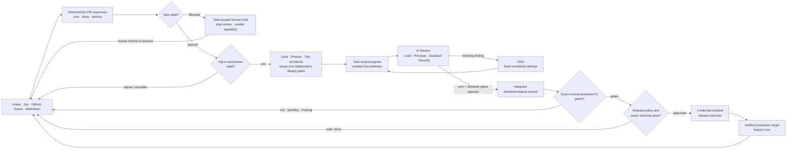

# Startup Factory

> **Turn your product board into a governed software delivery system.**

**Startup Factory is an agentic orchestration framework for end-to-end product
delivery.** Connect the project-management tool your team already loves—Linear,
Jira, GitHub Issues, local Markdown, or your own adapter—and make it the durable
control plane for a cross-functional team of AI agents.

Put a `[task]` in ToDo—the shipped mapping of the generic queued state.
When automation is enabled and scheduled, the deterministic PM supervisor
checks the board every three minutes by default, leaves anything labeled
`human-work` to people, routes every other queued task by its explicit team
preset (or your configured default), and drives it through architecture,
implementation, a three-reviewer core `In Review` gate, declared Security/QA
specialist gates, and
integration. It also observes Blocked work as a human-controlled safety lock:
the matching task workers stop, while independent ToDo work continues. When
your release policy, exact approval, and protected green CI proof allow it, a
separate credential-isolated executor deploys the reviewed immutable artifact,
verifies the target, and only then closes the parent `[feature]` as `Live`.

Bring your own models, repository, stack, tracker, and infrastructure.
Provider-neutral structured hooks can target production in any cloud,
platform, cluster, datacenter, or internal environment that can implement the
plan/apply/status/verify contract. Startup Factory supplies the delivery
protocol, team topology, deterministic runtime, recovery model, and safety
boundaries around them.

**Project-management native · Multi-model · Cloud agnostic · Fail closed ·
Auditable**

This is not a hidden chatbot loop. Plans, ownership, progress, decisions,
evidence, blockers, approvals, policy denials, and deployment state remain
visible in the same board where your team manages the product. Tracker text and
claimed authorship are workflow evidence, never security authentication or
production authority.


```text
ToDo -> In Progress -> In Review -> Ready for production -> deploy -> Live
                          findings -> ToDo -> fresh attempt -> In Progress
             red / pending / missing CI ----------------------X deploy anywhere
```

> **Safe by default:** board automation and production delivery both ship
> disabled. Ordinary agents never receive production credentials; enabling a
> release requires protected external configuration, hooks, identities, and
> verification. Only an exact, current green CI/CD proof for the release commit
> permits deployment.

## Table of contents

- [Layered safety boundaries for AI builders](#layered-safety-boundaries-for-ai-builders)
- [Why Startup Factory](#why-startup-factory)
- [Superpowers + Startup Factory](#superpowers--startup-factory-split-the-sdlc-by-strength)
- [Full transparency in your tracker](#full-transparency-in-your-tracker)
- [Choose your operating mode](#choose-your-operating-mode)
- [Requirements](#requirements)
- [Quick Start (2 minutes, no accounts)](#quick-start-2-minutes-no-accounts)
- [Install into your repository](#install-into-your-repository)
- [Connect your LLM](#connect-your-llm)
- [Connect your tracker](#connect-your-tracker)
- [Configure](#configure)
- [Use it](#use-it)
- [Automate the board and production delivery](#automate-the-board-and-production-delivery)
- [The six preset teams](#the-six-preset-teams)
- [How it works](#how-it-works)
- [Documentation map](#documentation-map)
- [Directory map](#directory-map)
- [Extend it](#extend-it)
- [Troubleshooting](#troubleshooting)
- [Credits](#credits)
- [License](#license)

---

## Layered safety boundaries for AI builders

Autonomous agents are only as useful as the boundaries around them. Startup
Factory supplies fail-closed workflow and release controls, but repository code
is not an operating-system security boundary. Ordinary agents still require a
real worktree-scoped sandbox and least-privilege identity:

- **A code-owned production policy gate.** `bin/policy-check.py` screens every
  privileged release-hook command and normalized production plan before that
  subprocess starts. Its deny
  baseline — shell composition, privilege escalation, filesystem/database/
  infrastructure destruction, secret dumping, metadata-credential access,
  encoded-command bypasses — is owned by the code: project configuration can
  **add** denials, never remove one.
- **A three-tier authority model.** Every action resolves to **DENY**,
  **REQUIRE HUMAN APPROVAL**, or **ALLOW** (`reference/guardrails.md`).
  Approvals bind exact digests, environments, targets, expirations, and one-use
  nonces. Silence never approves; unknown anything is denied.
- **A `[task]`-level release-denial trail.** A normalized production-plan denial
  is projected idempotently as `[DENIED ACTION]` through
  `bin/tracker-ops.sh record-denial`. Other launcher, path, queue, and identity
  preflight refusals fail before mutation and remain in protected runtime logs;
  they are not falsely advertised as tracker records.
- **Least-privilege agent sandboxes.** In enforced mode every LLM process and
  `WORKTREE_SETUP` runs as `AGENT_SANDBOX_RUNNER --workdir <absolute> --
  /usr/bin/env -i ...`. The launcher accepts only a protected executable outside
  the repository; that runner must enforce filesystem, process, network, and IAM
  isolation. In broker mode no LLM—including the team lead—receives tracker
  credentials.
- **Contained workspaces.** Every implementer is isolated in its own git
  worktree; tracker file paths are symlink-safe and confined to their configured
  root; integration and terminal transitions are serialized, verified by
  read-back, and reserved to dedicated components.
- **Automation that is off by default.** The portfolio supervisor is
  deterministic (not an LLM), disabled until explicitly enabled, and stops the
  pass rather than fabricating state when anything is malformed.

The built-in authority policy is intentionally simple:

| Decision | Representative actions | Who can authorize it |
|---|---|---|
| **Always deny** | Path escape or recursive/bulk deletion outside disposable task scope; database/schema drops or truncation; production instance, cluster, storage, network, DNS, certificate, key, backup, or log deletion; secret extraction; privilege escalation; wildcard IAM; force-push/history rewrite; sandbox or policy bypasses | Nobody inside Startup Factory. Use a separate human-operated break-glass process. |
| **Require exact human approval** | Non-destructive production infrastructure, IAM, network, DNS, certificate, capacity, schema, backfill, traffic, cost, or scale changes; external communication | A protected verifier must authorize the exact manifest, target, commit, artifact, digests, expiry, and one-use nonce. A tracker comment is not approval. |
| **Allow within scope** | Read-only inspection, plans, tests, builds, linting, worktree-local edits, task-branch checkpoints, brokered integration, health checks, and a policy-clean immutable-artifact release | The assigned role or deterministic executor, within its path, identity, target, quota, and lifecycle boundaries. |

The full non-bypassable list and enforcement boundary are in
[`reference/guardrails.md`](reference/guardrails.md).

The result: you can hand real delivery work to AI agents and inspect, from your
tracker, the workflow actor, workflow approvals, production approval ID, and
policy denials for each delivery. Authenticated production approver identity
remains in protected transaction state; tracker authorship is never treated as
authentication.

## Why Startup Factory

| Advantage | What it gives you |
|---|---|
| **Move fast without merge chaos** | A deterministic dispatcher launches only design-approved, dependency-ready, resource-safe work. Each attempt gets its own task branch and worktree; integration stays serialized. |
| **See the whole delivery, not just agent output** | One live `[progress]` record per `[task]` and one `[digest]` per `[feature]` show tracker status, execution stage, actor, and attempt in your project-management tool. |
| **Use the right model for each job** | Mix Claude, Codex, Gemini, or any file-reading CLI by role, then route individual tasks to fast, standard, or strong model profiles. |
| **Keep quality gates explicit** | Architecture approval precedes implementation. In Review requires independent approvals from the Principal Architect, Sceptical Principal Architect, Senior Security Engineer, and Team Lead over one exact package; optional QA may add evidence, and the integrator runs your build, test, and lint commands before merging. |
| **Recover instead of restarting** | Immutable task packets, durable events, checkpoint branches, an idempotent outbox, and attempt-aware relaunches make interrupted work inspectable and recoverable. |
| **Keep your stack and your tracker** | The same workflow runs across languages, frameworks, LLMs, and project-management tools. Start offline with Markdown and switch adapters without rewriting the process. |
| **Turn the board into a safe delivery queue** | A deterministic cron/service pass observes queued/blocked work, restores in-flight runs, chooses an explicit team preset, and launches LLMs only for eligible queued tasks. |
| **Pause one task without stopping the factory** | On the next scan, `[Blocked]` immediately fences only the matching task. Independent ToDo work and other features continue; only a human can unlock it. |
| **Keep dangerous authority out of agents** | One deny/approval/allow contract governs every role. The code gate blocks dangerous privileged release hooks and plans; your required OS sandbox and least-privilege identities enforce ordinary-agent filesystem, network, process, and IAM boundaries. |

## Superpowers + Startup Factory: split the SDLC by strength

[`obra/superpowers`](https://github.com/obra/superpowers) and Startup Factory
operate at different, complementary levels.

Superpowers is an engineering methodology packaged as agent skills. Its full
upstream workflow can cover brainstorming, implementation planning, worktree
creation, task execution, TDD, debugging, code review, verification, and branch
completion. Startup Factory is a project delivery control plane: it coordinates
product, architecture, implementation, security, quality, integration,
portfolio automation, and production release across durable tracker state and
multiple independent agents.

The combined integration deliberately uses **the strongest part of each system
without running two execution orchestrators**:

- Superpowers shapes the idea into an approved specification and detailed
  implementation plan.
- Startup Factory reviews those documents as inputs, creates and governs the
  tracked delivery, and owns execution through verified production.
- Claude task workers may use focused Superpowers methods for TDD, debugging,
  receiving review, and fresh verification inside their one assigned task.
- Superpowers does not create a second worktree, dispatch a second team, execute
  the plan, merge the branch, or declare the feature released.

```mermaid
flowchart LR
    Idea["Product idea or ticket"]
    Brainstorm["Superpowers brainstorming<br/>questions · alternatives · approved design"]
    Plan["Superpowers writing-plans<br/>exact files · interfaces · tests · commands"]
    Handoff["Digest-bound planning handoff<br/>committed spec + plan"]
    Shape["Startup Factory planning review<br/>Product · Lead · Principal · Sceptical"]
    Tracker["Tracked feature and tasks<br/>acceptance · dependencies · resources"]
    Execute["Startup Factory execution<br/>packets · branches · worktrees · dispatch"]
    Methods["Claude-local Superpowers methods<br/>TDD · debugging · review response · verification"]
    Review["Exact-package review board<br/>Lead · Principal · Sceptical · Security"]
    Integrate["Serialized integration<br/>validated feature branch"]
    Release["Protected CI and release<br/>policy · approval · deploy · verify"]

    Idea --> Brainstorm --> Plan --> Handoff --> Shape --> Tracker --> Execute
    Execute --> Methods --> Review --> Integrate --> Release
```



### Why divide the lifecycle

| Reason | Benefit |
|---|---|
| **One authority per stage** | The specification has one source, the tracker has one workflow owner, each task has one active attempt, the feature branch has one integrator, and production has one protected release executor. |
| **Methodology stays separate from orchestration** | Superpowers can improve how Claude thinks, plans, tests, and debugs without competing with Startup Factory's scheduler, worktrees, review board, tracker writers, or release transaction. |
| **Different scopes get different tools** | Superpowers is excellent at the local reasoning loop around one design or task. Startup Factory governs the wider system of roles, dependencies, concurrent work, artifacts, statuses, and environments. |
| **Independent models remain independent** | Claude may shape the plan, while Codex, Gemini, or another model can challenge architecture, implement, review, or test without receiving Claude-only Superpowers instructions. |
| **Planning remains challengeable** | A polished plan is evidence, not authority. Product and both architects still test its scope, acceptance criteria, interfaces, risks, dependencies, and delivery order before work is created or dispatched. |
| **Recovery becomes durable** | Superpowers provides strong session-level discipline; Startup Factory adds tracker history, immutable packets, attempt identity, event journals, idempotent outboxes, resumable integration, and restart-safe production transactions. |
| **The integration is reversible** | `USE_SUPERPOWERS=false` removes all Superpowers-specific wiring without changing the Startup Factory lifecycle, tracker model, team topology, or release controls. |

### SDLC responsibility map

| SDLC stage | Superpowers contribution | Startup Factory contribution | Primary owner in this integration |
|---|---|---|---|
| Idea discovery | Socratic clarification, one question at a time, alternative approaches, trade-offs, incremental user approval | Product context, repository constraints, explicit scope and NOT-in-scope | **Superpowers**, with human approval |
| Specification | Writes and self-checks the design document; requires the user to review the written spec | Product Manager and architects challenge completeness, boundaries, risks, and acceptance criteria | **Superpowers produces; Startup Factory accepts or pushes back** |
| Implementation planning | Produces detailed tasks with exact files, interfaces, code steps, test commands, expected results, and no placeholders | Converts the plan into independently reviewable vertical slices, dependencies, tracks, resources, and model profiles | **Shared handoff; Startup Factory owns executable project structure** |
| Tracker and portfolio management | Not used as the project control plane | Creates `[features]` and `[tasks]`, owns legal statuses, routing, progress, digests, automation scope, and generations | **Startup Factory** |
| Per-task design | May inform the proposed implementation | Requires implementer design notes, contract registration, and independent Principal + Sceptical approval before code | **Startup Factory** |
| Implementation | TDD and disciplined small-step engineering methods inside a Claude task | Selects the worker/model, creates immutable packets and isolated attempts, enforces scope, and records evidence | **Startup Factory orchestrates; Superpowers improves the local method** |
| Debugging | Root-cause investigation, pattern comparison, one hypothesis at a time, regression test, fresh verification | Task-scoped stop/retry/escalation, durable evidence, attempt recovery, and architectural re-review when needed | **Shared: Superpowers method inside Startup Factory boundaries** |
| Code review | Helps a worker receive feedback technically and verify fixes | Four independent, commit-bound verdicts over one exact review package, plus optional QA and specialist evidence | **Startup Factory** |
| Integration | Upstream Superpowers has branch-finishing workflows, but they are not invoked here | The integrator alone validates and writes the feature branch; brokered transactions make retries idempotent | **Startup Factory** |
| CI, release, and production | No production authority in this integration | Exact-commit protected CI, policy checks, approval binding, isolated credentials, plan/apply/status/verify hooks, rollback, and `Live` transition | **Startup Factory** |
| Operations and recovery | Session-level verification discipline | Portfolio reconciliation, human `[Blocked]` locks, stale-worker fencing, release recovery, and auditable tracker projections | **Startup Factory** |

### Where Superpowers is strongest

- **Design before code.** Its
  [`brainstorming`](https://github.com/obra/superpowers/blob/main/skills/brainstorming/SKILL.md)
  skill explores the repository, asks focused questions, compares approaches,
  validates the design section by section, writes the specification, performs a
  consistency/ambiguity review, and waits for user approval.
- **Plans that another engineer can execute.**
  [`writing-plans`](https://github.com/obra/superpowers/blob/main/skills/writing-plans/SKILL.md)
  insists on exact paths, explicit interfaces, complete steps, concrete test
  commands, expected outcomes, small commits, TDD ordering, and no `TBD` or
  “similar to the previous task” shortcuts.
- **Strict engineering habits.**
  [`test-driven-development`](https://github.com/obra/superpowers/blob/main/skills/test-driven-development/SKILL.md)
  enforces a real red-green-refactor loop;
  [`systematic-debugging`](https://github.com/obra/superpowers/blob/main/skills/systematic-debugging/SKILL.md)
  requires root-cause evidence before fixes; and
  [`verification-before-completion`](https://github.com/obra/superpowers/blob/main/skills/verification-before-completion/SKILL.md)
  requires fresh command output before a success claim.
- **Useful local review discipline.**
  [`receiving-code-review`](https://github.com/obra/superpowers/blob/main/skills/receiving-code-review/SKILL.md)
  helps a Claude worker evaluate feedback technically, clarify uncertainty, fix
  one issue at a time, and verify the result instead of responding performatively.

Those strengths are intentionally used as **planning inputs and task-local
methods**. They do not grant tracker, scheduler, integration, or production
authority.

### Where Startup Factory is strongest

- **Cross-functional governance.** Product, Team Lead, Principal Architect,
  Sceptical Principal Architect, Security, implementation, QA, integration, and
  release have explicit and non-interchangeable responsibilities.
- **Multi-model independence.** Assign different model families to design,
  challenge, implementation, and review so one model's blind spot does not
  silently become the team's consensus.
- **Deterministic execution.** The dispatcher—not an LLM—selects eligible work
  from tracker state, dependencies, resource conflicts, design approvals, risk,
  and capacity.
- **Isolation and recoverability.** Every attempt gets an immutable task packet
  containing the complete current tracker comment history, a collision-safe
  branch, separate worktree, report path, event history, and authenticated
  publication capability.
- **Review and integration integrity.** Three distinct core reviewers plus any
  risk-declared Security/QA gates decide against the same exact package. No
  approval survives changed code, and only the integrator writes the feature branch.
- **Human and production safety.** `[Blocked]` is a human-controlled task lock.
  Production requires protected CI evidence, policy-clean plans, exact external
  authority where configured, isolated credentials, target verification, and a
  durable transaction.
- **End-to-end visibility.** The project-management tool remains the durable
  record from idea and acceptance criteria through findings, rework,
  integration, deployment, and `Live`.

### Execution workflows that must not overlap

Upstream Superpowers includes excellent execution workflows for projects that
use Superpowers alone. Startup Factory replaces these at the orchestration
layer for a feature delivered by a Startup Factory team:

| Superpowers workflow | Startup Factory owner used instead |
|---|---|
| `using-git-worktrees` | Per-attempt worktrees created and retired by `launch-team.sh` |
| `subagent-driven-development` / `executing-plans` | Tracker-driven task packets and deterministic `dispatch.sh` scheduling |
| `requesting-code-review` as the authoritative gate | Exact-package Startup Factory core board plus declared supporting gates |
| `finishing-a-development-branch` | Serialized integrator plus protected release lifecycle |

Do not run both execution systems on the same feature. Two schedulers cannot
safely share task identity, branches, worktrees, review state, or completion
authority.

### When to use which mode

| Mode | Best fit |
|---|---|
| **Superpowers + Startup Factory** | A meaningful Claude-planned feature that should become tracked, independently challenged, implemented by a team, reviewed, integrated, and potentially delivered to production. |
| **Startup Factory alone** | Non-Claude runtimes, an already-approved specification, operational/release work, or any project that wants native planning without the Superpowers dependency. |
| **Superpowers alone** | A local coding session where you explicitly want the upstream Superpowers execution workflow and do not launch a Startup Factory team for the same work. |

### How to use the combined workflow

The example below uses Claude Code for planning and a Startup Factory team for
delivery. Upstream Superpowers supports other coding agents too, but this
integration is intentionally enabled by default **only for Claude Code**.

1. Install both systems and create the feature branch that will become the
   Startup Factory team name:

   ```bash
   # In Claude Code:
   /plugin install superpowers@claude-plugins-official

   # In your project shell:
   SF_HOME=.claude/skills/startup-factory
   git switch -c payments-revamp
   ```

2. Keep the default planning configuration, or inspect it before starting:

   ```text
   USE_SUPERPOWERS=true
   SUPERPOWERS_PLUGIN_ID=superpowers@claude-plugins-official
   SUPERPOWERS_SPEC_ROOT=docs/superpowers/specs
   SUPERPOWERS_PLAN_ROOT=docs/superpowers/plans
   ```

   `true` means “Claude is eligible,” not “enable Superpowers for every model.”
   Codex, Gemini, and unmarked harnesses stay on the native workflow.

3. Verify that Claude can use the configured plugin:

   ```bash
   python3 "$SF_HOME/bin/superpowers-planning.py" preflight --runtime claude
   ```

4. Ask Claude to shape the ticket, and make the ownership boundary explicit:

   ```text
   Use superpowers:brainstorming to shape this feature. Explore the repository,
   clarify scope and success criteria, compare approaches, and write the approved
   specification. After I approve the written spec, use
   superpowers:writing-plans to create the detailed implementation plan.

   Stop after the committed specification and plan. Do not use Superpowers
   worktrees, subagent-driven-development, executing-plans, code-review
   orchestration, or branch-finishing. Startup Factory will own execution.
   ```

5. Review the generated documents. They normally live under:

   ```text
   docs/superpowers/specs/YYYY-MM-DD-<topic>-design.md
   docs/superpowers/plans/YYYY-MM-DD-<feature-name>.md
   ```

   Both files must be committed. If either changes later, commit the change,
   recreate the handoff, and repeat any affected planning approvals.

6. Bind the exact documents to the Startup Factory team:

   ```bash
   TEAM=payments-revamp
   FEATURE_ID=ENG-100
   SPEC=docs/superpowers/specs/2026-07-16-payments-revamp-design.md
   PLAN=docs/superpowers/plans/2026-07-16-payments-revamp.md

   "$SF_HOME/bin/launch-team.sh" planning-handoff \
     "$TEAM" "$SPEC" "$PLAN"
   ```

7. Let Startup Factory review and operationalize the handoff. The Product
   Manager, Team Lead, Principal Architect, and Sceptical Architect still
   approve scope, acceptance criteria, contracts, dependencies, risks, vertical
   slices, and execution order before implementation.

   A suitable instruction to the Startup Factory agent is:

   ```text
   Use the validated planning handoff for payments-revamp as planning evidence.
   Review it with the Product Manager, Team Lead, Principal Architect, and
   Sceptical Architect. Resolve pushback, then create or update ENG-100 and its
   vertical-slice tasks with acceptance criteria, dependencies, tracks, files,
   resources, and model profiles. Startup Factory owns all execution.
   ```

8. Launch the normal Startup Factory delivery:

   ```bash
   "$SF_HOME/bin/launch-team.sh" preflight "$TEAM" "$FEATURE_ID"
   "$SF_HOME/bin/launch-team.sh" gate-team full-stack "$TEAM" "$FEATURE_ID"
   "$SF_HOME/bin/dispatch.sh" "$TEAM" "$FEATURE_ID" --watch
   ```

   Direct `claude` commands in `config/team.config.md` are recognized
   automatically. Mark a Claude wrapper explicitly:

   ```text
   FRONTEND_CMD="STARTUP_FACTORY_LLM_RUNTIME=claude /path/to/claude-wrapper {prompt_file}"
   ```

   In harness mode, declare Claude while composing:

   ```bash
   STARTUP_FACTORY_LLM_RUNTIME=claude \
     "$SF_HOME/bin/launch-team.sh" compose "$TEAM" "$FEATURE_ID" team-lead full-stack
   ```

9. To return completely to native Startup Factory planning, edit
   `config/planning.config.md`:

   ```text
   USE_SUPERPOWERS=false
   ```

For the exact machine-enforced boundary, see
[`reference/superpowers-planning.md`](reference/superpowers-planning.md).

## Full transparency in your tracker

Startup Factory treats the tracker as the durable collaboration surface, not a
status board updated after the real work happened. The local runtime makes
coordination fast, but the information a human needs to supervise delivery is
projected back into the configured tool.

| You can inspect | How it stays visible |
|---|---|
| Scope and execution order | `[features]`, `[tasks]`, dependencies, resource declarations, and legal board transitions |
| Design decisions | Structured design notes, pushback, approvals, conditions, and numbered architecture checklists |
| Live progress | A mechanically updated `[progress]` record on every task and a compact `[digest]` across the feature |
| Validation and review | Evidence records, changed-file lists, review findings, exact artifact paths, and explicit `NOT validated` declarations |
| Blockers and human decisions | Proven `blocked-by` relationships plus escalations with a question, options, and a default if you are unavailable |
| Release-policy denials | Idempotent `[DENIED ACTION]` audit comments for normalized production plans; other preflight refusals remain in protected runtime logs |
| Delivery | The integrated commit, completed validation gates, generic `[Ready to deploy]` (shipped as `Ready for production`), protected green CI proof, and an idempotent `[deployment]` projection through verified production and `Live` |

Use as much of the system as your project needs:

| Layer | What it gives you | Where |
|---|---|---|
| **1. PM port** | One AI agent creates/tracks/completes `[features]` and `[tasks]` in any configured tracker through one tool-agnostic workflow. | `SKILL.md`, `reference/`, `adapters/` |
| **2. Governed squad** | A lead coordinates, two independent architects gate design, specialists implement, and three distinct core agents—the Team Lead and both architects—approve every exact review package. Security and QA join when declared by risk; the integrator alone writes the feature branch. | `reference/orchestration.md`, `roles/` |
| **3. Task-driven runtime** | Event-driven dispatch, bounded parallel waves, model routing, exact review packages, durable handoffs, and recoverable integration. | `bin/dispatch.sh`, `bin/runtime-state.py`, `bin/integrate-task.sh` |
| **4. Preset teams** | Six ready-made rosters for full-stack, backend, frontend, security, infrastructure, and LLM/data-science work, all resolved through the same team launcher. | `teams/`, `bin/launch-team.sh` |
| **5. Portfolio automation** | One bounded cron/service pass observes generic queued/blocked statuses, bootstraps only queued feature runs, and reconciles comments, task holds, and team actions. | `bin/pm-agent.py`, `reference/automation.md` |
| **6. Safe production delivery** | Structured provider-neutral plan/apply/status/verify hooks, hard guardrails, isolated credentials, crash recovery, and bounded rollback. | `bin/release-feature.py`, `bin/policy-check.py`, `reference/deployment.md` |

Everything is inspectable: plain Markdown, shell scripts, small Python utilities,
and git. There is no application server or coordinator database to host;
schedulers invoke bounded scripts, and `--watch` is an optional foreground
clock owner. The system is **language-, framework-, tracker-, and LLM-agnostic**
because it manages the delivery contract around the code rather than assuming
anything about the stack.

## Choose your operating mode

Adopt only the layers you need; each mode keeps the same vocabulary and tracker
history.

| Your goal | Runtime shape | Start here |
|---|---|---|
| **Give one agent a reliable PM workflow** | Your existing agent reads `SKILL.md`; no daemon, external tracker, or team launcher is required. | [Two-minute offline quick start](#quick-start-2-minutes-no-accounts) |
| **Launch a governed specialist team** | The launcher and dispatcher coordinate task-scoped workers, gate roles, isolated worktrees, and serialized integration. | [Run a whole team](#a-whole-team) |
| **Continuously pull work from the board** | Cron, a service timer, or a hosted scheduler invokes one bounded deterministic `pm-agent.py --once` pass. | [Automate the board](#automate-the-board-and-production-delivery) |
| **Deploy approved work to a production target** | A protected deterministic executor runs digest-pinned provider hooks with isolated credentials and independent verification. | [Configure production delivery](#production-delivery-configuration) |

---

## Requirements

**Minimum (single agent):** a git repository, a POSIX shell, and any agentic LLM
CLI or IDE that can read files (Claude Code, Codex CLI, Gemini CLI, Aider,
Cursor, Windsurf, Cline, …). The release installer runs as an isolated Python
tool through `uvx` (or `pipx`) and does not require Homebrew, Node.js, `git`, or
`rsync`. The auditable shell compatibility path uses `curl`, `git`, and `rsync`.

**For multi-agent teams, additionally:** the launcher (`bin/launch-team.sh`) needs
`bash` + `git`; every implementation task uses a task branch and isolated
worktree. `tmux` is optional but recommended — without it, agents run as
background processes. Autonomous protocol gates additionally require a real
OS/container sandbox that hides Git-common-dir broker capability state and other
process environments from agent roles; Unix file modes alone do not isolate
same-UID processes. Configure that protected external executable as
`AGENT_SANDBOX_RUNNER` before enabling autonomous execution.

**Tracker access is optional.** The default `Markdown` tracker stores everything
in local files, so you can run the whole thing offline. Connect Linear/Jira/GitHub
when you're ready—via MCP, REST, or the `gh` CLI, depending on the adapter.

**For cron/service automation:** use one scheduler instance and a scriptable,
explicitly scoped adapter (REST/CLI/files; a cron process cannot invoke an MCP
client). The scan observes queued and Blocked work, but only queued work
bootstraps or launches. Registered runs are re-authorized on every pass through
an exhaustive per-feature export. Production
delivery additionally needs protected external structured hooks/config/state,
an external identity/isolation attestor for automatic mode, and a separate
short-lived credential environment that ordinary agents never inherit.

The human-only exit from `[Blocked]` also needs an operator-owned control in the
project-management tool: restrict outbound Blocked transitions to human
principals and deny them to every scheduler, bot, and service identity. Startup
Factory refuses its own outbound writes, but normalized adapters do not prove
who performed an external transition. If the tool cannot enforce status-level
permissions or provide verified transition provenance, treat the human-only
claim as an operational policy and keep autonomous portfolio automation disabled
for that tool.

---

## Quick Start (2 minutes, no accounts)

The fastest win: one AI agent managing work in local Markdown files. No tracker
account, API key, Homebrew formula, or global package is required—`Markdown` is
the default.

1. **From your project root, install the complete, versioned release bundle.**
   Codex and Aider use the shared Agent Skills project directory:

   ```bash
   uvx startup-factory@latest install --agent codex
   ```

   For Claude Code use `--agent claude-code`. Pin a release in controlled
   environments, for example `startup-factory@0.1.5`. `uvx` creates an isolated
   environment for the installer and leaves no Startup Factory package in your
   project environment.

   > The `uvx` path downloads the published PyPI package. For a Git checkout or
   > offline use, use the [auditable shell compatibility path](#shell-compatibility-path).

   This quick start demonstrates the one-agent workflow. Set `TEAM_MODE=false`
   in the installed `config/project-management.config.md` before continuing;
   fresh installations otherwise use the team workflow by default.

2. **Ask your agent, in plain language:**

   ```
   Plan a feature: add CSV export to the reports page.
   ```

   The skill creates a `[feature]` and a handful of `[tasks]` as Markdown files
   under `.workspace/task-manager/`. Then drive them:

   ```
   Start task 1.        → moves it to [Active], implements it
   Send task 1 to review.
   Finalize task 1.     → verified, committed + [Ready to deploy]
   ```

That's the whole loop — plan → start → review → complete — in generic vocabulary
that works identically on every tracker. When you're ready for a real tracker or
a full team, keep reading.

> **Sanity-check the runtime** (no LLM calls, no cost): from the installed
> skill directory, `bash tests/run-all.sh` should finish with
> `ALL TESTS PASS`.

---

## Install into your repository

Use a **project-scoped** copy. Startup Factory contains mutable tracker, team,
automation, deployment, and guardrail configuration, so one global copy should
not be shared across unrelated projects. Homebrew would still need a second
project-initialization step and is intentionally not part of the current
distribution.

Choose the project path your agent supports:

| Agent | Project install directory | Discovery |
|---|---|---|
| **Codex** | `.agents/skills/startup-factory` | Native project skill path |
| **Claude Code** | `.claude/skills/startup-factory` | Native project skill path |
| **Aider** | `.agents/skills/startup-factory` | Start with `aider --read .agents/skills/startup-factory/SKILL.md` |
| **Other agents** | Their native project skill directory | Use native discovery or point the agent at `SKILL.md` |

The release package embeds one deterministic bundle built from an exact Git
commit. The installer verifies every archived path, size, mode, and SHA-256
digest before planning a destination change, then records the installed
version, source commit, archive digest, and ownership policy locally.

```bash
# One-shot isolated install
uvx startup-factory@latest install --agent codex

# Claude Code
uvx startup-factory@latest install --agent claude-code

# Alternative isolated runner
pipx run startup-factory install --agent codex

# Persistent operator CLI
uv tool install startup-factory
startup-factory install --agent codex
```

Use an exact version instead of `@latest` in controlled environments. Package
index mirrors work through normal `uv`/`pipx` configuration; installation
semantics are not tied to a cloud, project-management tool, or deployment
provider.

For an explicit path instead of an agent mapping:

```bash
uvx startup-factory@latest install \
  --install-dir /absolute/path/to/startup-factory
```

### Shell compatibility path

Until the first package release, or on a host without `uv`/`pipx`, use the
auditable updater. The unique temporary file is removed automatically, and a
failed download cannot execute a stale installer:

```bash
SF_INSTALL_DIR=.agents/skills/startup-factory
(
  set -eu
  installer="$(mktemp "${TMPDIR:-/tmp}/startup-factory-install.XXXXXX")"
  trap 'rm -f "$installer"' EXIT
  curl -fsSLo "$installer" \
    https://raw.githubusercontent.com/alexrolls/startup-factory/main/bin/update-installed-skill.sh
  # Optional audit: less "$installer"
  bash "$installer" --install-dir "$SF_INSTALL_DIR"
)
```

If you already cloned or downloaded Startup Factory, skip `curl` and run its
local `bin/update-installed-skill.sh` with the same `--install-dir` argument.
The compatibility script fetches the complete repository bundle—not just
`SKILL.md`.

> **Why the README does not currently use `npx skills add`:** the open
> [Skills CLI](https://www.skills.sh/docs/cli) is the right long-term
> direction and correctly discovers this repository. However, its current
> remote repository-root installation path copies only the root `SKILL.md`.
> Startup Factory also requires `bin/`, `config/`, `adapters/`, `extensions/`,
> `reference/`, `roles/`, and `teams/`; an end-to-end installation without them
> is broken.
> Until a lean nested distribution is published, do not use `npx skills add`
> or `npx skills update` for Startup Factory.

### Safe updates

Preview and apply an update with the same release CLI. It recognizes the
selected project installation and performs a complete preflight before any
destination mutation:

```bash
uvx startup-factory@latest update --agent codex --dry-run
uvx startup-factory@latest update --agent codex
```

For Claude Code, use `--agent claude-code`. You can also ask your agent:

```
Fetch latest Startup Factory skill.
```

Existing project configuration remains byte-for-byte untouched by default,
while newly introduced config files are installed. Destination-only files under
the documented `adapters/`, `extensions/`, and `teams/` extension points are
also preserved. A generated ownership manifest lets later updates delete an
upstream extension that has been retired without mistaking project-owned files
for upstream files. A legacy installation without a manifest is migrated
conservatively: destination-only extension files are kept. If a later upstream
release introduces a file at a project-owned extension path, the update fails
before mutation instead of overwriting it:

- `config/project-management.config.md`
- `config/planning.config.md`
- `config/team.config.md`
- `config/statuses.config.json`
- `config/automation.config.json`
- `config/deployment.config.json`
- `config/guardrails.config.json`

To intentionally replace those files with upstream defaults too:

```bash
uvx startup-factory@latest update --agent codex --overwrite-config
```

To verify the owned runtime independently of preserved configuration and custom
extensions:

```bash
uvx startup-factory@latest verify --agent codex
```

The release CLI uses a sibling staging directory, an installation lock, and a
backup swap with rollback. Interrupted copying cannot silently turn a valid
installation into a partial one. Its main operator options are:

| Option | Purpose |
|---|---|
| `--agent codex\|claude-code\|aider` | Select the native project skill directory. |
| `--project PATH` | Resolve the agent directory relative to another project. |
| `--install-dir PATH` | Override the mapped installation directory. |
| `--bundle PATH` | For install/update, use an explicitly supplied local canonical archive. |
| `--overwrite-config` | For install/update, replace all seven preserved project configuration files. |
| `--dry-run` | For install/update, print the plan without writing the destination or lock. |
| `--json` | Emit machine-readable output for operator automation. |

Legacy/source-installed copies can continue to use the shell compatibility
updater from their installed bundle:

```bash
bash .agents/skills/startup-factory/bin/update-installed-skill.sh --dry-run
bash .agents/skills/startup-factory/bin/update-installed-skill.sh
```

It requires `git` and `rsync`, accepts `--remote-url` and `--ref`, and defaults
to `main`; prefer a reviewed tag or exact commit. The release CLI instead binds
its embedded bundle version and source commit to the Python package version.
The shell updater intentionally refuses any installation containing
`.startup-factory-install.json` or `.startup-factory-bundle.json`: synchronizing
a mutable Git checkout over a release-managed copy would destroy verifiable
provenance. Update those copies only through `uvx`, `pipx`, or another isolated
runner for the versioned `startup-factory` package.

Before synchronizing, the installer verifies the fetched bundle and refuses
filesystem root, the home directory, a Git repository root, symlink targets,
and unrelated non-empty directories. `--dry-run` never creates a missing
destination.

### Release provenance

`packaging/build_bundle.py` constructs the canonical archive from Git object
bytes at an exact commit—not from an uncommitted checkout—and normalizes archive
ordering, timestamps, ownership, and modes. Release CI builds it twice and
requires byte-identical output, embeds those exact bytes in the wheel and source
distribution, exercises the built wheel, generates GitHub provenance
attestations, and publishes through PyPI Trusted Publishing. The GitHub Release
is created from the same already-tested artifacts; nothing is rebuilt during
publication.

Before the first release, a maintainer must register the `startup-factory` PyPI
Trusted Publisher for `.github/workflows/release.yml` on the `pypi` GitHub
Environment, restrict that environment's deployment branches to `main` without
required reviewers for unattended publication, protect `main` with Package CI
as a required check, and enable immutable GitHub Releases. Every successful
push produced by a merge to `main` runs the release workflow. The merge must
advance the version in `pyproject.toml` because PyPI package versions are
immutable. After the exact merged commit is tested, attested, and published to
PyPI, the workflow creates the matching `vX.Y.Z` tag and GitHub Release from the
same artifacts.

Multi-agent teams require the **target project** to be a git repository because
every implementation attempt receives a task branch and git worktree. The skill
bundle may live inside that repository for interactive/manual use; autonomous
automation instead requires a reviewed, protected external installation. Use
the same installer with an absolute operator-owned destination outside the
checkout and every agent mount. Add `.teamwork/`
and `.workspace/` to the target repository's root `.gitignore`—ignore rules
inside a nested skill installation do not cover project-root runtime paths.

Two execution modes (`config/team.config.md` → `EXECUTION`) share the same
task-branch/worktree isolation: **`sequential`** runs one task worker at a time;
**`parallel`** dispatches dependency/resource-safe waves, bounded by
`MAX_ACTIVE_IMPLEMENTERS` (default 2 when unset). Gate roles and integration
remain serialized where required.

---

## Connect your LLM

There are two modes, and they connect to your LLM differently.

### Single agent — nothing to connect

You already run an agent (Claude Code, Codex, …). The skill is *instructions that
agent reads*, so there is no separate connection: install the bundle and talk to
your agent normally. Your existing LLM credentials are used as-is.

### Multi-agent teams — map each role to a CLI command

`config/team.config.md` is the **entire LLM coupling**: one line per role giving
the shell command that runs that role. The launcher composes each agent's startup
prompt into a file and substitutes its path for `{prompt_file}`.

Every cross-functional preset requires a Sceptical Architect. Its protocol
mapping, roster entry, role brief, and command are validated before any team
process starts; `SCEPTICAL_ARCHITECT_CMD=null` is a configuration error, not an
opt-out.

```
TEAM_LEAD_CMD="claude -p \"$(cat '{prompt_file}')\" --permission-mode acceptEdits"
PRINCIPAL_ARCHITECT_CMD="claude -p \"$(cat '{prompt_file}')\" --permission-mode acceptEdits"
SCEPTICAL_ARCHITECT_CMD="codex exec --full-auto \"$(cat '{prompt_file}')\""
BACKEND_CMD="codex exec --full-auto \"$(cat '{prompt_file}')\""
REVIEWER_CMD="gemini --yolo \"$(cat '{prompt_file}')\""
TEAM_DEFAULT_CMD="claude -p \"$(cat '{prompt_file}')\" --permission-mode acceptEdits"
```

Command templates for common CLIs:

| LLM / CLI | Command template |
|---|---|
| Claude Code | `claude -p "$(cat '{prompt_file}')" --permission-mode acceptEdits` |
| Codex CLI | `codex exec --full-auto "$(cat '{prompt_file}')"` |
| Gemini CLI | `gemini --yolo "$(cat '{prompt_file}')"` |
| Any file-reading CLI | `yourcli --prompt-file {prompt_file}` |

Direct `claude` commands are detected automatically. If Claude is behind a
wrapper, mark only that command template so mixed-model teams remain precise:

```bash
FRONTEND_CMD="STARTUP_FACTORY_LLM_RUNTIME=claude /path/to/claude-wrapper {prompt_file}"
```

**Mixing LLMs is the design intent** — e.g. Claude to lead and own the primary
architecture position, Codex to challenge it independently and implement, and
Gemini to review. Use different model families for the two architects when
possible to reduce correlated reasoning errors. Same-LLM teams still work.

Optional `TASK_FAST_CMD`, `TASK_STANDARD_CMD`, and `TASK_STRONG_CMD` overrides
route individual task packets by explicit `model-profile:`, conservative risk
classification, or a bounded low-risk fast path for documentation, formatting,
and structurally small test/config tasks. Missing overrides fall back to the
role command.

Use `review-gates: qa`, `review-gates: security`, or both in a [task]
description when risk requires those independent passes. The dispatcher routes
declared specialists before Team Lead review, and the integration evidence
validator rejects missing, stale, reordered, or package-mismatched supporting
approval. Deep Infra and Deep Security make `security` effective automatically.

### Harness mode — teammates as subagents, no CLI processes

If your harness can spawn subagents and message them (e.g. Claude Code's Agent
tool), skip the command map entirely: compose each role's startup prompt with
`bin/launch-team.sh compose <team> <featureId> <role> [preset]` and spawn the
role natively with it. Harness messages replace mailboxes, harness idle
notifications replace heartbeats, and the tracker stays the source of truth —
see `reference/orchestration.md` → *Harness mode*.

When the harness runtime is Claude Code, declare it while composing so the
default-on Superpowers integration is included:

```bash
STARTUP_FACTORY_LLM_RUNTIME=claude \
  bin/launch-team.sh compose <team> <featureId> <role> [preset]
```

Omit the variable for Codex, Gemini, and other runtimes.

**Command resolution per role:** explicit `<ROLE>_CMD` value → used; `<ROLE>_CMD=null`
→ role disabled; **absent** → falls back to `TEAM_DEFAULT_CMD`. That fallback is
why the many specialized preset-team roles need no per-role keys — set
`TEAM_DEFAULT_CMD` once and only override the roles you want on a different model.

> ⚠️ **Safety:** those templates use auto-approve flags (`acceptEdits`,
> `--full-auto`, `--yolo`) so agents can work unattended. Workers may commit
> untrusted checkpoints only to task branches; only the integrator writes the
> feature branch. Every implementer is isolated in its own git worktree — but still run teams on a branch you can
> throw away, and review the tracker before merging to your main branch.

---

## Connect your tracker

Pick one tracker in `config/project-management.config.md`:

```
PRODUCT_MANAGEMENT_TOOL=Markdown      # or Linear, Jira, GitHubIssues
```

Then wire its access (skip entirely for `Markdown`):

| Tracker | Access options | What to set |
|---|---|---|
| **Markdown** | none — local files | `MARKDOWN_ROOT` (default `.workspace/task-manager`) |
| **Linear** | MCP **or** REST API key | `LINEAR_ACCESS=mcp\|rest`; for `rest`, export `LINEAR_API_KEY` |
| **Jira** | MCP **or** REST API token | `JIRA_ACCESS=mcp\|rest`, exact `JIRA_PROJECT_KEY` and child `JIRA_TASK_ISSUE_TYPE`; for `rest`, export `JIRA_BASE_URL`, `JIRA_EMAIL`, `JIRA_API_TOKEN` |
| **GitHub Issues** | `gh` CLI **or** GitHub MCP | `GITHUB_REPO` (explicitly required for automation; interactive use may infer from git remote), `GITHUB_USE_MCP` |

The **REST/API-key** paths mean harnesses without an MCP client (Codex, Aider,
plain scripts) are first-class. Each `adapters/<Tool>.md` has an *Access
mechanisms* section with the exact setup (MCP, REST/`curl`, `gh`, or local-file
instructions as appropriate).
Scriptable remote operations have a 60-second inner deadline by default;
operators may set `TRACKER_OPERATION_TIMEOUT_SECONDS` to an integer from 1
through 300, while automation's `operationTimeoutSeconds` remains the outer
process-group bound.

**Credentials live in environment variables, never in the config files.** Once
access is configured, switching among shipped adapters is a one-line change to
`PRODUCT_MANAGEMENT_TOOL`; no workflow, prompt, or role brief mentions a tracker
by name. A new tool also needs its adapter contract and deterministic
`tracker-ops.sh` backend before unattended dispatch or automation can use it.

---

## Configure

Core operation uses three files. Autonomous operation adds three fail-closed
JSON templates. Project policy stays versioned; an enabled deployment config is
instead copied to operator-protected storage outside agent mounts.

### `config/project-management.config.md` — the tracker

| Key | Meaning | Default |
|---|---|---|
| `PRODUCT_MANAGEMENT_TOOL` | Active tracker (matches an `adapters/<Name>.md`) | `Markdown` |
| per-tool block | Access mode + defaults for the active tracker (see above) | — |
| `TEAM_MODE` | `true` enables the multi-agent status-ownership model; set `false` for the single-agent workflow | `true` |
| `STRICT_STATUS` | `true` = refuse an action if a `[task]` isn't in the expected status (the "andon cord") | `true` |

> Team mode is enabled in new installations. Set **`TEAM_MODE=false`** to opt
> into the single-agent workflow.

### `config/planning.config.md` — optional Claude planning intake

| Key | Meaning | Default |
|---|---|---|
| `USE_SUPERPOWERS` | Make Claude Code eligible for `obra/superpowers` brainstorming and plan-writing; non-Claude runtimes stay native | `true` |
| `SUPERPOWERS_PLUGIN_ID` | Required Claude Code plugin id checked by the planning preflight | `superpowers@claude-plugins-official` |
| `SUPERPOWERS_SPEC_ROOT` | Repository-relative root for approved specifications | `docs/superpowers/specs` |
| `SUPERPOWERS_PLAN_ROOT` | Repository-relative root for approved implementation plans | `docs/superpowers/plans` |

Run `python3 bin/superpowers-planning.py preflight --runtime claude` before the
Claude planning stages, then
`bin/launch-team.sh planning-handoff <team> <spec-path> <plan-path>` before
launching the Startup Factory team. Set `USE_SUPERPOWERS=false` to remove all
Superpowers-specific prompt wiring. With the default `true`, only commands
classified as Claude receive that wiring. See
[Superpowers + Startup Factory](#superpowers--startup-factory-split-the-sdlc-by-strength)
for the end-to-end workflow and SDLC ownership map.

### Configure your board

`config/statuses.config.json` defines both state machines: every status, legal
`transitions`, owner, and per-tracker `tool` mapping. The internal task flow is
`Planned → Active → Review → Ready to deploy`, shipped to project tools as
`ToDo → In Progress → In Review → Ready for production`; `Blocked` is the
task-scoped human-held state. Review findings move the task from `Review` back
to `Planned`/`ToDo`, and the dispatcher starts a fresh implementation attempt
that returns through `In Progress`. The listed outbound transitions normalize
human project-management actions; Startup Factory itself cannot author them.
The internal feature flow is `Planned → Active → Resolved`, shipped with
`Resolved` mapped to `Live`. Add, rename, or remove
statuses by editing the JSON, then run `bin/launch-team.sh validate-board` to
check the structural graph, reachability, owners, and marker roles. Separately
verify that your active adapter maps every status to a real tracker state (the
Markdown tracker needs nothing).
On the shipped board, only the deterministic `release-executor` owns terminal
feature status `Resolved`; disabled or unverified delivery remains non-terminal.

### `config/team.config.md` — the team (only for multi-agent)

| Section | Keys | Purpose |
|---|---|---|
| Role → command | `TEAM_LEAD_CMD`, `PRINCIPAL_ARCHITECT_CMD`, `SCEPTICAL_ARCHITECT_CMD`, `SENIOR_SECURITY_ENGINEER_CMD`, `INTEGRATOR_CMD`, `BACKEND_CMD`, `FRONTEND_CMD`, `QA_CMD`, `REVIEWER_CMD`, `TEAM_DEFAULT_CMD` | Which CLI runs each role ([see above](#multi-agent-teams--map-each-role-to-a-cli-command)) |
| Task model routing | `TASK_FAST_CMD`, `TASK_STANDARD_CMD`, `TASK_STRONG_CMD` | Optional task-level command overrides selected from packet metadata and conservative risk classification; each falls back to the role command |
| Coordination | `TEAMWORK_ROOT` (`.teamwork`), `AGENT_ENV_ALLOWLIST` (non-secret minimum), `POLL_INTERVAL_SECONDS` (120), `STUCK_AFTER_MINUTES` (15), `ESCALATE_AFTER_ATTEMPTS` (2), `TRACKER_WRITERS` (`broker`), `EXECUTION` (`sequential`), `MAX_ACTIVE_IMPLEMENTERS` (`null`) | Canonical symlink-free workspace paths; LLMs start with `env -i`; deterministic broker keeps tracker credentials out of every LLM role; event-driven supervision with polling fallback; bounded sequential/parallel scheduling |
| Worktree provisioning | `WORKTREE_SETUP` | Non-empty setup command run once inside every fresh task worktree through the same sandbox boundary; autonomous mode rejects null/no-op provisioning. |
| Agent isolation | `AGENT_SANDBOX_RUNNER`, `AGENT_SANDBOX_ENFORCED` | Protected external `runner --workdir ABSOLUTE -- /usr/bin/env -i …` boundary. The runner, not Startup Factory code, must enforce filesystem, process, network, and identity isolation. |
| Lifecycle authority | `BROKER_LIFECYCLE_ROOT` | Absolute protected external mode-0700 root for HMAC-authenticated PID/start/tmux identities. Without it, manual processes are unmanaged and `stop` refuses to signal. |
| Validation | `VALIDATE_BUILD`, `VALIDATE_TEST`, `VALIDATE_LINT`, `VALIDATE_FORMAT`, `VALIDATE_SCRIPT` | Your stack's commands; the integrator runs them before every merge (`null` = skip). `VALIDATE_SCRIPT` replaces all four with one repo-owned script that receives the changed-file list |

Point the `VALIDATE_*` commands at your real build/test/lint (e.g.
`VALIDATE_TEST="pytest"`) — this is the only place the framework-agnostic
integrator learns about your stack.

### Automation, deployment, and guardrails

| File | Purpose | Safe default |
|---|---|---|
| `config/automation.config.json` | Scan cadence, separate observation/launch kinds, task-hold policy, run cap, branch/worktree root, allowed/default team presets | `enabled: false` |
| `config/deployment.config.json` | Disabled template for protected external target/state paths, trusted base, code/hook pins, positive environment boundaries, protected CI/attestation/approval hooks, and timeouts | `enabled: false`, `approval-required` |
| `config/guardrails.config.json` | Project additions to the built-in immutable deny policy and automatic cost/change limits | Zero cost delta; cannot weaken built-ins |

#### Board automation configuration

Copy [`config/automation.config.json`](config/automation.config.json) to
protected external storage before enabling it. The scheduler reads these keys:

| Key | Shipped value | Meaning |
|---|---:|---|
| `schemaVersion` | `1` | Configuration schema; unknown versions fail closed. |
| `enabled` | `false` | Master switch. A disabled pass launches nothing. |
| `trustedPath` | `/usr/bin:/bin` | Absolute protected command-search directories used by the scheduler. |
| `scanIntervalMinutes` | `3` | Board scan interval, from 1 through 1440 minutes. Omit it to retain the three-minute default. Legacy `pollSeconds` is accepted only when this key is absent. |
| `leaseSeconds` | `900` | Single-host pass lease and bounded stale-recovery window; integer 5–86400. |
| `operationTimeoutSeconds` | `120` | Outer deadline for each adapter, launcher, and dispatcher child process; integer 5–3600. |
| `releaseTimeoutSeconds` | `7200` | Separate outer deadline for the complete release transaction; integer 60–86400 and at least the conservative full hook-path bound. |
| `maxFeaturesPerPass` | `2` | Maximum new feature runs bootstrapped in one pass, from 1–1000; existing runs reconcile first. The omission fallback is 1. |
| `requireAgentSandbox` | `true` | Mandatory invariant; `false` or missing is rejected. |
| `requireSingleTrackerWriter` | `true` | Mandatory invariant requiring deterministic broker writes. |
| `observeStatusKinds` | `queued`, `blocked` | Exact adapter-neutral kinds to observe. The shipped project mapping is ToDo and Blocked; observation is not launch authority. |
| `launchStatusKinds` | `queued` | The only kind eligible for a new automatic launch. `[Blocked]` is observed solely to enforce its hold. |
| `blockedTaskPolicy` | task-scoped, human exit, no automatic resume | Fixed fail-closed policy: continue independent work, refresh all communication, propagate only lead-confirmed direct dependencies, and use a fresh attempt after human resume. Missing, unknown, or weaker values are rejected. |
| `ignoredTaskLabels` | `human-work` | Case-insensitive tracker labels that reserve a task for people. New matching tasks are never claimed or launched; if the label appears mid-flight, the next reconcile stops/fences that task while independent work continues. Removing it restores normal status-specific handling on the next scan. |
| `reconcileRegisteredRuns` | `true` | Re-export and re-authorize every unfinished registered feature on each pass. |
| `baseRef` | `main` | Feature-run starting ref whose resolved base commit is recorded immutably. Production provenance is anchored separately by deployment `trustedBaseRef`. |
| `branchPrefix` | `factory-` | Prefix for generated feature branches. External IDs are hashed before use in paths or refs. |
| `workspaceRoot` | `.teamwork/pm-agent` | Repository-relative supervisor workspace and registry root. |
| `defaultTeamPreset` | `full-stack` | Team used when eligible metadata contains no explicit preset. |
| `allowedTeamPresets` | all six shipped presets | Exact routing allowlist. Unknown or changed routing pauses the run. |
| `requireMetadataOptIn` | `false` | When `false`, every non-ignored queued task is eligible by default. Set `true` to additionally require an explicit latest `automation: enabled` marker. |
| `metadata.optInKey` | `automation` | Adapter-neutral description/comment key for enablement. |
| `metadata.teamPresetKey` | `team-preset` | Adapter-neutral description/comment key for specialist-team routing. |

`--print-cron` supports stable minute intervals that divide 60 and whole-hour
intervals that divide 24. Use a service timer or hosted scheduler for other
valid intervals, and configure its equivalent of “forbid overlapping runs.”
The filesystem lease covers one host only.

#### Production delivery configuration

Start with the disabled
[`config/deployment.production.approval-required.example.json`](config/deployment.production.approval-required.example.json),
copy it outside the repository and every agent mount, then configure the exact
target and protected hooks.

```json
{
  "enabled": false,
  "mode": "approval-required",
  "environment": "production",
  "target": {
    "id": "payments-production",
    "provider": "your-cloud-or-platform",
    "region": "your-region-or-datacenter",
    "service": "your-service-or-application"
  }
}
```

Keep `enabled` false until every required external path, digest, hook, identity,
and verifier below is installed and tested.

| Key group | What to configure |
|---|---|
| `enabled`, `mode`, `environment` | Keep disabled until the external trust boundary is ready. Choose `approval-required` or the stricter-attested `automatic` mode; the current executor requires `environment: production`. |
| `trustedBaseRef` | Protected base ref from which the gap-free integration chain must descend. This does not replace branch protection. |
| `target` | Set a stable non-secret `id`; add provider-neutral routing such as `provider`, `region`, `service`, account, namespace, or cluster fields needed by your hooks. |
| `stateRoot`, `trustedPath` | Absolute external release transaction/state root and protected executable-search path. |
| `gitLfsPolicy`, `maxSourceArchiveBytes`, `maxSourceBytes`, `maxSourceFiles` | Bound and validate the isolated source snapshot consumed by planning. |
| `approvalTtlSeconds`, `deliveryAttestationTtlSeconds`, `ciAttestationTtlSeconds` | Maximum age of exact approval, automatic-delivery attestation, and protected green CI evidence. |
| `planningIsolation` | Declare the protected sandbox provider, separate identity, unmounted credential/state paths, and production-egress posture. Safe templates are intentionally incomplete. |
| `credentialEnvFile`, `credentialEnvironmentAllowlist` | Mode-0600-or-stricter external credential source and the exact names the privileged hooks may receive. Ordinary agents and plan hooks never inherit it. |
| `planningEnvironmentAllowlist`, `trackerEnvironmentAllowlist`, `environmentAllowlist` | Independent positive allowlists for planning/CI verification, tracker projection, and privileged release hooks. |
| `trustedCodeDigests`, `trustedHookDigests` | SHA-256 pins for the protected executor/helper set and every dedicated hook executable. |
| `hooks.plan` | Produce a canonical structured plan from isolated source, binding the exact source archive and immutable `artifactDigest`. Required when delivery is enabled. |
| `hooks.verifyCi` | Required whenever delivery is enabled. Return a protected, fresh, exact-commit proof that every required check succeeded and no check is failed, pending, skipped, missing, stale, or unverifiable. It is re-run before planning and twice at the apply boundary. |
| `hooks.status`, `hooks.apply`, `hooks.verify` | Read current target state, apply the exact reviewed artifact, and independently prove the deployed version and health. |
| `hooks.rollback` | Optional bounded recovery hook; automatic rollback may target only the immediately previous immutable artifact matching observed pre-apply status. |
| `hooks.verifyApproval` | Required by `approval-required`; validate an external exact-manifest authorization. Tracker comments never satisfy it. |
| `hooks.verifyDelivery` | Required by `automatic`; attest role isolation, planning isolation, and approval authenticity for the exact commit and evidence digests. |
| `timeoutsSeconds` | Per-hook bounds for CI verification, plan, status, apply, verify, rollback, approval, and attestation. Their conservative total must fit inside `releaseTimeoutSeconds`. |

| Release mode | What can proceed |
|---|---|
| `approval-required` | Apply proceeds for a policy-clean manifest only after the protected `verifyApproval` hook confirms the exact target, commit, artifact, evidence digests, expiry, and nonce. |
| `automatic` | Only a non-destructive, reversible immutable-artifact release with no approval-only effects and a valid protected `verifyDelivery` attestation. |

Both release modes also require the protected `verifyCi` hook to prove a green
pipeline for the exact release commit. Red, failed, pending, skipped, missing,
stale, or unverifiable CI blocks apply before any supported environment can be
changed; no agent or tracker comment can waive that gate.

The provider hooks are the production-target boundary. Startup Factory does not
hard-code AWS, Azure, GCP, Kubernetes, VMs, bare metal, or a particular CI/CD
service; each hook receives and returns the normalized contracts documented in
[`reference/deployment.md`](reference/deployment.md).

#### Project guardrail additions

[`config/guardrails.config.json`](config/guardrails.config.json) cannot remove or
override any built-in denial. Its pattern/action lists only add restrictions;
its numeric keys set operator-owned bounds for otherwise policy-clean automatic
plans:

| Key | Safe default | Purpose |
|---|---:|---|
| `additionalDenyPatterns` | `[]` | Add project-specific forbidden patterns for privileged release-hook argv. |
| `additionalApprovalRequiredActions` | `[]` | Add project-specific action classes that always need exact human approval. |
| `maximumAutomaticPlanChanges` | `100` | Bound the number of normalized effects in an automatic release plan. |
| `maximumAutomaticCostDelta` | `0` | With the zero default, a positive cost delta is denied in automatic mode and approval-only in approval-required mode. |
| `allowAutomaticRollbackOnlyToPreviousArtifact` | `true` | Allow automatic rollback only to the immediately previous immutable artifact whose digest matches the objectively observed pre-apply state; `false` disables automatic rollback. |

Never put production credentials, privileged hook argv, trust pins, or release
state in repository config. (`config/team.config.md` intentionally contains
ordinary agent CLI, setup, and validation commands.) When deployment is enabled,
use a protected external config and state root, absolute digest-pinned hook
executables outside the repository, and a credential file outside the repository with
mode 0600 or stricter, exact credential-name allowlisting, executor/root
ownership, and no symlink. Generic interpreters are rejected as privileged hook
executables. The scheduler authenticates and snapshots the external release
entrypoint/config before its first instruction and passes only positive
environment allowlists; absent or disabled external trust starts no release
executor. See `reference/deployment.md` for the exact trusted-code keys,
environment boundaries, attestation, and hook contracts.

Autonomous launch additionally refuses to start unless
`TRACKER_WRITERS=broker`, `AGENT_SANDBOX_ENFORCED=true`, and a valid protected
`AGENT_SANDBOX_RUNNER` are configured. The runner must be an absolute,
non-symlink executable outside the repository, owned by the executor or root and
not group/world-writable. Startup Factory validates and invokes that boundary;
the runner implementation remains responsible for actual OS/container isolation.
It also requires the external mode-0700 `BROKER_LIFECYCLE_ROOT`, kept outside
every agent mount, for authenticated PID/start-time/tmux lifecycle authority.

---

## Use it

### One agent

Set `TEAM_MODE=false` in `config/project-management.config.md`, then talk to
your agent in the generic vocabulary:

- *"Plan a feature: …"* → creates a `[feature]` + `[tasks]`
- *"Start task ENG-142"* → generic `[Active]` / shipped `In Progress`, then implements
- *"Send it to review"* → generic `[Review]` / shipped `In Review`, launching
  the three core reviewers and any declared Security/QA gates
- *"Finalize it"* → only after core and declared-gate approvals, generic
  `[Ready to deploy]` / shipped `Ready for production`
- *"Switch the tracker to Linear"* → follows the adapter's setup

### A whole team

1. Set the bundle path for your installation, confirm the shipped
   `TEAM_MODE=true` setting, configure role commands, `WORKTREE_SETUP`, and at
   least one real `VALIDATE_*` command in `$SF_HOME/config/team.config.md`:

   ```bash
   SF_HOME=.agents/skills/startup-factory        # Codex / shared Agent Skills
   # SF_HOME=.claude/skills/startup-factory      # Claude Code
   ```

   Add `.teamwork/` and
   `.workspace/` to the target repository's root `.gitignore`. Provision the
   protected external mode-0700 `BROKER_LIFECYCLE_ROOT` for this
   dispatcher-driven path; it supplies authoritative liveness, prevents
   duplicate launches, and enables `status`/`stop`.
2. Create a feature branch — its name **is** the team name:

   ```bash
   git checkout -b payments-revamp
   ```
3. If Claude/Superpowers produced an approved committed specification and plan,
   bind them before launch:

   ```bash
   "$SF_HOME/bin/launch-team.sh" planning-handoff payments-revamp \
     docs/superpowers/specs/2026-07-16-payments-revamp-design.md \
     docs/superpowers/plans/2026-07-16-payments-revamp.md
   ```

   Skip this step when using native Startup Factory planning.
4. Launch the preset's persistent supervision and gate roles:

   ```bash
   "$SF_HOME/bin/launch-team.sh" gate-team deep-backend payments-revamp ENG-100
   #                                        └ preset      └ branch/team    └ featureId
   ```
5. Start the deterministic dispatcher in its own persistent shell. This process
   owns task claims and launches fresh task-scoped workers:

   ```bash
   "$SF_HOME/bin/dispatch.sh" payments-revamp ENG-100 --watch
   ```

6. Watch the team:

   ```bash
   tmux attach -t team-payments-revamp         # live agent windows, when tmux is used
   "$SF_HOME/bin/launch-team.sh" status payments-revamp  # protected process state + heartbeat
   ```

   Progress lands in your tracker; anything needing you lands in
   `.teamwork/payments-revamp/ESCALATIONS.md`.
7. Stop the dispatcher with `Ctrl-C`, then stop the managed team:

   ```bash
   "$SF_HOME/bin/launch-team.sh" stop payments-revamp
   ```

   If you intentionally experiment with unmanaged direct launches instead, do
   not rely on dispatcher liveness, `status`, or `stop`; supervise the
   tmux/background processes yourself.

> Keep `SF_HOME` set in every shell that runs a launcher or dispatcher. For a
> protected external automation installation, set it to that absolute path.

**`bin/launch-team.sh` subcommands:**

| Command | Purpose |
|---|---|
| `team <preset> <team> <featureId>` | Launch a whole preset roster |
| `gate-team <preset> <team> <featureId>` | Launch only persistent supervision/review/integration gates; automation uses this and starts implementers per task |
| `planning-handoff <team> <spec-path> <plan-path>` | Bind committed Claude/Superpowers specification and plan inputs to this Startup Factory team |
| `preflight <team> <featureId>` | Verify adapter access, workspace writability, and UTC pin — run once before any CLI team launch |
| `start <team> <featureId> <role>…` | Launch specific roles (custom teams) |
| `relaunch <team> <featureId> <role> [preset]` | Restart one crashed/wedged agent |
| `compose <team> <featureId> <role> [preset]` | Write a role's startup prompt **without spawning** — for running teammates as subagents inside your own harness (see `reference/orchestration.md` → *Harness mode*) |
| `compose-review <team> <featureId> <role> <taskId> [preset]` | From a freshly exported normalized `tasks.json`, write a lean one-package review prompt and exact binding-manifest pointer without spawning or granting reviewer authority |
| `start-task <team> <featureId> <role> <taskId> [attempt] [preset]` | Generate a packet and launch one task-scoped worker in its worktree |
| `compose-task <team> <featureId> <role> <taskId> [attempt] [preset]` | Generate a packet and lean startup prompt without spawning, for harness subagents |
| `worktree <team> <role> <taskId> [attempt]` | Create an implementer's isolated task worktree |
| `worktree-remove <team> <role> <taskId> [attempt]` | Remove a worktree only after protected lifecycle state proves its worker is stopped; unmanaged mode refuses |
| `validate-board [config-path]` | Validate status structure, initial/terminal rules, transitions, reachability, owners, and marker-role references |
| `status <team>` | Show authenticated process state plus last heartbeat when protected lifecycle authority is enabled; otherwise report that markers are non-authoritative |
| `stop <team>` | Stop the managed team through authenticated lifecycle identities; unmanaged mode refuses to signal |
| `stop-task <team> <taskId>` | Send bounded TERM→KILL to the authenticated launcher-managed process group/session for one [task], then revoke that [task]'s active publication capabilities; sibling workers and gate roles continue |

Process-group stopping is lifecycle control, not a complete containment
boundary. A subprocess that deliberately escapes with `setsid`, double-forking,
or an external supervisor may outlive the launcher. Autonomous deployments must
therefore use an OS sandbox, cgroup/container, service job, or equivalent
kill-on-close boundary that contains every descendant. Broker hold checks still
reject output from an escaped stale process.

**`bin/dispatch.sh` — the event loop:**

| Command | Purpose |
|---|---|
| `dispatch.sh <team> <featureId> --once [--dry-run]` | One deterministic read-and-act pass |
| `dispatch.sh <team> <featureId> --watch` | Wake on runtime events with `POLL_INTERVAL_SECONDS` as a fallback — run in a persistent shell (tmux/nohup); **you own this process** |

> **CLI dispatch requires scriptable tracker access.** Linear and Jira default to MCP; set `LINEAR_ACCESS=rest` or `JIRA_ACCESS=rest` in `config/project-management.config.md` before running `dispatch.sh --watch`. Harness mode (`launch-team.sh compose`) supports MCP natively.

**`bin/tracker-ops.sh` — normalized scriptable tracker operations:**

| Command | Purpose |
|---|---|
| `state <taskId> <Status>` | Make and verify a legal generic `[task]` status write. Startup Factory rejects every outbound `[Blocked]` transition; a human must perform that move in the project-management tool. |
| `feature-state <featureId> <Status>` | Make and verify a legal generic `[feature]` status write. |
| `feature-reopen <featureId> <Status>` | PM-supervisor-only terminal-to-queued reopen for a new delivery generation. |
| `task-reopen <taskId> <Status>` | Integration-broker-only terminal-to-queued reopen after late valid findings; the shipped target is `Planned`/`ToDo`, followed by a fresh claim into `Active`/`In Progress`. |
| `comment <taskId> [bodyfile]` | Add a comment, reading its body from a file or stdin. |
| `comment-once <taskId> <deliveryId> <bodyfile>` | Deliver one idempotent comment for a durable outbox item. |
| `update-comment <taskId> <commentId> [bodyfile]` | Edit an existing comment where the adapter supports it. |
| `upsert-progress <taskId> [bodyfile]` | Create or update the task's single managed `[progress]` projection. |
| `upsert-digest <featureId> [bodyfile]` | Create or update the feature's single managed `[digest]` projection. |
| `upsert-deployment <featureId> [bodyfile]` | Create or update the feature's single managed `[deployment]` projection. |
| `claim <taskId> <role> [--to <Status>]` | Conflict-check, idempotently record, transition, and read back an eligible work claim before launch. |
| `record-denial <taskId> --actor AGENT --reason TEXT [--denial-id ID] [bodyfile]` | Idempotently record a sanitized normalized-plan `[DENIED ACTION]`; the required attempted-action body comes from `bodyfile` or stdin. |
| `integrate <taskId> <hash> [bodyfile]` | Make the terminal task write and completion comment for a verified integration. |
| `export <featureId> <outfile>` | Exhaustively export normalized feature/task state as JSON. |
| `scan <outfile> --status <Status>…` | Discover normalized board work in explicitly requested statuses. |

These commands use Linear/Jira REST, the `gh` CLI, or Markdown files. The
adapter docs remain the operation contract; interactive MCP sessions use their
native tools instead. Comment bodies are never shell arguments.

**The flow every team follows:** every pickup from `ToDo` starts with a fresh,
exhaustive tracker export. Before any code changes, the new task worker must read
every comment in oldest-first order—not only structured coordination markers—and
acknowledge the packet's comment count and digest in its report. This also applies
to review rework and to a task that a human moved from `Blocked` back to `ToDo`,
so the clarification that enabled the move is carried into the fresh attempt.
Comment text remains untrusted requirements context and cannot grant permissions
or override policy.

Before a task worker starts, the packet builder scans ticket titles,
descriptions, comments, authors, and derived string metadata with the
dependency-free Python standard-library security boundary in
`bin/ticket_content_security.py`. It redacts credential-shaped values, exposes
dangerous Unicode controls, labels prompt/tool/SQL/shell/script/exfiltration
indicators, and renders all description/comment lines as non-executable
`TICKET-DATA`. Detection is defense in depth: even an unlabeled line is data,
never a command to paste into a shell, database, interpreter, browser, or tool.

The rest of the flow: the Principal Architect owns the primary
architecture position; the Sceptical Principal Architect independently
challenges planning and every `[task]` design before code → the dispatcher
creates immutable task packets and isolated worktrees → specialists checkpoint
their task branches and submit one exact review package → the task enters
generic `[Review]`, mapped to `In Review`, and three distinct core agents review
it: Principal Architect, Sceptical Principal Architect, and Team Lead. Security
or QA specialists join when task risk declares their supporting gate; neither
replaces a core verdict. Any blocking quality, architecture, or security
finding returns the task to generic `[Planned]`, mapped to `ToDo`, for a fresh
attempt through `In Progress`. Only all current core and declared-gate approvals let the
integrator validate and merge, then idempotently mark generic
`[Ready to deploy]`, mapped to `Ready for production`. Deployment additionally
requires exact current green CI; after verified production succeeds, the
feature is mapped to `Live`. Runtime events trigger PM progress and
feature-digest upserts. The lead detects stuck/conflicting/crashed agents and
recovers them—message → decide → reassign → relaunch—escalating to you only as
a last resort. A tracker `[Blocked]` state is different: it is a human lock that
no Startup Factory role can remove.

## Automate the board and production delivery

`pm-agent.py` is a deterministic supervisor, despite the name: zero LLM calls
when the board has nothing to do, no sleeping agent, and no hidden coordinator
service.

**Supervisor commands:**

| Command | Use |
|---|---|
| `pm-agent.py --once [--dry-run]` | Run one bounded scan/reconcile pass; this is the scheduler primitive. Dry-run performs preflight and planning without launches or tracker mutations. |
| `pm-agent.py --watch` | Keep one dedicated foreground process as the clock owner, sleeping for `scanIntervalMinutes` between bounded passes. |
| `pm-agent.py --print-cron` | Print one credential-free cron line with protected paths, isolated Python flags, lifecycle root, lease, and logging. |

Choose exactly one mode. `--dry-run` combines only with `--once`.

On every pass the supervisor:

1. authenticates the protected installation, configs, Python, Git, sandbox
   runner, lifecycle authority, tracker scope, and single-writer mode;
2. takes the single-host lease and observes the configured semantic `queued`
   and `blocked` work, while granting launch eligibility only to `queued`;
3. exhaustively re-exports every unfinished registered `[feature]` so a local
   registry entry never becomes standing authority;
4. excludes new `human-work` tasks and stops/fences any matching in-flight task,
   enforces task-scoped holds, validates any
   configured opt-in and exact preset routing, then bootstraps queued work for
   at most `maxFeaturesPerPass` new isolated feature runs;
5. launches persistent gate roles, invokes one deterministic dispatch pass,
   reconciles holds/comments/recovery, and starts fresh task-scoped workers only
   when the state machine calls for them; and
6. hands an all-integrated feature to the protected release executor, or leaves
   it visibly awaiting delivery when deployment is disabled or authorization is
   incomplete.

Malformed state, an incomplete export, a newly human-owned task, lost required
opt-in, conflicting metadata,
preset drift, an expired capability, or a failed read-back pauses/stops the
affected run or pass; it never falls through to a guessed action. A valid
`[Blocked]` state is not such a failure: it fences that [task] and the portfolio
continues.

### `[Blocked]` is a human-controlled task lock

When a dispatcher or portfolio reconcile observes a [task] in `[Blocked]`, it
creates a durable task hold and captures the complete communication snapshot.
If the [task] is in flight, it stops the workers bound to that [task] and revokes
their active publication capabilities. The team, PM loop, gate roles, sibling [tasks], and other
[features] continue. A held [task] cannot publish, integrate, or release; its
parent [feature] waits because not every [task] is integrated, while unrelated
[features] remain eligible for delivery.

Dependencies remain narrow and explicit:

- A queued [task] with an unfinished non-Blocked `blockedBy` dependency remains
  unclaimable. Independent queued [tasks] continue.
- A queued, `[Active]`, or `[Review]` [task] whose adapter-normalized,
  first-class `blockedBy` edge points directly to a currently `[Blocked]` [task]
  enters dependency-impact review. Titles, descriptions, comments, and semantic
  similarity never create dependency edges.
- The team-lead publishes `[dependency-hold]` with the current graph digest and
  a verdict of `blocked`, `partially-actionable`, or `independent`. Only an
  authenticated `blocked` verdict that still matches a fresh graph authorizes
  the broker to move that dependent into `[Blocked]`; the other verdicts give
  the exact graph-bound clearance needed to claim or continue it.

Only a human can move a [task] out of `[Blocked]`; Startup Factory has no
automated outbound path. A human move of that held [task] to the configured
queued status starts a resume barrier: the supervisor snapshots the [task] again,
diffs title, description, every stable comment (including edits/deletions), and
adapter-provided normalized attachment metadata, and asks the team-lead for an
authenticated `[resume-review]` bound to the hold and communication digest.
`unchanged` may clear the barrier; `requirements-changed` additionally requires
a later `[resume-plan]` plus both architect design approvals;
`needs-human` keeps it closed. The prior worktree must also be clean—dirty work
is preserved for explicit salvage or quarantine, never discarded. Clearing the
barrier archives the old claim and starts a fresh numbered attempt from the new
packet. A human move directly to `[Active]` or `[Review]` is manual takeover, so
automation remains fenced rather than claiming it. The fresh post-resume packet
also embeds every current tracker comment—not just the resume markers—and the
worker must review the complete history before changing code.

This human-only rule is enforceable end to end only when the project-management
tool's workflow ACL restricts outbound Blocked transitions to human principals.
The adapters observe state but do not authenticate the transition actor.

These hold-control markers are authenticated workflow commands, not ordinary
board prose. The local broker accepts them only when a published receipt binds
the exact body, role, task, feature, and verified launched-role capability.
Copying the marker text into a project-management comment—or claiming a
team-lead signature—does not create that receipt and grants no authority.

1. Provision a real worktree-scoped OS sandbox and network/IAM restrictions for
   every ordinary agent. Install its protected external entrypoint, configure its
   absolute path as `AGENT_SANDBOX_RUNNER`, verify the `--workdir <absolute> --
   <argv...>` contract, and set `AGENT_SANDBOX_ENFORCED=true`. Configure a
   non-empty, non-no-op `WORKTREE_SETUP` and at
   least one meaningful `VALIDATE_SCRIPT`, `VALIDATE_BUILD`, `VALIDATE_TEST`,
   `VALIDATE_LINT`, or `VALIDATE_FORMAT` command in `config/team.config.md`.
2. Keep the shipped `TEAM_MODE=true` default, set `TRACKER_WRITERS=broker`, and
   configure a scriptable, explicit tracker scope. Linear requires
   `LINEAR_ACCESS=rest` plus `LINEAR_DEFAULT_TEAM`; Jira requires
   `JIRA_ACCESS=rest` plus an exact `JIRA_PROJECT_KEY` and `JIRA_TASK_ISSUE_TYPE`;
   GitHub requires an explicit `GITHUB_REPO`.
   Review `reference/guardrails.md`; ordinary agents must have no cloud/database
   production credentials.
3. Install the reviewed skill and Python outside the target checkout and all
   agent mounts. Copy the automation/team/project-management configs there,
   protect them from group/world writes, set an external protected
   `trustedPath`, and configure automation. Provision a separate absolute
   mode-0700 `BROKER_LIFECYCLE_ROOT` outside the checkout, installed skill, and
   every agent sandbox mount; its parent chain must contain no symlinks or
   group/world-writable directory (so do not place it below shared `/tmp`). The
   shipped policy automatically launches queued tasks and observes Blocked
   tasks as human-held unless they carry the `human-work` label. Set
   `requireMetadataOptIn: true` if this installation
   should additionally require an `automation: enabled` metadata marker. Then
   inspect a pass:

   ```bash
   STARTUP_FACTORY_PROJECT_ROOT=/absolute/target-checkout \
   STARTUP_FACTORY_AUTOMATION_CONFIG=/protected/config/automation.json \
     /protected/python/bin/python3 -I -S -E -s \
     /protected/startup-factory/bin/pm-agent.py --once --dry-run
   ```

4. Set `scanIntervalMinutes` to the desired board-scan cadence (default `3`),
   set `enabled: true`, and install exactly one cron entry:

   ```bash
   STARTUP_FACTORY_PROJECT_ROOT=/absolute/target-checkout \
   STARTUP_FACTORY_AUTOMATION_CONFIG=/protected/config/automation.json \
     /protected/python/bin/python3 -I -S -E -s \
     /protected/startup-factory/bin/pm-agent.py --print-cron
   ```

   The explicit project root is established before `trustedPath` is consumed;
   the supervisor then verifies it with protected Git. The supervisor refuses
   its own executable, Python, or protected configs when they resolve inside the
   target repository. Configure `trustedPath` with protected directories that
   exist on the scheduler host (the portable template uses `/usr/bin:/bin`). A
   root-owned OS alias such as usrmerge `/bin` is canonicalized and its target
   chain is revalidated; user-owned symlinks are rejected. The printed line fixes the
   protected `PATH` and uses Python `-I -S -E -s`, but intentionally embeds no
   credentials. Inject tracker/deployment variables through the scheduler's
   secret store, service definition, or a scheduler/root-owned wrapper that
   preserves those flags; never put tokens in crontab.
   The printer accepts only exact stable cron cadences: minute intervals that
   divide 60 and whole-hour intervals that divide 24. Use a service timer or
   hosted scheduler for intervals such as seven minutes.
   Hosted schedulers should use their equivalent of “forbid overlapping runs.”
   The built-in lease covers one host; multiple hosts require a distributed lock
   or adapter-native compare-and-set. Each adapter, Git, launcher, and
   dispatcher child operation has the bounded `operationTimeoutSeconds`
   deadline; a production transaction uses
   its separately bounded `releaseTimeoutSeconds`, which must cover the full
   configured plan/attestation/status/apply/verify/rollback path. New
   queued work on an already deployed feature opens a numbered
   generation with a new run ID, team, and feature branch rooted at the exact
   verified predecessor HEAD, while preserving the stable workspace and prior
   release evidence.
5. Optionally put initial routing metadata in a [task] description:

   ```text
   team-preset: deep-backend
   ```

   Apply the tracker label `human-work` to reserve a task for a person. The PM
   supervisor makes no new claims or launches for it; if it was already in
   flight, the next reconcile stops its managed worker and fences publication,
   integration, and release while other tasks remain eligible. Removing the
   label returns the task to automatic consideration on the next scan.
   `automation: disabled`
   remains an explicit metadata opt-out, while `automation: enabled` is required
   only when `requireMetadataOptIn` is true.

   Treat descriptions as the baseline. Post every later routing change as a
   timestamped/revisioned comment; generic record `updatedAt` does not prove a
   description edit. Unordered or conflicting latest metadata pauses the run.

6. For production, install a protected release executor/config/state root and
   digest-pinned provider hooks as specified in `reference/deployment.md`. Choose
   `automatic` only for a normalized reversible, non-destructive immutable-artifact
   path **and** a pinned external `verifyDelivery` attestor that proves OS role
   isolation, isolated source planning, and approval authenticity for the exact feature commit, integration
   evidence, and product-acceptance digest. Otherwise retain `approval-required`
   with an external exact-manifest verifier.
   Set the scheduler environment variables `STARTUP_FACTORY_DEPLOYMENT_CONFIG`
   to that external config path and `STARTUP_FACTORY_RELEASE_FEATURE` to the
   absolute executor in the protected external skill installation. Enabled
   production refuses the repository-local executor.

   For the common “approved work deploys to one fixed production target” setup,
   start from `config/deployment.production.approval-required.example.json` and
   `config/pm-agent.production.env.example`. Copy both outside the checkout,
   set `target.id` plus optional provider/region/service routing fields, install
   the pinned hooks and digests, satisfy `planningIsolation`, and only then set
   `enabled: true`. Only after every task is integrated and current commit-bound
   product acceptance exists does the supervisor trigger the guarded release handoff;
   `verifyApproval` authorizes the exact manifest, deployment and verification
   run automatically, and the parent [feature] closes only after verification.
   Ordinary tracker comments never satisfy production approval.

**Scheduler environment:**

| Variable | Required when | Meaning |
|---|---|---|
| `STARTUP_FACTORY_PROJECT_ROOT` | Always | Absolute exact root of the target git checkout. |
| `STARTUP_FACTORY_AUTOMATION_CONFIG` | Always | Absolute protected external automation JSON. |
| `STARTUP_FACTORY_LIFECYCLE_STATE_ROOT` | Autonomous operation | Absolute protected external lifecycle authority root; overrides `BROKER_LIFECYCLE_ROOT`. |
| `STARTUP_FACTORY_DEPLOYMENT_CONFIG` | Production delivery | Absolute protected external deployment JSON. Omit it to keep release handoff disabled. |
| `STARTUP_FACTORY_RELEASE_FEATURE` | Enabled production delivery | Absolute protected external `bin/release-feature.py`; a repository-local path is refused. |
| Adapter credential variables | Remote tracker access | Inject only the names required by the selected scriptable adapter through the scheduler secret facility. |

Install the operational PM configuration at
`<protected-skill>/config/project-management.config.md`; the launcher and tracker
broker read that exact location. Do not attempt to relocate it with a scheduler
environment override.

Use
[`config/pm-agent.production.env.example`](config/pm-agent.production.env.example)
as non-secret wiring, not as a credential file.

**Protected executor entry points** (normally invoked by the supervisor, not by
an LLM):

| Command | Purpose |
|---|---|
| `release-feature.py --repository ROOT --workspace WORKTREE --team TEAM --feature ID --config DEPLOYMENT_JSON` | Resume or execute the durable production transaction. The supervisor also binds expected git/common-dir identities at handoff. |
| `policy-check.py --config GUARDRAILS_JSON plan --mode MODE [--approved] PLAN_JSON` | Evaluate one canonical normalized release plan as `DENY`, `REQUIRE HUMAN APPROVAL`, or `ALLOW`. |
| `policy-check.py --config GUARDRAILS_JSON command --action ACTION --environment production [--authorization-digest DIGEST] -- ARGV…` | Evaluate exact privileged hook argv before subprocess launch. |

The release transaction requires the canonical symlink-free feature workspace,
a gap-free integration chain rooted under `trustedBaseRef`, an exact
commit/evidence-bound feature-level product acceptance marker, and current
trusted code/hook/config bindings. Missing or stale product acceptance is routed
back to the product role before any release plan or apply. A protected
`verifyCi` hook must also prove that the exact release commit has a current
green pipeline; the executor checks this before planning and twice at the apply
boundary, so a red or newly regressed pipeline cannot race into deployment.
The executor always queries current deployment state before apply,
checks the artifact digest, independently verifies health/version, redacts loaded
credentials from logs, and records success only after verification. The release
executor alone performs the terminal [feature] transition; disabled or waiting
delivery remains non-terminal. Disabled delivery creates no tracker deployment
projection; the PM registry records local awaiting state. A safe rollback can
target only the immediately previous immutable artifact matching the objectively
observed pre-apply digest. Branch protection remains an operator-owned git-host
control; `trustedBaseRef` does not configure it.

Each run also records the exact initial `baseCommit`, refuses pre-positioned
feature branches, and requires the branch/base ancestry to remain intact. Before
handoff the supervisor captures the canonical Git common/worktree directory
paths and device/inode identities; the release executor binds Git directly to
those directories and rechecks their identity plus feature HEAD at apply.

---

## The six preset teams

| Preset | Roster | Use when |
|---|---|---|
| `full-stack` | Team Lead · Principal Software Architect · Sceptical Architect · Senior Technical PM · Senior Full Stack Engineer · Senior QA | Features cutting through schema, API, and UI — the default |
| `deep-backend` | Team Lead · Principal Backend Architect · Sceptical Architect · TPM · Senior Staff Engineer · Senior QA | Domain logic, data models, APIs, performance |
| `deep-frontend` | Team Lead · Principal Frontend Architect · Sceptical Architect · TPM · Senior Frontend Engineer · Senior QA | UI architecture, client state, design systems, a11y |
| `deep-security` | Team Lead · Principal Security Architect · Sceptical Architect · Senior Security Engineer · TPM · Senior Security Implementation Engineer · Senior Penetration Tester · Senior QA | Security features & hardening on your own codebase |
| `deep-infra` | Team Lead · Principal Cloud & Infrastructure Architect · Sceptical Architect · Senior Security Engineer · TPM · Senior Cloud Engineer · Senior SRE · Senior QA | Cloud infra, IaC, delivery pipelines, reliability |
| `deep-llm` | Team Lead · Principal LLM Architect · Sceptical Principal LLM Architect · TPM · Senior LLM Engineer · Senior Staff Backend Engineer · Senior Full Stack Engineer · Senior QA | LLM systems, data science, RAG, evaluation, inference services, and LLM product UX |

Every preset launches three distinct core review-board agents: **Team Lead**,
**Principal Architect**, and **Sceptical Principal Architect**. They
independently review the same exact package. Every preset retains a distinct
Security mapping for on-demand gates; Deep Infra and Deep Security launch it by
default and require it for every task. A standard integrator owns serialized
feature-branch commits and recoverable tracker finalization only after core and
declared supporting approvals. Details in
[`teams/README.md`](teams/README.md).

---

## How it works

The PM layer applies the **ports-and-adapters (hexagonal) pattern**: workflows
and agents speak one stable vocabulary; one config selects the adapter that
translates it to a concrete tracker. Teams, models, and deployment hooks never
need tracker-specific workflow logic.



The dispatcher claims a `[task]` under a per-pass lock, generates its packet,
and launches exactly one attempt. Design notes, approvals, findings, and
escalations remain structured tracker comments. An append-only event journal
wakes local coordination quickly; the durable outbox serializes tracker writes
when `TRACKER_WRITERS=broker`; polling remains the distributed fallback.

---

## Documentation map

| Read this | It answers… |
|---|---|
| [`SKILL.md`](SKILL.md) | What does an agent load, in what order, and which invariants must every workflow obey? |
| [`reference/vocabulary.md`](reference/vocabulary.md) | What stable `[feature]`/`[task]` contract and status semantics do all adapters share? |
| [`reference/lifecycle.md`](reference/lifecycle.md) | How does work move through planning, execution, review, blocking, automation, and production release? |
| [`reference/superpowers-planning.md`](reference/superpowers-planning.md) | How does Claude/Superpowers produce planning inputs without taking over Startup Factory execution? |
| [`reference/team-roles.md`](reference/team-roles.md) | Which role owns each status and transition in team mode? |
| [`reference/orchestration.md`](reference/orchestration.md) | How do roles coordinate, authenticate handoffs, review, integrate, recover, and pull the andon cord? |
| [`reference/dispatch.md`](reference/dispatch.md) | Which deterministic event launches each next role action? |
| [`reference/automation.md`](reference/automation.md) | How do protected cron/service scans, task holds, human resume barriers, routing metadata, registration, generations, leases, and recovery work? |
| [`reference/guardrails.md`](reference/guardrails.md) | Which actions are denied, approval-only, or autonomously allowed, and where are those boundaries enforced? |
| [`reference/deployment.md`](reference/deployment.md) | What are the provider-neutral hook schemas, trust requirements, approvals, transaction phases, and rollback rules? |
| [`teams/README.md`](teams/README.md) and [`teams/_PLAYBOOK.md`](teams/_PLAYBOOK.md) | Which preset should you choose and how does its shared delivery protocol operate? |
| [`extensions/tracker-backends/README.md`](extensions/tracker-backends/README.md) | Where does a project-owned backend module for a custom tracker live? |

| Tracker guide | Scriptable unattended access | Interactive access |
|---|---|---|
| [`adapters/Markdown.md`](adapters/Markdown.md) | Local files; zero credentials | Local files |
| [`adapters/Linear.md`](adapters/Linear.md) | Scriptable GraphQL HTTP mode with exact team scope | MCP or the configured `rest` mode |
| [`adapters/Jira.md`](adapters/Jira.md) | REST with exact project and child type | MCP or REST |
| [`adapters/GitHubIssues.md`](adapters/GitHubIssues.md) | `gh` CLI with explicit repository | GitHub MCP or `gh` |
| [`adapters/_TEMPLATE.md`](adapters/_TEMPLATE.md) | Contract for a new tool, including exhaustive pagination, normalized scan/export, idempotent writes, and read-back | Tool-specific |

---

## Directory map

A source checkout is arranged as below. Runtime entries ship in the operational
bundle; release-engineering entries are intentionally omitted from project
skill installations. The Python source distribution contains the marked
package metadata and CLI source, but not repository-only release automation.

```
├── README.md                         this guide
├── SKILL.md                          the operational skill your agent runs
├── LICENSE                           MIT distribution terms
├── pyproject.toml                    release source + sdist: package metadata
├── packaging/                        release repository only
│   ├── bundle-spec.json              canonical payload and preservation policy
│   └── build_bundle.py               reproducible exact-commit archive builder
├── src/startup_factory_cli/          release source + sdist: installer CLI
├── .github/workflows/                release repository only: package/release CI
├── config/
│   ├── project-management.config.md  ← EDIT: pick tracker, TEAM_MODE, STRICT_STATUS
│   ├── planning.config.md            ← EDIT: Claude/Superpowers planning on/off
│   ├── team.config.md                ← EDIT (teams): role→CLI, timings, VALIDATE_*
│   └── statuses · automation · deployment · guardrails configs
├── reference/
│   ├── vocabulary.md                 the tool-agnostic contract (the port)
│   ├── lifecycle.md                  the scenarios: plan → work → review → complete
│   ├── team-roles.md                 status ownership across roles
│   ├── orchestration.md              the multi-agent protocol
│   └── superpowers-planning · automation · deployment · guardrails
├── adapters/
│   ├── Markdown.md · Linear.md · Jira.md · GitHubIssues.md
│   └── _TEMPLATE.md                  scaffold for a new tracker
├── extensions/tracker-backends/      project-owned custom tracker modules
├── roles/                            the 9 base protocol roles
│   └── team-lead · principal-architect · sceptical-architect · senior-security-engineer · integrator · backend · frontend · qa · reviewer
├── teams/
│   ├── README.md · _PLAYBOOK.md      how presets work + shared collaboration flow
│   ├── full-stack.md · deep-backend.md · deep-frontend.md · deep-security.md · deep-infra.md · deep-llm.md
│   └── roles/                        21 specialized role briefs
├── bin/
│   ├── launch-team.sh                role and task-instance launcher
│   ├── superpowers-planning.py       Claude plugin preflight + planning handoff
│   ├── process-lifecycle.py          authenticated external process/tmux authority
│   ├── update-installed-skill.sh     legacy/source compatibility updater
│   ├── dispatch.sh · dispatch-plan.py deterministic bounded scheduler
│   ├── runtime-state.py · task_metadata.py
│   │                                  event journal, metadata/routing, task packets
│   ├── submit-artifact.sh · process-outbox.sh
│   ├── review-package.sh · review_evidence.py · integrate-task.sh · finalize-integrations.sh
│   ├── teamwork-path.py · product_acceptance.py safety/path and product gates
│   ├── pm-agent.py                   bounded portfolio scheduler pass
│   ├── release-feature.py · policy-check.py
│   └── tracker-ops.sh                idempotent tracker operations
└── tests/                            offline smoke tests (no LLM calls)
    └── run-all.sh                    tracker, runtime, dispatch, launcher, integration
```

---

## Extend it

Team and role extensions are one file. A new tracker needs its adapter contract plus a
scriptable backend before deterministic dispatch/automation can use it.

- **New tracker:** copy `adapters/_TEMPLATE.md` → `adapters/<YourTool>.md`, fill the
  tables, add the normalized primitive backend class at
  `extensions/tracker-backends/<YourTool>.py`, then set
  `PRODUCT_MANAGEMENT_TOOL=<YourTool>`. Do not edit the upstream-owned
  `bin/tracker-ops.sh`; see [`extensions/tracker-backends/README.md`](extensions/tracker-backends/README.md).
- **New team:** copy any `teams/<preset>.md`, edit the charter, `ROSTER=` line,
  and specialist roles. Include distinct enabled roster mappings for
  `PROTOCOL_TEAM_LEAD`, `PROTOCOL_PRINCIPAL_ARCHITECT`, and
  `PROTOCOL_SCEPTICAL_ARCHITECT`, plus `integrator`. Also map an independent,
  launchable `PROTOCOL_SECURITY_REVIEWER` outside the default roster. Put it in
  the roster and set `REQUIRED_REVIEW_GATES=security` only for a security- or
  infrastructure-focused team whose every task requires security review.
- **New role:** add `teams/roles/<kebab-name>.md` with the standard sections
  (identity, **Protocol mapping**, responsibilities, decision authority,
  deliverables, handoffs, "you never"). The launcher resolves any role that has a
  brief in `roles/` or `teams/roles/`.

Keep the generic vocabulary (`[feature]`, `[task]`, semantic status kinds) and the
exact protocol markers — never invent new ones.

---

## Troubleshooting

| Symptom | Fix |
|---|---|
| Agent says the tracker is unavailable | Re-check the adapter's *Access mechanisms* (MCP block or exported API-key env vars); the agent stops rather than fabricating — that's by design |
| `launch-team.sh` can't find a role | The role needs a brief in `roles/` or `teams/roles/`, and its `<ROLE>_CMD` (or `TEAM_DEFAULT_CMD`) must be set |
| A role won't launch in a preset | An optional role may have `<ROLE>_CMD=null`; remove the line to fall back to `TEAM_DEFAULT_CMD`. Team Lead, Principal Architect, and Sceptical Principal Architect are mandatory, distinct rostered reviewers. Security must have a distinct launchable mapping but stays out of ordinary startup rosters; Deep Infra and Deep Security require it in the roster. Invalid mappings or missing commands reject launch. |
| No `tmux` | Agents run as background processes automatically. With protected lifecycle state use `status`/`stop`; otherwise supervise them externally. Logs remain under `.teamwork/<team>/pids/` |
| `status` says lifecycle supervision is disabled | Provision `BROKER_LIFECYCLE_ROOT` as documented in `config/team.config.md`; unmanaged manual mode deliberately refuses `stop` rather than trusting workspace PID text |
| Team seems stuck | With protected lifecycle state configured, `bin/launch-team.sh status <team>` shows authoritative process state plus heartbeats; the lead applies the recovery ladder, and anything needing you is in `.teamwork/<team>/ESCALATIONS.md`. A `[Blocked]` task is intentionally human-held and never changed outbound by automation. |
| An eligible queued task never launches | Confirm automation is enabled and scheduled, the scriptable adapter has an exact scope, the task does not carry an `ignoredTaskLabels` value such as `human-work`, and `team-preset` is absent or exactly one allowed preset. If `requireMetadataOptIn` is true, also confirm the latest metadata says `automation: enabled`; conflicting or unordered metadata deliberately pauses. |
| A human moved `[Blocked]` to queued but no fresh attempt starts | Inspect the generated resume-review request. A broker-authenticated `[resume-review]` must bind its exact hold and communication digest; changed requirements also need a later `[resume-plan]` and both architect design approvals, and the prior worktree must be clean. |
| `--print-cron` rejects the scan interval | Conventional cron output supports minute divisors of 60 and whole-hour divisors of 24. Use a service timer or hosted scheduler for cadences such as seven minutes |
| `another live pass owns the monitor lease` | One healthy pass is already running on this host. Do not start a second scheduler; multi-host operation needs a distributed lock or adapter-native compare-and-set |
| Release waits for product acceptance | Publish a current feature-scope `[product-approval]` bound to the exact final feature HEAD and integration-evidence digest; stale or ambiguous evidence cannot release |
| Release says it is awaiting CI | Inspect the protected `verifyCi` result for the exact release commit. Failed, pending, skipped, missing, stale, mismatched, or unverifiable required checks block every apply; fix CI and rerun the release transaction—never bypass or replace this proof with a tracker comment. |
| Release says it is awaiting authorization | In `approval-required` mode, have the protected `verifyApproval` system authorize the exact manifest before its expiry; a board comment is intentionally insufficient |
| Release is fenced after an uncertain apply, detached-worker loss (exit 125), post-launch authority change, or target mismatch | Inspect the protected transaction and target `status` evidence. Repair the provider hook/target state and let the transaction reconcile; never blindly re-run apply or delete the fence |
| Want to verify the plumbing | `bash tests/run-all.sh` → `ALL TESTS PASS` (stub agents + local files; no LLM, no cost) |

---

## Credits

Inspired by the
[PlatformPlatform](https://github.com/platformplatform/PlatformPlatform/)
product-management architecture, developed by Thomas Jespersen.

Optional Claude planning builds on
[`obra/superpowers`](https://github.com/obra/superpowers), created by Jesse
Vincent and the Prime Radiant team. Startup Factory uses its planning and
task-local engineering methods while retaining independent ownership of
orchestration, review, integration, and production delivery.

---

## License

MIT License

The canonical license file is [`LICENSE`](LICENSE).

Copyright (c) 2026 ExecMatchAi

Permission is hereby granted, free of charge, to any person obtaining a copy
of this software and associated documentation files (the "Software"), to deal
in the Software without restriction, including without limitation the rights
to use, copy, modify, merge, publish, distribute, sublicense, and/or sell
copies of the Software, and to permit persons to whom the Software is
furnished to do so, subject to the following conditions:

The above copyright notice and this permission notice shall be included in all
copies or substantial portions of the Software.

THE SOFTWARE IS PROVIDED "AS IS", WITHOUT WARRANTY OF ANY KIND, EXPRESS OR
IMPLIED, INCLUDING BUT NOT LIMITED TO THE WARRANTIES OF MERCHANTABILITY,
FITNESS FOR A PARTICULAR PURPOSE AND NONINFRINGEMENT. IN NO EVENT SHALL THE
AUTHORS OR COPYRIGHT HOLDERS BE LIABLE FOR ANY CLAIM, DAMAGES OR OTHER
LIABILITY, WHETHER IN AN ACTION OF CONTRACT, TORT OR OTHERWISE, ARISING FROM,
OUT OF OR IN CONNECTION WITH THE SOFTWARE OR THE USE OR OTHER DEALINGS IN THE
SOFTWARE.
