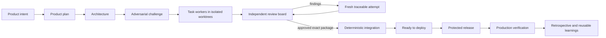

# Startup Factory

> **Your AI agents can write code. Startup Factory turns them into a delivery team.**

**From product intent to reviewed, tested, production-ready software — coordinated through the project board you already use.**

**Open source · MIT licensed · Multi-model · Tracker-native · Cloud-agnostic · Fail-closed**

AI made implementation faster. It did not make product delivery automatic.

I'm [Alex Ischenko](https://www.linkedin.com/in/alexischenko/), an AI-first CTO and product builder. For more than 20 years, I have built and scaled software across Fintech, Insurance, SaaS, E-commerce, Healthcare, Gaming, and AI. I have led engineering organizations of up to 150 people and helped build products serving 20M+ daily users and platforms handling billions of clicks each month.

When I started building [ExecMatchAI](https://www.execmatch.ai/) with more than 30 AI agents and supporting AI-native startups as a fractional CTO, I found a new bottleneck. The agents could produce code quickly. I was still acting as the message bus — clarifying scope, routing work, reconciling branches, checking reviews, updating the board, recovering failed runs, and deciding what was safe to ship.

**Startup Factory is my answer.** It turns your product board into the operating system for an AI engineering team. A Product Manager turns intent into executable work. A Principal Architect designs the solution. A Sceptical Principal Architect tries to break it. Builders implement isolated slices. Independent reviewers judge exact packages. A deterministic integrator verifies and merges. Production delivery stays behind explicit policy, current evidence, and human approval.

And you are not locked into one AI model. Mix Claude, Codex, Gemini, DeepSeek, or other agents across different roles — using different models to challenge each other, reduce correlated bias, and bring different perspectives to the same problem.

This is the system I use for real startup delivery. I am sharing it as open source because builders should not have to choose between AI speed and engineering discipline.

**The unit of progress is not a prompt, a diff, or a line of code. It is a verified product outcome.**

Startup Factory does not replace your coding agent, repository, project-management tool, CI/CD system, cloud, or engineering stack. It coordinates them.


## Table of contents

- [Who it is for](#who-it-is-for)
- [Quick start (local Markdown, no tracker account)](#quick-start-local-markdown-no-tracker-account)
  - [Safe updates](#safe-updates)
- [Ten easy prompts for startup delivery](#ten-easy-prompts-for-startup-delivery)
- [See the factory work](#see-the-factory-work)
- [This is not another coding copilot](#this-is-not-another-coding-copilot)
- [The delivery loop](#the-delivery-loop)
- [Meet the team](#meet-the-team)
- [Six team presets](#six-team-presets)
- [Bring your own agents, tracker, and stack](#bring-your-own-agents-tracker-and-stack)
- [Choose how much autonomy you want](#choose-how-much-autonomy-you-want)
- [Safety is part of the architecture](#safety-is-part-of-the-architecture)
- [What's new](#whats-new-in-020)
- [Documentation](#documentation)
- [Project status](#project-status)
- [Contributing](#contributing)
- [License](#license)

## Who it is for

| You are | Startup Factory helps you |
|---|---|
| **A founder or CTO who still ships** | Turn product intent into structured execution without becoming the dispatcher for every AI coding session. |
| **A solo builder who wants a team, not a blank prompt** | Add product, architecture, implementation, QA, security, and review roles around the agent you already use. |
| **A technical lead adopting coding agents** | Separate design, implementation, review, integration, and release authority instead of trusting one long agent loop. |
| **An AI-first engineering team** | Mix Claude, Codex, Gemini, Aider, DeepSeek Harness, or another file-reading CLI by role while keeping one shared workflow. |
| **A team already living in a product board** | Keep scope, progress, findings, approvals, blockers, and delivery state where product decisions already happen. |

Use your coding agent directly for a one-line fix. Startup Factory earns its keep when work crosses roles, branches, reviews, trackers, or production. See [Meet the team](#meet-the-team) for the roles it adds.

## Quick start (local Markdown, no tracker account)

Start with one agent and the local Markdown tracker. From your project root:

```bash
uvx startup-factory@latest install --agent codex
uvx startup-factory@latest init --agent codex --mode solo \
  --product-management-tool Markdown --apply
```

Use `--agent claude-code` for Claude Code. Then ask your agent:

```text
Plan a feature: add CSV export to the reports page.
```

Continue with `Start task 1`, `Send task 1 to review`, and `Finalize task 1`.
That exercises the smallest useful loop: **plan → build → review → verify**.

For a governed team delivery, guided integration-pack setup, prerequisites, and
the explicit non-production boundary, follow the
[`governed delivery benchmark path`](reference/quickstart.md). A reproducible
example is in
[`reference/governed-delivery-example.md`](reference/governed-delivery-example.md).

### Safe updates

Preview, apply, and verify an update with the same release CLI:

```bash
uvx startup-factory@latest update --agent codex --dry-run
uvx startup-factory@latest update --agent codex
uvx startup-factory@latest verify --agent codex
```

Updates are staged, locked, verified, and rollback-capable. Existing project
configuration and project-owned extensions are preserved by default; conflicts
fail before mutation. Replacing preserved configuration requires the explicit
`--overwrite-config` flag. Both supported updaters report preserved 0.1.x
authority settings that need migration in dry-run and applied output. The
release CLI also returns them as structured `migrationDiagnostics`; it never
rewrites the preserved settings. Reprovision a legacy operator-owned sandbox
runner under a canonical root-owned, non-executor-writable system path, and set
the protected lifecycle root explicitly before restarting governed services.
See [`SKILL.md`](SKILL.md#self-update-request) for the
release-managed and legacy/source-managed procedures and
[`reference/troubleshooting.md`](reference/troubleshooting.md) for fail-closed
recovery guidance.

## Ten easy prompts for startup delivery

Replace the brackets and paste. Each prompt assumes the same rules: use the
installed Startup Factory skill, keep agents inside their assigned roles, require
current tests and independent review, deploy only through the protected release
executor, and stop visibly when a gate or approval is missing.

> The **Senior Security Engineer** already exists and reviews independently; an
> implementation engineer writes the fix. For continuous work, use bounded
> `pm-agent.py` passes — not one endless LLM session.

### 1. Ship a product feature

```text
Deliver [FEATURE] from [TRACKER] to production with Startup Factory. Launch the
full-stack team, define measurable acceptance criteria, build and test isolated
slices, review independently, deploy the approved commit, and verify [OUTCOME].
```

### 2. Clear the Linear bug queue

```text
In Linear [TEAM/PROJECT], process queued tickets labelled "Bug". Choose the right
team per ticket, require security review, reproduce each bug with a failing test,
fix it, run regressions, deploy safely, and report the result.
```

### 3. Fix cloud infrastructure and backups

```text
Audit [CLOUD/ENVIRONMENT] with the deep-infra team. Fix drift through IaC, review
IAM, networking, monitoring, cost, backups, and restore readiness; validate the
plan and rollback, obtain production approval, then verify the service.
```

### 4. Harden product security

```text
Harden [SERVICE/FEATURE] with the deep-security team. Threat-model it, implement
the highest-risk fixes, run authorized abuse tests, require independent security
approval, deploy the verified commit, and monitor for regressions.
```

### 5. Build a regression safety net

```text
Create a regression suite for [PRODUCT]. Launch the appropriate engineering team
with QA review, cover critical journeys and past incidents with reliable
unit/API/E2E tests, remove flakiness, run them in CI, and publish release criteria.
```

### 6. Turn customer feedback into a roadmap

```text
Analyze [FEEDBACK SOURCE] with Startup Factory. Group evidence-backed themes,
rank them by impact, confidence, and effort, create scoped tracker features, and
deliver the approved top priority with measurable acceptance criteria.
```

### 7. Improve onboarding conversion

```text
Improve [ONBOARDING STEP] from [BASELINE] to [TARGET]. Launch the full-stack
team, instrument the funnel, define experiment guardrails, ship the change,
verify real analytics, and recommend keep, iterate, or rollback.
```

### 8. Prevent a production incident from recurring

```text
Investigate [INCIDENT] with the appropriate backend or infra team. Build an
evidence-based timeline, fix the root cause, add tests, alerts, and a runbook,
rehearse recovery safely, then verify the production signals.
```

### 9. Run a safe data migration

```text
Migrate [DATA/SYSTEM] with the deep-backend team. Use a backward-compatible
expand/contract plan, rehearse on representative non-production data, verify
integrity and rollback, obtain production approval, then monitor completion.
```

### 10. Ship an AI feature responsibly

```text
Deliver [AI FEATURE] with the deep-llm team. Define quality, safety, latency,
and cost thresholds; secure prompts, tools, and data; run reproducible evals,
release gradually, and monitor drift, failures, and spend.
```

## See the factory work

Here is the shape of a typical governed feature:

```text
You
  "Deliver organization invitations with roles and audit logging."

Product Manager
  Creates one [feature], measurable acceptance criteria, and a dependency-aware
  set of [tasks].

Principal Architect
  Designs the data model, API, authorization boundaries, rollout, and tests.

Sceptical Principal Architect
  Challenges tenant isolation, replay behavior, migration safety, and rollback.
  The design does not proceed until material objections are resolved.

Builders
  Implement backend, frontend, infrastructure, or LLM slices in isolated task
  branches and worktrees.

Independent review board
  Reviews one exact package. Findings return the [task] to a fresh, traceable
  attempt instead of silently approving changed code.

Integrator
  Runs the configured build, test, lint, and format checks, then merges only the
  approved package.

Protected release (optional)
  Deploys only the approved commit with current CI, policy, and human-approval
  evidence, then verifies the target.

Project board
  Keeps the scope, owners, decisions, progress, blockers, findings, approvals,
  and delivery state visible throughout the run.
```

One board. Different roles. No agent grades its own homework.

## This is not another coding copilot

Startup Factory is the coordination and governance layer around the coding agents you already use.

| A typical agent loop | Startup Factory |
|---|---|
| One chat contains the plan and state | The project board and durable task records remain the source of truth |
| The same agent plans, builds, and reviews | Product, architecture, implementation, review, integration, and release authority are separated |
| One model does every job | Different models and CLIs can be assigned by role and task profile |
| Agents edit one shared checkout | Each implementation attempt gets its own task branch and worktree |
| Review can become stale while the code keeps changing | Reviewers judge an exact, digest-bound package |
| Failure means restarting or guessing | Events, checkpoints, attempts, and outboxes make interrupted work recoverable |
| Success is claimed in prose | Status changes, checks, evidence, and approvals are written and verified |
| The coding session can reach production | Production credentials stay with a separate, policy-gated release executor |

**No single agent is asked to be the product manager, architect, implementer, reviewer, integrator, and release authority for its own work.**

## The delivery loop

Startup Factory is a process, not a bag of prompts:

**Plan -> Design -> Challenge -> Build -> Review -> Integrate -> Release -> Verify -> Learn**


```mermaid
flowchart LR
    A[Product intent] --> B[Product plan]
    B --> C[Architecture]
    C --> D[Adversarial challenge]
    D --> E[Task workers in isolated worktrees]
    E --> F[Independent review board]
    F -->|findings| E2[Fresh traceable attempt]
    E2 --> F
    F -->|approved exact package| G[Deterministic integration]
    G --> H[Ready to deploy]
    H --> I[Protected release]
    I --> J[Production verification]
    J --> K[Retrospective and reusable learnings]
```

Every stage has an owner, an allowed set of actions, and a visible handoff. The complete lifecycle is documented in [`reference/lifecycle.md`](reference/lifecycle.md), and the multi-agent protocol lives in [`reference/orchestration.md`](reference/orchestration.md).

## Meet the team

| Role | Responsibility | What it does not do |
|---|---|---|
| **Product Manager** | Turns product intent into acceptance criteria, tasks, dependencies, and measurable outcomes | Does not write code or waive architecture and review gates |
| **Team Lead** | Owns dispatch, coordination, process integrity, and independent quality review | Does not write implementation code or override another mandatory gate |
| **Principal Architect** | Proposes the architecture, contracts, risks, migration path, and validation strategy | Does not implement and then approve its own design |
| **Sceptical Principal Architect** | Tries to disprove the design, expose hidden assumptions, and force safer alternatives | Does not become a second implementer |
| **Builders** | Implement bounded backend, frontend, infrastructure, security, data, or LLM tasks | Do not merge or declare themselves production-ready |
| **QA and Security reviewers** | Add independent evidence for the gates required by the task or team | Do not rewrite the reviewed package while approving it |
| **Integrator** | Verifies the approved package with deterministic repository checks and performs serialized integration | Does not redesign or silently repair rejected work |
| **Release Executor** | Applies an approved production plan using isolated credentials and verifies the result | Is not an LLM and does not infer missing approval |

Every preset team includes three distinct core review-board roles — Team Lead, Principal Architect, and Sceptical Principal Architect — plus a dedicated integrator. The presets are listed in [Six team presets](#six-team-presets).

## Six team presets

| Preset | Use it for |
|---|---|
| [`full-stack`](teams/full-stack.md) | Product features spanning schema, API, and UI |
| [`deep-backend`](teams/deep-backend.md) | Domain logic, data models, APIs, migrations, and performance |
| [`deep-frontend`](teams/deep-frontend.md) | UI architecture, complex client state, and design-system work |
| [`deep-security`](teams/deep-security.md) | Threat-model-driven security work and hardening of your own codebase |
| [`deep-infra`](teams/deep-infra.md) | Cloud infrastructure, CI/CD, reliability, observability, and operations |
| [`deep-llm`](teams/deep-llm.md) | LLM products, RAG, evaluation, serving, safety, latency, and cost |

Each team uses the same [delivery loop](#the-delivery-loop) and authority model. Only the specialist roster changes. See [`teams/README.md`](teams/README.md) for launch and extension details.

## Bring your own agents, tracker, and stack

### Coding agents and models

The package installer has first-class targets for:

| Agent | Installer value |
|---|---|
| Claude Code | `--agent claude-code` |
| OpenAI Codex CLI | `--agent codex` |
| Aider | `--agent aider` |
| DeepSeek Harness | `--agent deepseek-harness` |

Team roles are configured through command templates, so you can mix runtimes. For example, use Claude for the Team Lead and Principal Architect, Codex for the Sceptical Principal Architect and security review, Gemini for review diversity, and DeepSeek Harness or Aider for selected implementation tasks.

[`config/team.config.md`](config/team.config.md) is the entire LLM coupling: one line per role giving the shell command that runs it. The launcher composes each agent's startup prompt into a file and substitutes its path for `{prompt_file}`:

```
TEAM_LEAD_CMD="claude -p \"$(cat '{prompt_file}')\" --permission-mode acceptEdits"
PRINCIPAL_ARCHITECT_CMD="claude -p \"$(cat '{prompt_file}')\" --permission-mode acceptEdits"
SCEPTICAL_ARCHITECT_CMD="codex exec --approve-for-me \"$(cat '{prompt_file}')\""
BACKEND_CMD="codex exec --approve-for-me \"$(cat '{prompt_file}')\""
REVIEWER_CMD="gemini --yolo \"$(cat '{prompt_file}')\""
TEAM_DEFAULT_CMD="claude -p \"$(cat '{prompt_file}')\" --permission-mode acceptEdits"
```

Command templates for common CLIs:

| LLM / CLI | Command template |
|---|---|
| Claude Code | `claude -p "$(cat '{prompt_file}')" --permission-mode acceptEdits` |
| Codex CLI | `codex exec --approve-for-me "$(cat '{prompt_file}')"` |
| Gemini CLI | `gemini --yolo "$(cat '{prompt_file}')"` |
| DeepSeek Harness | `dsh --profile headless "$(cat '{prompt_file}')"` |
| Any file-reading CLI | `yourcli --prompt-file {prompt_file}` |

Command resolution per role: an explicit `<ROLE>_CMD` value is used; `<ROLE>_CMD=null` disables the role; an absent key falls back to `TEAM_DEFAULT_CMD`. That fallback is why the many specialist preset roles need no per-role keys — set `TEAM_DEFAULT_CMD` once and override only the roles you want on a different model. The three core review-board roles are the exception: a launch fails before any agent starts if one of their commands is `null` or unresolved.

> ⚠️ **Safety:** these templates use unattended execution modes (`acceptEdits`, `--approve-for-me`, `--yolo`). Codex keeps its workspace-write sandbox and routes approval requests through automatic review. Workers may commit untrusted checkpoints only to task branches; only the integrator writes the feature branch. Every implementer is isolated in its own git worktree — but still run teams on a branch you can throw away, and review the tracker before merging to your main branch.

The contract is intentionally thin: provide the prompt, let the agent read and edit files within its assigned boundary, capture the result, and trust the exit status. Adding another compatible CLI should not require rewriting the orchestration core.

### Project-management tools

| Tracker | Best for | Adapter |
|---|---|---|
| **Markdown** | Local evaluation, offline work, and zero-account setup | [`adapters/Markdown.md`](adapters/Markdown.md) |
| **Linear** | Product-led startup and scale-up teams | [`adapters/Linear.md`](adapters/Linear.md) |
| **Jira** | Established engineering and enterprise workflows | [`adapters/Jira.md`](adapters/Jira.md) |
| **GitHub Issues** | Teams that keep planning close to the repository | [`adapters/GitHubIssues.md`](adapters/GitHubIssues.md) |
| **Your own tool** | Internal systems or another project-management platform | [`adapters/_TEMPLATE.md`](adapters/_TEMPLATE.md) |

The workflow speaks one generic vocabulary — `[feature]`, `[task]`, `[subtask]`, and configured statuses — while each adapter translates it into the selected tool.

Credentials live in environment variables, never in the config files, and a hosted tracker needs its access wired once. See [`reference/tracker-access.md`](reference/tracker-access.md) for the exact key, scope, and env-var setup per tool.

Validated integration packs provide a guided `validate → preview → apply → doctor`
path for the shipped trackers, exact-commit GitHub Actions evidence, and inactive
Docker Compose or Kubernetes deployment boundaries. Packs are data-only, plans
are digest-bound, and doctor checks names/presence without reading credential
values or authenticating a provider. See
[`extensions/integration-packs/README.md`](extensions/integration-packs/README.md).

### Engineering stack

Startup Factory is language-, framework-, cloud-, and CI-provider-agnostic. Your repository defines the real build, test, lint, format, deployment, rollback, and verification commands.

## Choose how much autonomy you want

Start small and add authority only when the environment is ready.

| Mode | What runs | Best use |
|---|---|---|
| **Solo** | One installed agent follows the lifecycle; self-review is labelled as self-review and cannot impersonate independent approval | Learning the workflow and shipping small features |
| **Team** | Specialist agents work through separate roles, packages, worktrees, and mandatory review gates | Normal multi-agent delivery after protected runtime setup |
| **Autonomous** | A deterministic supervisor scans the board, restores in-flight state, and launches only eligible bounded work | Carefully controlled unattended queues |
| **Release** | A separate executor applies an exact, approved production plan and verifies the target | Governed production delivery |

`init --apply` configures the safe `solo` and `team` starting modes; the full flag list is in [Safe updates](#safe-updates). Autonomous board processing and production release are intentionally off by default and require external configuration, identities, sandboxes, hooks, and readiness checks. Read [Safety is part of the architecture](#safety-is-part-of-the-architecture) before turning either on.

Team initialization alone does not grant authenticated publication authority.
That requires the separately provisioned external sandbox runner, broker-only
tracker writes, lifecycle authority, and successful doctor probes documented in
the [governed delivery benchmark path](reference/quickstart.md). Without that
boundary, team processes are manually supervised and cannot publish governed
review, integration, or release evidence.

## Safety is part of the architecture

Autonomous agents are useful only when their authority is bounded.

Startup Factory provides:

- A code-owned **DENY / REQUIRE HUMAN APPROVAL / ALLOW** policy contract.
- Exact package, commit, artifact, environment, expiry, and approval binding.
- Independent roles that cannot approve work outside their authority.
- Serialized integration and verified status transitions.
- Durable denial, blocker, attempt, and delivery records.
- Automation and production delivery that remain disabled until explicitly configured.
- A credential-separated release executor. Ordinary coding agents do not receive production credentials.
- Fail-closed behavior when evidence is missing, stale, malformed, or inconsistent.

Startup Factory is not an operating-system sandbox. Run agents with real filesystem, process, network, and identity isolation appropriate to your environment. Repository-level policy is an additional boundary, not a replacement for host security.

Read the full contracts before enabling unattended or production operation:

- [`reference/guardrails.md`](reference/guardrails.md)
- [`reference/automation.md`](reference/automation.md)
- [`reference/deployment.md`](reference/deployment.md)
- [`reference/orchestration.md`](reference/orchestration.md)

## What's new in 0.2.0

This release candidate makes governed delivery faster without weakening its
authority boundaries. One monotonic policy selects `micro`, `standard`, or
`high-risk` from both declared scope and the exact committed diff. A requested
profile can raise rigor but never lower it; high-risk work forces strong-model,
exclusive implementation plus QA and Security, while the core review board,
its checklists and preset `REVIEW_MODE`, exact-package evidence, immutable deny
rules, integration, and release authority remain unchanged. See
[`reference/delivery-profiles.md`](reference/delivery-profiles.md).

The first integration-pack catalog adds guided, validated setup for Markdown,
GitHub Issues, Jira, Linear, GitHub Actions exact-commit verification, Docker
Compose, and Kubernetes. Manifests are strict data rather than executable
configuration, credentials remain outside repository config, saved plans bind
their source and target identities, CI verification requires a non-empty set of
real provider check names, and deployment templates are inactive until separately
configured and approved.

Beta preparation now includes [`SECURITY.md`](SECURITY.md), a shorter governed
quickstart, explicit platform support, a reproducible walkthrough, benchmark and
usage methodology, and a fail-closed exact-release-set readiness checker. No
benchmark result is fabricated: documentation alone reports **not ready** until
fresh protected validation, review, disclosure, benchmark, and usage evidence
for the exact bundle, wheel, and sdist is supplied.

Merging to `main` no longer publishes automatically. After repository owners
configure the required branch and environment protections, release owners must
invoke the manual workflow with the exact current-main commit and exact tip of
the protected, evidence-only branch; readiness runs before any publication, and
PyPI requires its separate protected-environment approval.

**0.1.x upgrade action:** project configuration is preserved during updates.
Before restarting autonomous or release services, update the protected
installed `config/team.config.md`: set `BROKER_LIFECYCLE_ROOT` to the exact
canonical external lifecycle path and, when `AGENT_SANDBOX_ENFORCED=true`,
replace a missing, null, or legacy operator-owned `AGENT_SANDBOX_RUNNER` with a
canonical external executable whose file and complete ancestor chain are
root-owned and not writable by the executor, group, or world. The scheduler's
`STARTUP_FACTORY_LIFECYCLE_STATE_ROOT` may only repeat that value; it no longer
substitutes for a null or missing config assignment. Follow the bounded
[migration procedure](reference/deployment.md#required-01x-lifecycle-authority-migration).

## What's new in 0.1.23

Updating an installation could quietly undo work, in three different ways.

A local edit to a shipped file was replaced without a word. The updater already
records the hash of every file it installs, but only consulted it when deciding
whether a *retired* file was safe to delete — never for files the incoming
version overwrites. It now names them: `WARNING: 2 upstream file(s) were
modified locally since they were installed`, in both the dry run and the applied
update, so a local fix is either re-applied deliberately or upstreamed.

`update` also had no notion of version order and would write an older bundle over
a newer installation. A published index is not always ahead of what is installed
— a release can be mid-flight, or half-published when post-publish verification
fails — so `@latest` legitimately resolves to the previous version, and
installing it reverted whatever the newer one fixed. Downgrades are now refused
unless `--allow-downgrade` says otherwise.

Finally, `bin/update-installed-skill.sh` already refuses release-managed
installations because it cannot carry their bundle provenance, but the mirror
image was open: the release CLI would convert a source-managed installation
without comment, which is how the previous two problems combined into a silent
revert. `update` now refuses it and names the updater that preserves source
provenance.

## What's new in 0.1.22

Two defects could stop a board permanently, and the contract behind one of them
was documented nowhere.

A published artifact carries a `delivery-id:` trailer appended after the role
signature, so resolving the signing role from the end of the body returned the
delivery id instead of a role. Every gate then looked foreign to the planner: on
a [task] with a declared supporting review gate the core-approval branch was
never entered, the merge queue was unreachable, and the same reviewer was
relaunched every pass while the board reported itself idle. Signature resolution
now skips that trailer.

The integration authorizer also accepted only a `Files:` line split on commas,
while reviewers publish the same evidence under prose labels. Both authorizer
sites now share one fail-closed parser: it accepts the prose labels and a single
consistent comma, middot, or bullet separator, while rejecting duplicate
declarations or paths, mixed separators, empty declarations, and unquoted
whitespace-only lists. Set-equality against the reviewed Git diff is unchanged.
That contract is now specified in
[`reference/orchestration.md`](reference/orchestration.md) and in every role brief
that publishes a file list, and a set mismatch names which paths differ in each
direction.

## What's new in 0.1.21

This release documents what the README rewrite would otherwise have dropped.
Troubleshooting and tracker access were reachable only from the old README, so
replacing it would have removed them from the project entirely. They now live in
[`reference/troubleshooting.md`](reference/troubleshooting.md) and
[`reference/tracker-access.md`](reference/tracker-access.md), and the README
links to both.

## What's new in 0.1.20

This release makes an idle dispatch pass affordable and a stalled board visible,
and stops a relaunch destroying verdicts the previous boot had enqueued.

A pass now asks the adapter for a cheap change token and reuses the cached
[feature] export when nothing moved, so an idle pass costs a couple of requests
instead of hundreds — a watch loop at the default cadence could otherwise
exhaust an hourly hosted-tracker budget with no work having changed. Reuse is
bounded on every side: a full export runs at least every
`EXPORT_MAX_REUSE_SECONDS`, the token is recorded only after a successful
export, and an adapter that cannot promise the token moves whenever the export
would simply omits it.

`launch-team.sh health` adds a board-level line per team, because every role
reaching `exited` is the normal end of a pass and per-role output cannot
separate a board that finished from one nobody is driving.

Workers no longer receive an outbox signing secret. For sandbox-enforced launches,
the launcher keeps each secret in a generation-bound publication supervisor and
gives the worker only a non-secret Unix-socket locator; unenforced/manual launches
receive no authenticated publication transport. Task relaunches share one logical task lane and
gate relaunches one role lane, so a successor immediately fences its predecessor
from signing anything new. Signing also creates a protected, durable receipt for
that exact entry and body under the same authority lock used by mint, revoke,
holds, and tracker effects. This lets a final package already admitted before a
normal worker exit drain safely after the supervisor's exact-id revocation,
without letting a stale generation publish a different package.

## What's new in 0.1.19

This release rewrites the README as a landing page. It leads with what Startup
Factory is, who it is for, and a short local quick start, then hands off to
[`SKILL.md`](SKILL.md) and [`reference/`](reference/) for operational detail.

Navigation is new: a table of contents, section anchors, and cross-links between
related sections. The role-to-command mapping from
[`config/team.config.md`](config/team.config.md) is documented alongside the
unattended-execution safety note, and `### Safe updates` keeps the update,
verify, and preserved-configuration contract in the README.

No runtime, adapter, or packaging behavior changes in this release.

## What's new in 0.1.18

This release fixes the public installation check that gates a release. The step
retries while a freshly published version propagates, but the version comparison
ran inside the `if` body, so the first not-yet-propagated answer aborted the step
instead of retrying — and because the GitHub release job depends on that check,
a transient lag could leave a version published to PyPI while the tag and GitHub
release were skipped entirely.

The comparison is now part of the retry condition, so propagation lag is retried
as intended while a genuinely wrong published version still fails the release
after the retry budget is exhausted.

## What's new in 0.1.17

This release keeps an exhaustive tracker read inside a hosted tracker's request
budget, so a dispatch pass can complete on a `[feature]` with hundreds of
`[task]` items.

Previously the Linear project export hydrated comments, labels, and relations
with one request per connection per issue, and the Jira export and board scan
read comments once per `[task]`. On a large `[feature]`, a single pass could
exceed an hourly request budget before finishing, so it never persisted its
projection and the next pass repeated the same work. Both adapters now hydrate
from the paginated read they already perform, and any connection reporting a
further page still falls back to the exhaustive per-item read — a truncated or
malformed response is never treated as complete.

Two projection defects are fixed alongside it. Managed `[feature]` projections
are now tracker comments rather than project fields, because a short description
is length-capped and a content document is reformatted by the tracker, so
neither could hold a projection verifiable as stored; a block left in either
field by an earlier version is retired on the next upsert. The `[task]`
projection also no longer back-fills completed history it never tracked, and it
skips archived items instead of failing the pass that encounters one.

## What's new in 0.1.16

This release adds project-scoped agent health monitoring. Teams can use
`launch-team.sh health [--json] [--watch]` to see typed agent status across the
current Git project, including linked worktrees, without exposing agents from
other projects. Fresh, self-reported implementation percentages are shown when
available; otherwise the view reports trusted elapsed time.

Watch mode observes immediately and then every five minutes without waking an
LLM. For unattended operation, `pm-agent.py --healthcheck` atomically publishes
the same presentation-only snapshot, while its health clock remains independent
of portfolio scanning. Health data never controls lifecycle, scheduling,
reviews, integration, or releases.

## Documentation

| Start here | What it covers |
|---|---|
| [`reference/quickstart.md`](reference/quickstart.md) | External-runner prerequisites and the unproven benchmark path for a governed, non-production team delivery |
| [`SKILL.md`](SKILL.md) | The operational front door and supported user requests |
| [`reference/lifecycle.md`](reference/lifecycle.md) | Planning, starting, reviewing, finalizing, blocking, automation, and release scenarios |
| [`reference/orchestration.md`](reference/orchestration.md) | Task packets, worktrees, mailboxes, dispatch, gates, attempts, and integration |
| [`reference/delivery-profiles.md`](reference/delivery-profiles.md) | Monotonic micro, standard, and high-risk routing and invariant authority boundaries |
| [`extensions/integration-packs/README.md`](extensions/integration-packs/README.md) | Pack schema, two-root setup model, preview/apply/doctor flow, and extension contract |
| [`teams/README.md`](teams/README.md) | Team presets, roles, launch modes, and extension rules |
| [`reference/vocabulary.md`](reference/vocabulary.md) | Tool-neutral entities, statuses, mappings, and naming rules |
| [`reference/automation.md`](reference/automation.md) | Deterministic board monitoring and bounded task dispatch |
| [`reference/guardrails.md`](reference/guardrails.md) | Denied actions, exact human approvals, and allowed operations |
| [`reference/deployment.md`](reference/deployment.md) | Provider-neutral, recoverable production delivery |
| [`reference/evidence-providers.md`](reference/evidence-providers.md) | Commit-bound external evidence and provider contracts |
| [`reference/compatibility.md`](reference/compatibility.md) | Tested, declared, untested, and unsupported platform/runtime positions |
| [`reference/governed-delivery-example.md`](reference/governed-delivery-example.md) | Reproducible first-delivery and exact package-build walkthrough |
| [`reference/benchmarks.md`](reference/benchmarks.md) | Honest latency, usage, and cost measurement methodology |
| [`reference/beta-readiness.md`](reference/beta-readiness.md) | Objective beta criteria and exact evidence schema |
| [`SECURITY.md`](SECURITY.md) | Private vulnerability reporting and coordinated disclosure process |
| [`reference/tracker-access.md`](reference/tracker-access.md) | Wiring a tracker: access mechanisms, scopes, and credential env vars |
| [`reference/troubleshooting.md`](reference/troubleshooting.md) | Symptoms an operator hits, and what each fail-closed stop means |
| [`config/`](config/) | Tracker, planning, team, automation, guardrail, and deployment configuration |
| [`adapters/`](adapters/) | Shipped project-management adapters and the custom adapter template |
| [GitHub Releases](https://github.com/alexrolls/startup-factory/releases) | Version history and release notes |

Claude Code users can optionally connect [`obra/superpowers`](https://github.com/obra/superpowers) for planning intake. Startup Factory still owns task execution, worktrees, dispatch, review, integration, and release. See [`reference/superpowers-planning.md`](reference/superpowers-planning.md).

## Project status

Startup Factory is early-stage open-source software under active development. Start with Markdown and `solo` or `team` mode. Pin a reviewed package version in controlled environments and upgrade through [Safe updates](#safe-updates). Native Windows is unsupported and WSL is currently untested; see the [compatibility matrix](reference/compatibility.md). Do not enable autonomous or production operation until the documented readiness checks pass.

The framework is deliberately explicit. It would rather stop visibly than invent state, skip a gate, or pretend that work shipped.

## Contributing

Startup Factory is designed to be extended:

- Add a project-management adapter.
- Add a coding-agent runtime.
- Add a specialist role or team preset.
- Improve a lifecycle, security, or release control.
- Share a reproducible delivery case study.

Issues and pull requests are welcome. Please keep changes compatible with the tool-neutral workflow and the fail-closed authority model.

## License

[MIT](LICENSE). Use it, fork it, improve it, and make it yours.

Built for builders who want AI speed without giving up engineering discipline.
